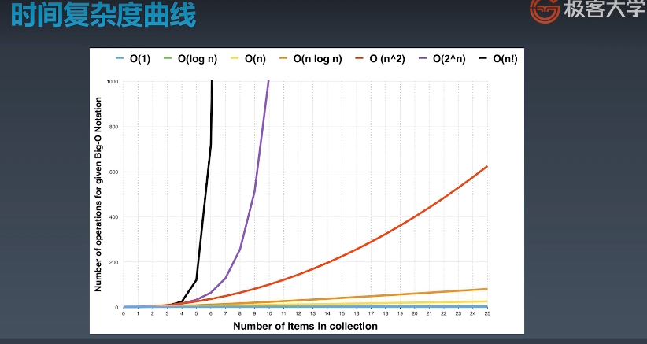

# 01-复杂度简单了解

算法（Algorithm）是指用来操作数据、解决程序问题的一组方法。对于同一个问题，使用不同的算法，也许最终得到的结果是一样的，但在过程中消耗的资源和时间却会有很大的区别。

那么我们应该如何去衡量不同算法之间的优劣呢？

主要还是从算法所占用的「时间」和「空间」两个维度去考量。

- 时间维度：是指执行当前算法所消耗的时间，我们通常用「时间复杂度」来描述。
- 空间维度：是指执行当前算法需要占用多少内存空间，我们通常用「空间复杂度」来描述。

# 1. 时间复杂度

通用表示复杂度的方法：「 **大O符号表示法** 」，即 T(n) = O(f(n))

举例：

```java
for(i=1; i<=n; ++i)
{
   j = i;
   j++;
}
```

通过「 大O符号表示法 」，这段代码的时间复杂度为：O(n) ，为什么呢?

> 在 大O符号表示法中，时间复杂度的公式是： T(n) = O( f(n) )，其中f(n) 表示每行代码执行次数之和，而 O 表示正比例关系，这个公式的全称是：**算法的渐进时间复杂度**。


**常见的7种复杂度：**

大O描述的是算法的运行时间和输入数据之间的关系

- O(1) 常数复杂度
- O(log n) 对数复杂度
- O(n) 线性时间复杂度
- 线性对数阶O(nlogN)
- O(n^2) 平方
- O(n^3) 立方
- O(n^k) K次方阶
- O(2^n) 指数
- O(n!) 阶乘

**上面从上至下依次的时间复杂度越来越大，执行的效率越来越低。**


**注意：只看最高复杂度的运算**

简单示例：分析以下案例的时间复杂度

1. 常数复杂度示例

   ```java
   int n = 1000;
   System.out.println("你的输入为："+n);
   ```

   分析：无n等于多少，程序只执行一次println，所以它的时间复杂度就是`O(1)`的，属于常数复杂度

   科普：常数是指固定不变的数值

   ```java
   int n = 1000;
   System.out.println("你的第一次输入为："+n);
   System.out.println("你的第二次输入为："+n);
   System.out.println("你的第三次输入为："+n);
   ```

   分析：不管n是多少，程序只执行3次println，所以它的时间复杂度还是常数的，准确来说是`O(1)`，而不是`O(3)`，理由是`O(1)`是一个泛指，代表常数复杂度

3.  线性时间复杂度示例：

   ```java
   int n = 100;
   for (int i = 0; i <= n; i++) {
       System.out.println("你的输入为："+i);
   }
   ```

   分析：由代码可以看出，**随着n的不同，语句执行的次数也会不一样**，那么就可以发现，它的时间复杂度和n是线性关系，所以是`O(N)`

3. 平方复杂度示例：

   平方阶O(n²) 就更容易理解了，如果把 O(n) 的代码再嵌套循环一遍，它的时间复杂度就是 O(n²) 了。

   ```java
   int n = 100;
   for (int i = 0; i <= n; i++) {
       for (int j = 0; j <= n; j++) {
           System.out.println("你的输入为："+i + " 和 "+j);
       }
   }
   ```

   分析：由代码可以看出，随着n的不同，语句执行的次数`n^2`，假设n=100，那么语句就会执行100*100次，所以它的时间复杂度是`O(N^2)`，同理如果是三层嵌套那么就是`O(N^3)`立方了

   注意：

   这段代码其实就是嵌套了2层n循环，它的时间复杂度就是 O(n*n)，即 O(n²)
   如果将其中一层循环的n改成m，即：

   ```java
   for(x=1; i<=m; x++)
   {
      for(i=1; i<=n; i++)
       {
          j = i;
          j++;
       }
   }
   ```

   那它的时间复杂度就变成了 **O(m*n)**

4. 对数复杂度示例：

   ```java
   int i = 1;
   while(i<n)
   {
       i = i * 2;
   }
   ```

   分析：从上面代码可以看到，在while循环里面，每次都将` i `乘以 2，乘完之后，`i `距离 n 就越来越近了。我们试着求解一下，假设循环x次之后，`i `就大于 2 了，此时这个循环就退出了，也就是说 2 的 x 次方等于 n，那么` x = log2^n`也就是说当循环 `log2^n` 次以后，这个代码就结束了。因此这个代码的时间复杂度为：**O(logn)**

   科普：log就是对数，对数公式是数学中的一种常见公式，如果`a^x=N(a>0,且a≠1)`，则x叫做以a为底N的对数,记做`x=log(a)(N)`，其中a要写于log右下

5. 线性对数阶O(nlogN)

   线性对数阶`O(nlogN)` 其实非常容易理解，将时间复杂度为`O(logn)`的代码循环N遍的话，那么它的时间复杂度就是 `n * O(logN)`，也就是了**O(nlogN)**。

   ```java
   for(m=1; m<n; m++)
   {
       i = 1;
       while(i<n)
       {
           i = i * 2;
       }
   }
   ```

6. 指数复杂度示例：

   ```java
   public static int fid(int n) {
       if (n<2) return n;
       return fid(n-1) + fid(n-2);
   }
   ```

   分析：可以发现，这其实就是一个递归，n越大，那么递归的次数是呈指数级上升的，所以答案是`O(K^n)`，其中k是常数，是指数级的




小练习：

示例：计算1+2+3+4+5…..+n

- 方法1：从1到n的循环累加

  ```java
  public static int sum(int count){
      int sum = 0;
      for (int i = 0; i <= count; i++){
          sum += i;
      }
      return sum;
  }
  ```

  时间复杂度是O(N)

- 方法2：求和公式`sum = n*(n+1)/2`

  ```java
  public static int sum2(int count){
      // 套用求和公式求和公式sum = n*(n+1)/2
      return count*(count+1)/2;
  }
  ```

  时间复杂度是O(1)

**思考题1：**二叉树遍历的前序，中序，后序的时间复杂度是多少

答案：O(N)，N代表二叉树的节点总数，不管是前序，中序，后序，每个节点会访问一次，且仅访问一次

**思考题2：**图的遍历，时间复杂度是多少

答案：O(N)，N代表图里面的节点总数。

**思考题3：**DFS（深度优先），BFS（广度优先），时间复杂度是多少

答案：O(N)，N代表搜索空间里面的节点总数。每个节点会访问一次，且仅访问一次

**思考题4**：二分查找的时间复杂度是多少

答案：总共有n个元素，每次查找的区间大小就是n，n/2，n/4，…，n/2^k（接下来操作元素的剩余个数），其中k就是循环的次数。由于n/2^k取整后>=1，即令n/2^k=1，可得k=log2n,（是以2为底，n的对数），所以时间复杂度可以表示O(log(n))


# 2. 空间复杂度

空间复杂度(Space Complexity)是对一个算法在运行过程中临时占用存储空间大小的量度，记做`S(n)=O(f(n))`。比如直接插入排序的时间复杂度是`O(n^2)`，空间复杂度是`O(1) `。而一般的递归算法就要有`O(n)`的空间复杂度了，因为每次递归都要存储返回信息。**一个算法的优劣主要从算法的执行时间和所需要占用的存储空间两个方面衡量。**

既然时间复杂度不是用来计算程序具体耗时的，那么我们也应该明白，**空间复杂度也不是用来计算程序实际占用的空间的。**空间复杂度**是对一个算法在运行过程中临时占用存储空间大小的一个量度，同样反映的是一个趋势**，我们用 **S(n)** 来定义。

空间复杂度比较常用的有：O(1)、O(n)、O(n²)，我们下面来看看：

- 数组的长度，就是空间复杂度

  比如：一维数组中，它的长度为传入的元素的个数，那么一般来说空间复杂度就是O(N)

  二维数组中，数组的长度为N的平方，那么一般来说空间复杂度就是O(N^2)

- 递归最深的深度就是你的空间复杂度的最大值

示例：

1. 空间复杂度 O(1)

   如果算法执行所需要的临时空间不随着某个变量n的大小而变化，即此算法空间复杂度为一个常量，可表示为 O(1)
   举例：

   ```java
   int i = 1;
   int j = 2;
   ++i;
   j++;
   int m = i + j;
   ```

   > 代码中的 i、j、m 所分配的空间都不随着处理数据量变化，因此它的空间复杂度 S(n) = O(1)

2. 空间复杂度 O(n)

   ```java
   int[] m = new int[n]
   for(i=1; i<=n; ++i)
   {
      j = i;
      j++;
   }
   ```

   这段代码中，第一行new了一个数组出来，这个数据占用的大小为n，这段代码的2-6行，虽然有循环，但没有再分配新的空间，因此，这段代码的空间复杂度主要看第一行即可，即 S(n) = O(n)