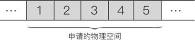
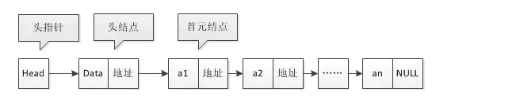
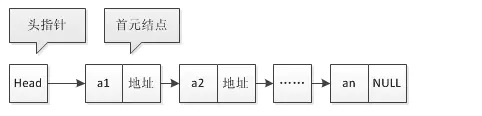
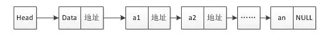

# 1. 线性表的基本概念

线性表，全名为线性存储结构。使用线性表存储数据的方式可以这样理解，即**“把所有数据用一根线儿串起来，再存储到物理空间中**”。

将具有“一对一”关系的数据“线性”地存储到物理空间中，这种存储结构就称为线性存储结构（简称线性表）。

使用线性表存储的数据，如同向[数组](http://data.biancheng.net/view/181.html)中存储数据那样，要求数据类型必须一致，也就是说，线性表存储的数据，要么全不都是整形，要么全部都是字符串。一半是整形，另一半是字符串的一组数据无法使用线性表存储。

**分类：**顺序存储结构 和 链式存储结构

1. 将数据依次存储在连续的整块物理空间中，这种存储结构称为顺序存储结构（简称**顺序表**）；
2. 数据分散的存储在物理空间中，通过一根线保存着它们之间的逻辑关系，这种存储结构称为链式存储结构（简称**链表**)）；

也就是说，线性表存储结构可细分为顺序存储结构和链式存储结构。

## 1.1 顺序表

基本概念：顺序表是在计算机内存中以数组的形式保存的线性表，是指用一组地址连续的存储单元依次存储数据元素的线性结构。

例如，使用顺序表存储集合 `{1,2,3,4,5}`，数据最终的存储状态如图所示：



由此我们可以得出，将“具有 '一对一' 逻辑关系的数据按照次序连续存储到一整块物理空间上”的存储结构就是顺序存储结构。

通过观察图中数据的存储状态，我们可以发现，顺序表存储数据同数组非常接近。其实，**顺序表存储数据使用的就是数组。**


## 1.2 链表

**链表**（Linked list）是一种常见的基础数据结构，是一种[线性表](https://zh.wikipedia.org/wiki/线性表)，但是并不会按线性的顺序存储数据，而是在每一个节点里存到下一个节点的[指针](https://zh.wikipedia.org/wiki/指標_(電腦科學))(Pointer)。由于不必须按顺序存储，链表在插入的时候可以达到O(1)的[复杂度](https://zh.wikipedia.org/wiki/複雜度)，比另一种线性表[顺序表](https://zh.wikipedia.org/wiki/顺序表)快得多，但是查找一个节点或者访问特定编号的节点则需要O(n)的时间，而顺序表相应的时间复杂度分别是O(logn)和O(1)。

使用链表结构可以克服数组链表需要预先知道数据大小的缺点，链表结构可以充分利用计算机内存空间，**实现灵活的内存动态管理**。但是**链表失去了数组随机读取的优点，同时链表由于增加了结点的指针域，空间开销比较大。**

在计算机科学中，链表作为一种基础的数据结构可以用来生成其它类型的数据结构。**链表通常由一连串节点组成，每个节点包含任意的实例数据（data fields）和一或两个用来指向上一个/或下一个节点的位置的链接（"links"）**

链表最明显的好处就是，常规数组排列关联项目的方式可能不同于这些数据项目在记忆体或磁盘上顺序，数据的访问往往要在不同的排列顺序中转换。而链表是一种自我指示数据类型，因为它包含指向另一个相同类型的数据的指针（链接）。**链表允许插入和移除表上任意位置上的节点，但是不允许随机存取**。**链表有很多种不同的类型：单向链表，双向链表以及循环链表。**


## 1.3 头指针， 头节点，首元节点

一个完整的链表需要由以下几部分构成：

1. 头指针：

   > 一个普通的指针，它的特点是永远指向链表第一个节点的位置。很明显，**头指针用于指明链表的位置**，便于后期找到链表并使用表中的数据；

   - 在线性表的链式存储结构中，头指针指向链表的头节点或者首元节点。
   - 头指针具有标识作用，故常用头指针冠以链表的名字。
   - 无论链表是否为空，头指针均不为空。头指针是链表的必要元素。

2. 头节点：

   > 其实就是一个不存任何数据的空节点，通常**作为链表的第一个节点**。对于链表来说，头节点不是必须的，它的作用只是为了方便解决某些实际问题
   >
   > 对于头节点，数据域可以不存储任何信息，也可存储如链表长度等附加信息。

   - 头结点是为了操作的统一与方便而设立的，放在第一个元素结点之前，其数据域一般无意义（当然有些情况下也可存放链表的长度、用做监视哨等等）。
   - 有了头结点后，对在第一个元素结点前插入结点和删除第一个结点，其操作与对其它结点的操作统一了。
   - 首元结点也就是第一个元素的结点，它是头结点后边的第一个结点。
   - 头结点不是链表所必需的。
   - 头节点是一个实际存在的节点，它包含有数据域和指针域。

3. 首元节点

   链表中第一个元素所在的节点，它**是头节点后边的第一个节点**。

   其实，首元节点和链表中存放数据的其他节点没什么不同，只是因为该节点位于链表的头部，所以被称为首元节点。

其结构如图所示：



**单链表为什么要设置头结点：**

- 链表中第一个结点的存储位置叫做头指针，那么整个链表的存取就必须从头指针开始进行了。之后的每一个结点，其实就是上一个的后继指针指向的位置。
- 头指针和头结点不同，头结点即第一个结点，头指针是指向第一个结点的指针。链表中可以没有头结点，但不能没有头指针。
- 如果链表有头结点，那么头指针就是指向头结点数据域的指针。


**单链表也可以没有头结点，没有头结点的单链表，如图**




**头节点和头指针的区别在程序中的直接体现**是：头指针只声明而没有分配存储空间，头节点需要声明并分配一个节点的实际物理内存。


**头节点和头指针的区别是：**

为了使空链表与非空链表处理一致，我们通常设一个头结点。

1. **不带头结点的单链表**对于第一个节点的操作与其他节点不一样，**需要特殊处理**，这**增加了程序的复杂性**和出现bug的机会，因此，通常在单链表的开始结点之前附设一个头结点。
2. **带头结点的单链表，初始时一定返回的是指向头结点的地址**，所以一定要用二维指针，否则将导致内存访问失败或异常。
3. 带头结点与不带头结点初始化、插入、删除、输出操作都不样，在遍历输出链表数据时，带头结点的判断条件是`while(head.next != null)`，而不带头结点是`while(head != null)`，虽然头指针可以在初始时设定，但是如1所述，对于特殊情况如只有一个节点会出现问题。

# 2. 链表概念详解

链表的基本结构：链表中每个数据的存储都由以下两部分组成：

1. 数据元素本身，其所在的区域称为数据域；
2. 指向直接后继元素的指针，所在的区域称为指针域；

如下图所示节点结构：


## 2.1 单向链表

链表中最简单的一种是**单向链**表，它包含两个域，**一个数据域和一个指针域**。这个链接指向列表中的下一个节点，而最后一个节点则指向一个空值。

一个单向链表包含两个值：当前节点的值和一个指向下一个节点的地址

也就是说，链表实际存储的是一个一个的节点，真正的数据元素包含在这些节点中，如下图：



**单链表的特性：**

- 一个单向链表的节点被分成两个部分。第一个部分保存或者显示关于节点的信息，第二个部分存储下一个节点的地址。**单向链表只可向一个方向遍历。**
- 链表最基本的结构是在**每个节点保存数据 和 到下一个节点的地址**，在**最后一个节点保存一个特殊的结束标记**，另外在**一个固定的位置保存指向第一个节点的指针**，有的时候也会同时储存指向最后一个节点的指针。
- 一般**查找一个节点**的时候需要**从第一个节点开始每次访问下一个节点，一直访问到需要的位置。**但是也可以提前把一个节点的位置另外保存起来，然后直接访问。
- 当然如果只是访问数据就没必要了，不如在链表上储存指向实际数据的指针。这样一般是为了访问链表中的下一个或者前一个（需要储存反向的指针，见下面的双向链表）节点。
- 相对于后面的双向链表，这种普通的，每个节点只有一个指针的链表也叫**单向链表**，或者**单链表**，通常用在每次都只会按顺序遍历这个链表。

单链表基本代码实现：

```java

```


## 2.2 双向链表

一种更复杂的链表是“双向链表”或“双面链表”。每个节点有两个连接：**一个指向前一个节点，**（当此“连接”为第一个“连接”时，指向空值或者空列表）；**而另一个指向下一个节点，**（当此“连接”为最后一个“连接”时，指向空值或者空列表）


一个双向链表有三个整数值: 数值, 向后的节点链接, 向前的节点链接

**双向链表**也叫**双链表**。双向链表中**不仅有指向后一个节点的指针，还有指向前一个节点的指针。**这样可以从任何一个节点访问前一个节点，当然也可以访问后一个节点，以至整个链表。**一般是在需要大批量的另外储存数据在链表中的位置的时候用**。双向链表也可以配合下面的其他链表的扩展使用。

由于另外储存了指向链表内容的指针，并且可能会修改相邻的节点，有的时候第一个节点可能会被删除或者在之前添加一个新的节点。这时候就要修改指向首个节点的指针。有一种方便的可以消除这种特殊情况的方法是在最后一个节点之后、第一个节点之前储存一个永远不会被删除或者移动的虚拟节点，形成一个下面说的循环链表。这个虚拟节点之后的节点就是真正的第一个节点。这种情况通常可以用这个虚拟节点直接表示这个链表，对于把链表单独的存在[数组](https://zh.wikipedia.org/wiki/数组)里的情况，也可以直接用这个数组表示链表并用第0个或者第-1个（如果编译器支持）节点固定的表示这个虚拟节点。

## 2.3 循环链表

在一个 **循环链表**中, **首节点和末节点被连接在一起**。这种方式在单向和双向链表中皆可实现。要转换一个循环链表，你开始于任意一个节点然后沿着列表的任一方向直到返回开始的节点。再来看另一种方法，循环链表可以被视为“无头无尾”。这种列表很利于节约数据存储缓存， 假定你在一个列表中有一个对象并且希望所有其他对象迭代在一个非特殊的排列下。

指向整个列表的指针可以被称作访问指针。


用单向链表构建的循环链表

**循环链表**中第一个节点之前就是最后一个节点，反之亦然。循环链表的**无边界**使得在这样的链表上设计算法会比普通链表更加容易。对于新加入的节点应该是在第一个节点之前还是最后一个节点之后可以根据实际要求灵活处理，区别不大(详见下面实例代码)。当然，如果只会在最后插入数据（或者只会在之前），处理也是很容易的。

另外有一种模拟的循环链表，就是在访问到最后一个节点之后的时候，手工的跳转到第一个节点。访问到第一个节点之前的时候也一样。这样也可以实现循环链表的功能，在直接用循环链表比较麻烦或者可能会出现问题的时候可以用。

# 3. 跳表

基于多个线性链表的数据结构：跳表

在[计算机科学](https://zh.wikipedia.org/wiki/计算机科学)中，**跳跃列表**是一种[数据结构](https://zh.wikipedia.org/wiki/数据结构)。它使得包含n个元素的有序[序列](https://zh.wikipedia.org/wiki/序列)的查找和插入操作的平均时间复杂度都是O(log n)，优于[数组](https://zh.wikipedia.org/wiki/数组)的 O(n)复杂度。

快速的查询效果是通过维护一个多层次的[链表](https://zh.wikipedia.org/wiki/链表)实现的，且与前一层（下面一层）链表元素的数量相比，每一层链表中的元素的数量更少。一开始时，算法在最稀疏的层次进行搜索，直至需要查找的元素在该层两个相邻的元素中间。这时，算法将跳转到下一个层次，重复刚才的搜索，直到找到需要查找的元素为止。跳过的元素的方法可以是随机性选择或确定性选择，其中前者更为常见。

# 4. 单链表的基本操作

## 4.1 增加节点

增加节点，即不断在链表后面加入节点。此时链表中仅有头节点，而第一次插入，此时头节点=尾节点，所以在此之前必须先实例化一个尾节点。

```java

```


