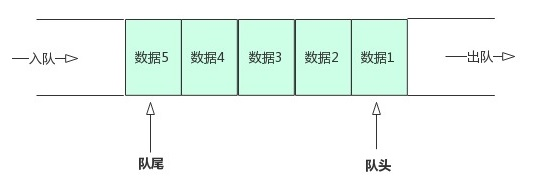

# 03-Stack栈 与 Queue 队列的实现与基本特性

# 1. Queue 队列

## 1.1 基本概念

队列（Queue）是一种经常使用的集合，Queue实际上是实现了一个先进先出（FIFO：First In First Out）的有序表。它和List的区别在与，List可以在任意位置添加和删除元素，**而Queue只有两个操作**：

- 把元素添加到队列末尾
- 从队列头部取出元素

Queue源码定义：

```java
public interface Queue<E> extends Collection<E>
```

Queue的常用实现类：LinkedList，PriorityQueue

Queue源码地址：https://docs.oracle.com/javase/10/docs/api/java/util/Queue.html

Queue的 **添加/删除** 的时间复杂度为`O(1)`，**查询/修改** 的时间复杂度为`O(n)`

示例：



**FIFO存储器概念：**FIFO( First Input First Output)简单说就是指先进先出


继承关系：


## 1.2 Queue相关方法

在Java的标准库中，队列接口`Queue`定义了以下几个方法：

| throw Exception | 返回false或null    | 作用                               |
| :-------------- | ------------------ | :--------------------------------- |
| add(E e)        | boolean offer(E e) | 添加元素到队列尾部；               |
| E remove()      | E poll()           | 获取队列首元素并从队列中删除；     |
| E element()     | E peek()           | 获取队列首元素但并不从队列中删除。 |

对于具体的实现类，有的Queue有最大队列长度限制，有的Queue没有。注意到**添加、删除和获取队列元素总是有两个方法**，这是因为在添加或获取元素失败时，**这两个方法的行为是不同的**。

注意：要避免把`null`添加到队列。

**说明：**

- 使用add / romove / element 方法，当执行失败时（可能超过了队列的容量），它会抛出异常：
- 使用offer /  poll / peek 方法，当执行失败时，它不会抛异常，而是返回`false`：


`remove /  poll`（获取并删除） 和`element / peek`（获取但不删除）方法的区别说明：

- 对于`Queue`来说，每次调用`poll()`，都会获取队首元素，并且获取到的元素已经从队列中被删除了：

  ```java
  public static void main(String[] args) {
      Queue<String> queue = new LinkedList<>();
      // 添加3个元素到队列:
      queue.offer("apple");
      queue.offer("pear");
      queue.offer("banana");
      // 获取队列首元素并从队列中删除；
      System.out.println(queue.poll()); // apple
      System.out.println(queue.poll()); // pear
      System.out.println(queue.poll()); // banana
      System.out.println(queue.poll()); // null,因为队列已经被取空了
  }
  ```

- 如果用`peek()`，因为获取队首元素时，并不会从队列中删除这个元素，所以可以反复获取：

  ```java
  private static void test2() {
      Queue<Integer> queue = new LinkedList<>();
      queue.offer(1);
      queue.offer(2);
      queue.offer(3);
  
      // 获取队列首元素但并不从队列中删除。因为队首永远都是1
      System.out.println(queue.peek()); // 1
      System.out.println(queue.peek()); // 1
      System.out.println(queue.peek()); // 1 
      System.out.println(queue.peek()); // 1
      
      // 获取队列的长度
      System.out.println(queue.size()); // 3 
  }
  ```

总结：从上面的代码中，我们还可以发现，`LinkedList`即实现了`List`接口，又实现了`Queue`接口，但是，在使用的时候，如果我们把它当作List，就获取List的引用，如果我们把它当作Queue，就获取Queue的引用：

```java
// 这是一个List:
List<String> list = new LinkedList<>();
// 这是一个Queue:
Queue<String> queue = new LinkedList<>();
```

**始终按照面向抽象编程的原则编写代码，可以大大提高代码的质量。**

# 2. Deque 双端队列（常用）

Deuque源码：

```java
public interface Deque<E> extends Queue<E>
```

简单理解：两端可以进出的Queue。Deque(double ended queue)


插入和删除都是O(1)操作，查询操作是O(N)

所有已知的实现类：

```
ArrayDeque`, `ConcurrentLinkedDeque`, `LinkedBlockingDeque`, `LinkedList
```

相关说明：

支持在两端插入和删除元素的线性集合。 名称双端队列是“双端队列”的缩写，通常发音为“ deck”。 大多数Deque实现对它们可能包含的元素数量没有固定的限制，但是此接口支持容量受限的双端队列以及没有固定大小限制的双端队列。
此接口定义访问双端队列两端的元素的方法。 提供了用于插入，删除和检查元素的方法。 这些方法中的每一种都以两种形式存在：一种在操作失败时引发异常，另一种返回一个特殊值（根据操作而为null或false）。 插入操作的后一种形式是专门为容量受限的Deque实现设计的。 在大多数实现中，插入操作不会失败。

下表总结了上述十二种方法：

- 双端队列方法摘要

  具体的解释查看官方源码地址：https://docs.oracle.com/javase/10/docs/api/java/util/Deque.html

  |         | First Element (Head)                                         |                                                              | 操作尾元素                                                   |                                                              |
  | ------- | ------------------------------------------------------------ | ------------------------------------------------------------ | ------------------------------------------------------------ | ------------------------------------------------------------ |
  |         | Throws exception                                             | 返回特殊值                                                   | 抛出异常                                                     | 返回特殊值                                                   |
  | Insert  | [`addFirst(e)`](https://docs.oracle.com/javase/10/docs/api/java/util/Deque.html#addFirst(E)) | [`offerFirst(e)`](https://docs.oracle.com/javase/10/docs/api/java/util/Deque.html#offerFirst(E)) | [`addLast(e)`](https://docs.oracle.com/javase/10/docs/api/java/util/Deque.html#addLast(E)) | [`offerLast(e)`](https://docs.oracle.com/javase/10/docs/api/java/util/Deque.html#offerLast(E)) |
  | Remove  | [`removeFirst()`](https://docs.oracle.com/javase/10/docs/api/java/util/Deque.html#removeFirst()) | [`pollFirst()`](https://docs.oracle.com/javase/10/docs/api/java/util/Deque.html#pollFirst()) | [`removeLast()`](https://docs.oracle.com/javase/10/docs/api/java/util/Deque.html#removeLast()) | [`pollLast()`](https://docs.oracle.com/javase/10/docs/api/java/util/Deque.html#pollLast()) |
  | Examine | [`getFirst()`](https://docs.oracle.com/javase/10/docs/api/java/util/Deque.html#getFirst()) | [`peekFirst()`](https://docs.oracle.com/javase/10/docs/api/java/util/Deque.html#peekFirst()) | [`getLast()`](https://docs.oracle.com/javase/10/docs/api/java/util/Deque.html#getLast()) | [`peekLast()`](https://docs.oracle.com/javase/10/docs/api/java/util/Deque.html#peekLast()) |

  该接口扩展了Queue接口。 当双端队列用作队列时，将导致FIFO（先进先出）行为。 元素在双端队列的末尾添加，并从开头删除。 从Queue接口继承的方法与Deque方法完全等效，如下表所示：

- 队列和双端队列方法的比较

  | `Queue` Method                                               | Equivalent `Deque` Method                                    |
  | ------------------------------------------------------------ | ------------------------------------------------------------ |
  | [`add(e)`](https://docs.oracle.com/javase/10/docs/api/java/util/Deque.html#add(E)) | [`addLast(e)`](https://docs.oracle.com/javase/10/docs/api/java/util/Deque.html#addLast(E)) |
  | [`offer(e)`](https://docs.oracle.com/javase/10/docs/api/java/util/Deque.html#offer(E)) | [`offerLast(e)`](https://docs.oracle.com/javase/10/docs/api/java/util/Deque.html#offerLast(E)) |
  | [`remove()`](https://docs.oracle.com/javase/10/docs/api/java/util/Deque.html#remove()) | [`removeFirst()`](https://docs.oracle.com/javase/10/docs/api/java/util/Deque.html#removeFirst()) |
  | [`poll()`](https://docs.oracle.com/javase/10/docs/api/java/util/Deque.html#poll()) | [`pollFirst()`](https://docs.oracle.com/javase/10/docs/api/java/util/Deque.html#pollFirst()) |
  | [`element()`](https://docs.oracle.com/javase/10/docs/api/java/util/Deque.html#element()) | [`getFirst()`](https://docs.oracle.com/javase/10/docs/api/java/util/Deque.html#getFirst()) |
  | [`peek()`](https://docs.oracle.com/javase/10/docs/api/java/util/Deque.html#peek()) | [`peekFirst()`](https://docs.oracle.com/javase/10/docs/api/java/util/Deque.html#peekFirst()) |

  双端队列也可以用作LIFO（后进先出）堆栈。此接口应优先于旧版Stack类使用。当双端队列用作堆栈时，元素从双端队列的开头被压入并弹出。堆栈方法完全等同于Deque方法，如下表所示：

- 堆栈和双端队列方法的比较

  | Stack Method                                                 | Equivalent `Deque` Method                                    |
  | ------------------------------------------------------------ | ------------------------------------------------------------ |
  | [`push(e)`](https://docs.oracle.com/javase/10/docs/api/java/util/Deque.html#push(E)) | [`addFirst(e)`](https://docs.oracle.com/javase/10/docs/api/java/util/Deque.html#addFirst(E)) |
  | [`pop()`](https://docs.oracle.com/javase/10/docs/api/java/util/Deque.html#pop()) | [`removeFirst()`](https://docs.oracle.com/javase/10/docs/api/java/util/Deque.html#removeFirst()) |
  | [`peek()`](https://docs.oracle.com/javase/10/docs/api/java/util/Deque.html#peek()) | [`peekFirst()`](https://docs.oracle.com/javase/10/docs/api/java/util/Deque.html#peekFirst()) |

方法测试：

```java
public static void testNewAPI1(){
    Deque<Integer> deque =  new LinkedList<>();
    // 往双端队列的首位不断添加元素
    deque.addFirst(1);
    deque.addFirst(2);
    deque.addFirst(3);
    deque.addFirst(4);

    // 打印此队列
    System.out.println(deque); // [4, 3, 2, 1]
    // 获取双端队列首位元素
    System.out.println(deque.getFirst());// 4
    // 获取双端队列最后一位元素
    System.out.println(deque.getLast());// 1

    // 遍历双端队列
    while (deque.size() > 0){
        System.out.println(deque.poll());
    }
}

public static void testNewAPI2(){
    Deque<Integer> deque =  new LinkedList<>();
    // 往双端队列的最后添加元素
    deque.addLast(1);
    deque.addLast(2);
    deque.addLast(3);
    deque.addLast(4);

    // 打印元素
    System.out.println(deque); // [1, 2, 3, 4]
    // 获取双端队列首位元素
    System.out.println(deque.getFirst());// 1
    // 获取双端队列最后一位元素
    System.out.println(deque.getLast());// 4

    while (deque.size() > 0){
        System.out.println(deque.poll());
    }
}
```


# 3. PriorityQueue 优先队列

## 3.1 基本概念

PriorityQueue 源码：

```java
public class PriorityQueue<E> extends AbstractQueue<E> implements Serializable
```

PriorityQueue的时间复杂度：

- 插入操作的时间复杂度是O(1)
- 取出操作的时间复杂度是O(lonN)，按照元素的优先级取出

**PriorityQueue的底层具体实现的数据结构比较多样和复杂：**

- heap（堆）heap的实现也是很多种多样的不仅只是二叉树
- bst（二叉搜索树 ）
- 平衡二叉树
- 红黑树
- treap

**概述：**

- 一个基于优先级堆的无界优先级队列。优先级队列的元素按照其自然顺序进行排序，或者根据构造队列时提供的 Comparator 进行排序，具体取决于所使用的构造方法。**优先级队列不允许使用 null 元素**。依靠自然顺序的优先级队列还不允许插入不可比较的对象.
- 此**队列的头是按指定排序方式确定的最小元素**。如果多个元素都是最小值，则头是其中一个元素——选择方法是任意的。队列获取操作 poll、remove、peek 和 element 访问处于队列头的元素。
- 优先级队列是无界的，但是有一个内部容量，控制着用于存储队列元素的数组大小。它通常至少等于队列的大小。**随着不断向优先级队列添加元素，其容量会自动增加**。无需指定容量增加策略的细节。

## 3.2 PriorityQueue底层数据结构

在Java 1.5版本后就提供了一个具备了小根堆性质的数据结构也就是优先队列PriorityQueue。下面详细了解一下PriorityQueue到底是如何实现小顶堆的，然后利用PriorityQueue实现大顶堆。

**PriorityQueue的数据结构**


PriorityQueue的逻辑结构是**一棵完全二叉树**，**存储结构其实是一个数组**。逻辑结构层次遍历的结果刚好是一个数组。

## 3.3 优先级队列相关方法

| Modifier and Type | Method               | Description                                                  |
| :---------------- | :------------------- | :----------------------------------------------------------- |
| `boolean`         | `add(E e)`           | 将指定的元素插入此优先级队列。                               |
| `void`            | `clear()`            | 从此优先级队列中删除所有元素。                               |
| `Comparator`      | `comparator()`       | 返回用于对队列中的元素进行排序的比较器；如果此队列是根据其元素的自然顺序排序的，则返回null。 |
| `boolean`         | `contains(Object o)` | 如果此队列包含指定的元素，则返回true。                       |
| `Iterator`        | `iterator()`         | 返回对该队列中的元素进行迭代的迭代器。                       |
| `boolean`         | `offer(E e)`         | 将指定的元素插入此优先级队列。                               |
| `boolean`         | `remove(Object o)`   | 从该队列中删除指定元素的单个实例（如果存在）。               |
| `Object[]`        | `toArray()`          | 返回一个包含此队列中所有元素的数组。                         |
| ` T[]`            | `toArray(T[] a)`     | 返回一个包含此队列中所有元素的数组； 返回数组的运行时类型是指定数组的运行时类型。 |

- add和offer方法示例

  > `add(E e)`和`offer(E e)`的语义相同，都是向优先队列中插入元素，只是`Queue`接口规定二者对插入失败时的处理不同，前者在插入失败时抛出异常，后则则会返回`false`。对于*PriorityQueue*这两个方法其实没什么差别。

  add(E e) 和 offer(E e) 方法都是向PriorityQueue中加入一个元素，其中**add（）其实调用了offer（）方法**如下：

  - offer方法 源码解析
  
    ```java
    public boolean add(E e) {
        return offer(e);
    }
    
    public boolean offer(E e) {
        if (e == null)
            throw new NullPointerException();
        //如果压入的元素为null 抛出异常      
        int i = size;
        if (i >= queue.length)
            grow(i + 1);
        //如果数组的大小不够扩充
        size = i + 1;
        if (i == 0)
            queue[0] = e;
        //如果只有一个元素之间放在堆顶
        else
          siftUp(i, e);
        //否则调用siftUp函数从下往上调整堆。
        return true;
    }
    ```
    
     上述代码中，扩容函数`grow()`类似于`ArrayList`里的`grow()`函数，就是再申请一个更大的数组，并将原数组的元素复制过去，这里不再赘述。需要注意的是`siftUp(int k, E x)`方法，该方法用于插入元素`x`并维持堆的特性。
    
    图解： 
    
      
  
  **对上面代码做几点说明：**
  
  1. 优先队列中不能存放空元素。
  2. 压入元素后如果数组的大小不够会进行扩充，上面的queue其实就是一个默认初始值为11的数组（也可以赋初始值）。
  3. offer元素的主要调整逻辑在 siftUp ( i, e )函数中。下面看看 siftUp(i, e) 函数到底是怎样实现的。
  
- element()和peek()方法示例

  `element()`和`peek()`的语义完全相同，**都是获取但不删除队首元素**，也就是队列中权值最小的那个元素，二者唯一的区别是当方法失败时前者抛出异常，后者返回null。根据小顶堆的性质，堆顶那个元素就是全局最小的那个；由于堆用数组表示，根据下标关系，0下标处的那个元素既是堆顶元素。所以直接返回数组0下标处的那个元素即可。

  

  示例：

  ```java
  private static void test3() {
      PriorityQueue<Integer> priorityQueue = new PriorityQueue<>();
      priorityQueue.add(2);
      priorityQueue.add(1);
      priorityQueue.add(5);
      priorityQueue.add(6);
  
  
      System.out.println(priorityQueue.peek()); // 1
  }
  ```

  peek方法源码：

  ```java
  public E peek() {
      return (size == 0) ? null : (E) queue[0]; //0下标处的那个元素就是最小的那个
  }
  ```

- remove()和poll()方法示例

  - remove()和poll()方法的语义也完全相同，**都是获取并删除队首元素**，区别是当方法失败时前者抛出异常，后者返回null。由于删除操作会改变队列的结构，为维护小顶堆的性质，需要进行必要的调整。

  - poll 方法每次从 PriorityQueue 的头部删除一个节点，也就是从小顶堆的堆顶删除一个节点，而remove（）不仅可以删除头节点而且还可以用 remove(Object o) 来删除堆中的与给定对象相同的最先出现的对象。先看看poll（）方法。下面是poll（）之后堆的操作

  `poll方法`源码

  ```java
  public E poll() {
      if (size == 0)
          return null;
      //如果堆大小为0则返回null      
      int s = --size;
      modCount++;
      E result = (E) queue[0];
      E x = (E) queue[s];
      queue[s] = null;
      //如果堆中只有一个元素直接删除        
      if (s != 0)
          siftDown(0, x);
      //否则删除元素后对堆进行调整            
      return result;
  }
  ```

  

  删除元素后要对堆进行调整：

  

  源码如下：

  ```java
  public E poll() {
      if (size == 0)
          return null;
      int s = --size;
      modCount++;
      E result = (E) queue[0]; //0下标处的那个元素就是最小的那个
      E x = (E) queue[s];
      queue[s] = null;
      if (s != 0)
          siftDown(0, x); //调整
      return result;
  }
  ```

  上述代码首先记录`0`下标处的元素，并用最后一个元素替换`0`下标位置的元素，之后调用`siftDown()`方法对堆进行调整，最后返回原来`0`下标处的那个元素（也就是最小的那个元素）。重点是`siftDown(int k, E x)`方法，该方法的作用是**从`k`指定的位置开始，将`x`逐层向下与当前点的左右孩子中较小的那个交换，直到`x`小于或等于左右孩子中的任何一个为止**。

- remove(Object o)方法

  `remove(Object o)`方法用于删除队列中跟`o`相等的某一个元素（如果有多个相等，只删除一个），该方法不是*Queue*接口内的方法，而是*Collection*接口的方法。由于删除操作会改变队列结构，所以要进行调整；又由于删除元素的位置可能是任意的，所以调整过程比其它函数稍加繁琐。具体来说，`remove(Object o)`可以分为2种情况：1. 删除的是最后一个元素。直接删除即可，不需要调整。2. 删除的不是最后一个元素，从删除点开始以最后一个元素为参照调用一次`siftDown()`即可。此处不再赘述。

  源码：

  ```java
  public boolean remove(Object o) {
      //通过遍历数组的方式找到第一个满足o.equals(queue[i])元素的下标
      int i = indexOf(o);
      if (i == -1) //情况1
          return false;
      else {
          removeAt(i); //情况2
          return true;
      }
  }
  ```

  图解：

  

## 3.4 使用PriorityQueue实现大顶堆

PriorityQueue默认是一个小顶堆，然而可以通过传入自定义的Comparator函数来实现大顶堆。如下代码：

```java
private static final int DEFAULT_INITIAL_CAPACITY = 11;

PriorityQueue<Integer> maxHeap=new PriorityQueue<Integer>(DEFAULT_INITIAL_CAPACITY, new Comparator<Integer>() {
    @Override
    public int compare(Integer o1, Integer o2) {                
        return o2-o1;
    }
});
```

实现了一个初始大小为11的大顶堆。这里只是简单的传入一个自定义的Comparator函数，就可以实现大顶堆了。

# 4. Stack 栈

```java
public class Stack<E> extends Vector<E>
```

基本概念：

Stack类表示对象的后进先出（LIFO）堆栈。 底层是Vector实现的。

在工程中，不推荐使用Stack，推荐使用Deque，因为Deque接口及其实现提供了一组更完整和一致的LIFO堆栈操作

eg：

```java
Deque<Integer> stack = new ArrayDeque<Integer>();
```

基本方法：

| Modifier and Type | Method             | Description                                          |
| :---------------- | :----------------- | :--------------------------------------------------- |
| `boolean`         | `empty()`          | 测试此堆栈是否为空。                                 |
| `E`               | `peek()`           | 在不将其从堆栈中移除的情况下，查看该堆栈顶部的对象。 |
| `E`               | `pop()`            | 删除此堆栈顶部的对象，并将该对象作为此函数的值返回。 |
| `E`               | `push(E item)`     | 将项目推入此堆栈的顶部。                             |
| `int`             | `search(Object o)` | 返回对象在此堆栈上的从1开始的位置。                  |

基本方法测试

```java
public static void main(String[] args) {
    Stack<Integer> stack = new Stack<>();
    // 往栈中压入元素，所以，栈中元素从上至下分别是4,3,2,1
    stack.push(1);
    stack.push(2);
    stack.push(3);
    stack.push(4);

    // stack本身并位实现toString，而是来自Stack继承的父类Vector
    System.out.println(stack); // [1, 2, 3, 4]

    // 返回元素对象，从1开始，需要注意栈的先入后出概念
    System.out.println(stack.search(4)); // 1
    System.out.println(stack.search(1)); // 4

    // 不存在的元素则返回 -1
    System.out.println(stack.search(-2)); // -1
    System.out.println(stack.search(9)); // -1

    // 查看栈中顶部元素
    System.out.println(stack.peek()); // 4
}
```

