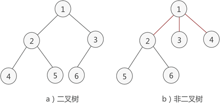
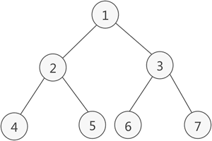
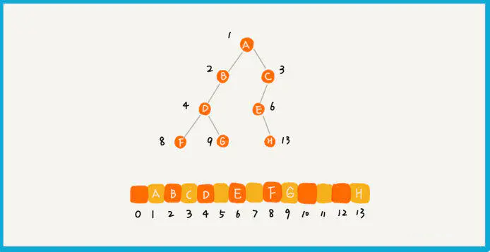

# 1. 树的相关概念

1. 定义：

   树（英语：tree）是一种抽象数据类型（ADT）或是实现这种抽象数据类型的数据结构，用来模拟具有树状结构性质的数据集合。它是由n（n>0）个有限节点组成一个具有层次关系的集合。把它叫做“树”是因为它看起来像一棵倒挂的树，也就是说它是根朝上，而叶朝下的。

2. 特点：

   - 每个节点都只有有限个子节点或无子节点；
   - 没有父节点的节点称为根节点；
   - 每一个非根节点有且只有一个父节点；
   - 除了根节点外，每个子节点可以分为多个不相交的子树；
   - 树里面没有环路(cycle)

3. 术语

   - **节点的度**：一个节点含有的子树的个数称为该节点的度；
   - **树的度**：一棵树中，最大的节点度称为树的度；
   - **叶节点**或**终端节点**：度为零的节点；
   - **非终端节点**或**分支节点**：度不为零的节点；
   - **父亲节点**或**父节点**：若一个节点含有子节点，则这个节点称为其子节点的父节点；
   - **孩子节点**或**子节点**：一个节点含有的子树的根节点称为该节点的子节点；
   - **兄弟节点**：具有相同父节点的节点互称为兄弟节点；
   - 节点的**层次**：从根开始定义起，根为第1层，根的子节点为第2层，以此类推；
   - **深度**：对于任意节点n,n的深度为从根到n的唯一路径长，根的深度为0；
   - **高度**：对于任意节点n,n的高度为从n到一片树叶的最长路径长，所有树叶的高度为0；
   - **堂兄弟节点**：父节点在同一层的节点互为堂兄弟；
   - **节点的祖先**：从根到该节点所经分支上的所有节点；
   - **子孙**：以某节点为根的子树中任一节点都称为该节点的子孙。
   - **森林**：由m（m>=0）棵互不相交的树的集合称为森林；

4. 种类

   - 无序树：树中任意节点的子节点之间**没有顺序关系**，这种树称为无序树，也称为自由树
   - 有序树：树中任意节点的子节点之间**有顺序关系**，这种树称为有序树；
     - 二叉树：每个节点最多含有两个子树的树称为二叉树；
       - 完全二叉树：对于一颗二叉树，假设其深度为d（d>1）。除了第d层外，其它各层的节点数目均已达最大值，且第d层所有节点从左向右连续地紧密排列，这样的二叉树被称为完全二叉树；
       - 平衡二叉树（AVL树）：当且仅当任何节点的两棵子树的高度差不大于1的二叉树；
       - 二叉搜索树，也称二叉排序树、有序二叉树（Ordered Binary Tree）、排序二叉树（Sorted Binary Tree）
     - 霍夫曼树：带权路径最短的二叉树称为哈夫曼树或最优二叉树；
     - B树：一种对读写操作进行优化的自平衡的二叉查找树，能够保持数据有序，拥有多于两个子树。

图解：树


# 2. 二叉树，树，森林遍历

## 2.1 二叉树的遍历

二叉树的结构是**递归的**，由根节点、左子树、右子树组成，所以我们只需**递归地**遍历这三个部分即可。

二叉树遍历模拟网站：https://visualgo.net/zh/bst

**二叉树有多种遍历方法，有：深度优先遍历、广度优先遍历（后续在补）等**

这里暂时只说明深度优先遍历：根据遍历这三个部分的顺序的不同，有三种遍历方式：

1. 前序（Pre-order）：根-左-右
2. 中序（In-order）：左-根-右
3. 后序（Post-order）：左-右-根


### 2.1.1 前序遍历

基本步骤：

1. 二叉树不为空时
   1. 访问根节点
   2. 先序遍历左子树
   3. 先序遍历右子树
2. 二叉树为空时，做空操作

图解步骤：


所以与其说是在遍历结点，不如说是在遍历「根结点」，我们只是在递归地把「所有根结点」找出来并输出而已。（因为每个结点都可以看做是根结点）

### 2.1.2 中序遍历

基本步骤：

1. 二叉树不为空时
   1. 中序遍历左子树
   2. 访问根节点
   3. 中序遍历右子树
2. 二叉树为空时，做空操作


### 2.1.3 后序遍历

1.  二叉树不为空时
   1. 后续遍历左子树
   2. 后序遍历右子树
   3. 访问根节点
2. 二叉树为空时，做空操作


### 2.1.4 二叉树遍历总结

实际上，二叉树的前、中、后序遍历就是一个递归的过程。

二叉树遍历的时间复杂度是 o(n)

比如前序遍历，其实就是先打印根节点，然后再递归地打印左子树，最后递归的打印右子树。

递归代码难不难写主要是看能不能写出递推公式，而写递推公式的关键就是，如果要解决问题 A ，就假设子问题 B、C 已经解决，然后再来看如何利用 B、C 来解决 A。所以，我们可以把前、中、后序遍历的递推公式都写出来。

```java
前序遍历的递推公式：
preOrder(r) = print r->preOrder(r->left)->preOrder(r->right)

中序遍历的递推公式：
inOrder(r) = inOrder(r->left)->print r->inOrder(r->right)

后序遍历的递推公式：
postOrder(r) = postOrder(r->left)->postOrder(r->right)->print r
```

通过递推公式来书写递归代码就简单很多了，以下是代码：

```java
void preOrder(Node* root) {
  if (root == null) return;
  print root // 此处为伪代码，表示打印 root 节点
  preOrder(root->left);
  preOrder(root->right);
}

void inOrder(Node* root) {
  if (root == null) return;
  inOrder(root->left);
  print root // 此处为伪代码，表示打印 root 节点
  inOrder(root->right);
}

void postOrder(Node* root) {
  if (root == null) return;
  postOrder(root->left);
  postOrder(root->right);
  print root // 此处为伪代码，表示打印 root 节点
}
```


## 2.2 树的遍历

- **先根遍历：**先访问树的根结点，然后依次先根遍历根的每颗子树

  

- **后根遍历：**先依次后根遍历每颗子树，然后访问根结点

  

## 2.3 森林的遍历

- **先序遍历**：若森林非空，则：

  1. 访问森立中第一棵树的根结点
  2. 先序遍历第一棵树的「根结点的子树构成的森林」
  3. 先序遍历除去第一棵树之后「剩余的树构成的森林」

  说白了就是，**依次先根遍历森林中的每棵树**。

  

- **中序遍历：**若森林非空，则：

  1. 中序遍历森林中第一棵树的「根结点的子树构成的森林」
  2. 访问第一棵树的根结点
  3. 中序遍历除去第一棵树之后「剩余的树构成的森林」

  说白了就是，**依次后根遍历森林中的每颗树**。

  

  森林的先序遍历和中序遍历即为其对应二叉树的先序和中序遍历。

## 2.4  二叉树、树、森林的转换

### 2.4.1 树和二叉树的转换

给定一棵树，可以找到惟一的一颗二叉树与之对应。


转换方法：

1. 按照「先根遍历的次序」来转化每个结点
2. 如果该结点是根结点，则作为二叉树的根结点
3. 如果该结点是「第一个孩子」，则作为「上一个结点的左孩子」
4. 如果该结点「非第一个孩子」，则作为「上一个兄弟结点的右孩子」

说明：

1. 孩子的次序通常自左向右排序，如A的孩子BCD的次序为第一个、第二个、第三个
2. 「上一个结点」是指在先根遍历次序中的上一个结点。
3. 「上一个兄弟结点」是指在原树中的左面的兄弟结点，如E、F、G为兄弟，F的上一个兄弟结点为E，G的兄弟结点为F。


观察树对应的二叉树，我们发现：

1. 「在二叉树中，某个结点的左孩子」对应「在原树中，该结点的第一个孩子」。
2. 「在二叉树中，某个结点的右孩子」对应「在原树中，该结点的兄弟节点」。

根据以上两个特点，我们可以将二叉树转化为树。

### 2.4.2 森林和二叉树的转换

「森林和二叉树的转换」与「树和二叉树的转换」规则类似，我们只需将森林中的每棵树的根结点看做是兄弟结点，即将森林看做一棵树，然后按照树和二叉树的转换规则即可。


## 2.5 最优二叉树

给定N个权值作为N个叶子节点，构造一棵二叉树，若该树的带权路径长度达到最小，称这样的二叉树为最优二叉树，也称为哈夫曼树(Huffman Tree)。**哈夫曼树是带权路径长度最短的树，权值较大的结点离根较近。**

### 2.5.1 哈夫曼(Huffman)编码

我们知道计算机里每个字符在没有压缩的文本文件中由一个字节（比如ASCII码）或两个字节（比如Unicode,这个编码在各种语言中通用）表示，在这些方案中，每个字符需要相同的位数。

有很多压缩数据的方法，就是减少表示最常用字符的位数量，比如英语中，E是最常用的字母，我们可以只用两位01来表示，2位有四种组合：00、01、10、11，那么我们可以用这四种组合表示四种常用的字符吗？

答案是不可以的，因为在编码序列中是没有空格或其他特殊字符存在的，全都是有0和1构成的序列，比如E用01来表示，X用01011000表示，那么在解码的时候就弄不清楚01是表示E还是表示X的起始部分，所以在编码的时候就定下了一个规则：**每个代码都不能是其它代码的前缀。**

**二叉树中有一种特别的树——哈夫曼树（最优二叉树）**，其通过某种规则（权值）来构造出一哈夫曼二叉树，在这个二叉树中，**只有叶子节点才是有效的数据节点（很重要）**，其他的**非叶子节点是为了构造出哈夫曼而引入的！** 哈夫曼编码是一个通过哈夫曼树进行的一种编码，一般情况下，以字符：‘0’与‘1’表示。编码的实现过程很简单，只要实现哈夫曼树，通过遍历哈夫曼树，规定向左子树遍历一个节点编码为“0”，向右遍历一个节点编码为“1”，结束条件就是遍历到叶子节点！因为上面说过：哈夫曼树叶子节点才是有效数据节点！


我们用01表示S，用00表示空格后，就不能用01和11表示某个字符了，因为它们是其它字符的前缀。在看三位的组合，分别有000,001,010,100,101,110和111，A是010，I是110，为什么没有其它三位的组合了呢？因为已知是不能用01和11开始的组合了，那么就减少了四种选择，同时011用于U和换行符的开始，111用于E和Y的开始，这样就只剩下2个三位的组合了，同理可以理解为什么只有三个四位的代码可用。

所以对于消息：SUSIE SAYS IT IS EASY

哈夫曼编码为：100111110110111100100101110100011001100011010001111010101110

### 2.5.2 哈夫曼解码

如果收到上面的一串哈夫曼编码，怎么解码呢？消息中出现的字符在哈夫曼树中是叶节点，也就是没有子节点，如下图：它们在消息中出现的频率越高，在树中的位置就越高，每个圆圈外面的数字就是频率，非叶节点外面的数字是它子节点数字的和。

每个字符都从根开始，如果遇到0，就向左走到下一个节点，如果遇到1，就向右。比如字符A是010，那么先向左，再向右，再向左，就找到了A，其它的依次类推。


## 2.6 总结

1. **树是由边和节点构成，根节点是树最顶端的节点，它没有父节点；**

2. 二叉树中，最多有两个子节点；某个节点的左子树每个节点都比该节点的关键字值小，右子树的每个节点都比该节点的关键字值大，那么这种树称为**二叉搜索树**

   - 其查找、插入、删除的时间复杂度都为logN；

   1. 可以通过**前序遍历、中序遍历、后序遍历**来遍历树，前序是根节点-左子树-右子树，中序是左子树-根节点-右子树，后序是左子树-右子树-根节点
   2. 删除一个节点只需要断开指向它的引用即可；

3. 哈夫曼树是二叉树，用于数据压缩算法，最经常出现的字符编码位数最少，很少出现的字符编码位数多一些。

# 3. 什么是二叉树

简单地理解，满足以下两个条件的树就是二叉树：

1. 本身是有序树；
2. 树中包含的各个节点的度不能超过 2，即只能是 0、1 或者 2；

例如，图1a) 就是一棵二叉树，而图 1b) 则不是。



## 3.1 二叉树的性质

二叉树具有以下几个性质：

1. 二叉树中，第 i 层最多有 2i-1 个结点。
2. 如果二叉树的深度为 K，那么此二叉树最多有 2K-1 个结点。
3. 二叉树中，终端结点数（叶子结点数）为 n0，度为 2 的结点数为 n2，则 n0=n2+1。

## 3.2 满二叉树

概念：如果二叉树中除了叶子结点，每个结点的度都为 2，则此二叉树称为满二叉树。如下：



满二叉树除了满足普通二叉树的性质，还具有以下性质：

1. 满二叉树中第 i 层的节点数为 2n-1 个。
2. 深度为 k 的满二叉树必有 2k-1 个节点 ，叶子数为 2k-1。
3. 满二叉树中不存在度为 1 的节点，每一个分支点中都两棵深度相同的子树，且叶子节点都在最底层。
4. 具有 n 个节点的满二叉树的深度为 log2(n+1)。

## 3.3 完全二叉树

如果二叉树中除去最后一层节点为满二叉树，且最后一层的结点依次从左到右分布，则此二叉树被称为完全二叉树。


如图所示是一棵完全二叉树，图 3b) 由于最后一层的节点没有按照从左向右分布，因此只能算作是普通的二叉树。

完全二叉树除了具有普通二叉树的性质，它自身也具有一些独特的性质，比如说，n 个结点的完全二叉树的深度为 ⌊log2n⌋+1。

> ⌊log2n⌋ 表示取小于 log2n 的最大整数。例如，⌊log24⌋ = 2，而 ⌊log25⌋ 结果也是 2。

对于任意一个完全二叉树来说，如果将含有的结点按照层次从左到右依次标号（如图 3a)），对于任意一个结点 i ，完全二叉树还有以下几个结论成立：

1. 当 i>1 时，父亲结点为结点 [i/2] 。（i=1 时，表示的是根结点，无父亲结点）
2. 如果 2*i>n（总结点的个数） ，则结点 i 肯定没有左孩子（为叶子结点）；否则其左孩子是结点 2*i 。
3. 如果 2*i+1>n ，则结点 i 肯定没有右孩子；否则右孩子是结点 2*i+1 。

## 3.4 平衡二叉树

平衡二叉树（Balanced BinaryTree）又被称为AVL树：它是一棵空树或它的左右两个子树的高度差的绝对值不超过1，并且左右两个子树都是一棵平衡二叉树。

平衡二叉树一般是一个有序树，它具有二叉树的所有性质，其遍历操作和二叉树的遍历操作相同。但是由于其对二叉树施加了额外限制，因而其添加、删除操作都必须保证平衡二叉树的因子被保持。

**平衡二叉树中引入了一个概念**：平衡二叉树节点的平衡因子，它指的是该节点的两个子树，即左子树和右子树的高度差，即用左子树的高度减去右子树的高度，如果该节点的某个子树不存在，则该子树的高度为0,如果高度差的绝对值超过1就要根据情况进行调整


## 3.5 二叉查找树

二叉查找树（Binary Search Tree），也称二叉搜索树、有序二叉树（ordered binary tree），排序二叉树（orted binary tree），是指一棵空树或者具有下列性质的二叉树：

1. 若任意节点的左子树不空，则左子树上所有节点的值均小于它的根节点的值；
2. 若任意节点的右子树不空，则右子树上所有节点的值均大于它的根节点的值；
3. 任意节点的左、右子树也分别为二叉查找树；
4. **没有键值相等的节点**

二叉查找树相比于其他数据结构的优势在于查找、插入的时间复杂度较低,均为O(log n)。二叉查找树是基础性数据结构，用于构建更为抽象的数据结构，如集合、multiset、关联数组等。


## 3.6 二叉树的特点总结

1. 树执行查找、删除、插入的时间复杂度都是O(logN)
2. 遍历二叉树的方法包括前序、中序、后序
3. 非平衡树指的是根的左右两边的子节点的数量不一致
4. 在非空二叉树中，第i层的结点总数不超过 , i>=1；
5. 深度为h的二叉树最多有个结点(h>=1)，最少有h个结点；
6. 对于任意一棵二叉树，如果其叶结点数为N0，而度数为2的结点总数为N2，则N0=N2+1；

# 4. 二叉树的存储结构

## 4.1 链式存储结构

**使用链表结构，每个节点有三个字段，数据、左节点指针、右节点指针**。我们只要拎住根节点，就可以通过左右节点的指针，把整棵树都穿起来。这种存储方式比较常用，大部分二叉树代码都是通过这种结构来实现的。


## 4.2 顺序存储结构 

基于数组的循序存储法

把根节点存储在下标 i = 1 的位置，把左子节点存储在下标 2 * i = 2 的位置，右子节点存储在 2 * i + 1 = 3 的位置。以此类推，B节点的左子节点存储在 2 * i = 2 * 2 = 4 的位置，右子节点存储在 2 * i + 1 = 2 * 2 + 1 = 5 的位置。


**所以，求一个节点的父节点：i/2 即可**（一般情况下，为了方便计算子节点，根节点都会存储在下标为 1 的位置）。

刚刚示例，其实就是一个完全二叉树，我们可以发现，完全二叉树会浪费下标为 0 的存储位置，如果是非完全二叉树的话，其实会浪费更多的数组存储空间。



所以，**完全二叉树无疑是最节省内存的一种方式**。因为数组的存储方式并不需要像链式存储法那样，要存储额外的左右子节点的指针。这也是为什么完全二叉树会单独拎出来的原因，也是为什么完全二叉树要求最后一层的子节点要从左到右排列的原因。

**堆其实是一种完全二叉树，最常用的存储方式就是数组。**

# 5. java实现二叉树的遍历

树节点

```java
public class TreeNode {
    public int val; // 数据
    public TreeNode left, right; // 左右节点
    public TreeNode(int val) {
        this.val = val;
        this.left = null;
        this.right = null;
    }
}
```

无论是哪种遍历方法，考查节点的顺序都是一样的(思考做试卷的时候，人工遍历考查顺序)。只不过有时候考查了节点，**将其暂存**，需要之后的过程中输出。


如图所示，三种遍历方法(人工)得到的结果分别是：

- 先序：1 2 4 6 7 8 3 5
- 中序：4 7 6 8 2 1 3 5
- 后序：7 8 6 4 2 5 3 1

**三种遍历方法的考查顺序一致，得到的结果却不一样，原因在于：**

**先序：**考察到一个节点后，**即刻输出该节点的值，并继续遍历**其左右子树。(根左右)

**中序：**考察到一个节点后，**将其暂存，遍历完左子树后，再输出**该节点的值，然后遍历右子树。(左根右)

**后序：**考察到一个节点后，**将其暂存，遍历完左右子树后，再输出**该节点的值。(左右根)


准备工作：创建二叉树

```java
// 创建二叉树
public static TreeNode createBinaryTree() {
    // 创建二叉树节点
    TreeNode treeNode0 = new TreeNode(0);
    TreeNode treeNode1 = new TreeNode(1);
    TreeNode treeNode2 = new TreeNode(2);
    TreeNode treeNode3 = new TreeNode(3);
    TreeNode treeNode4 = new TreeNode(4);
    TreeNode treeNode5 = new TreeNode(5);
    TreeNode treeNode6 = new TreeNode(6);
    TreeNode treeNode7 = new TreeNode(7);
    TreeNode treeNode8 = new TreeNode(8);
    TreeNode treeNode9 = new TreeNode(9);
    TreeNode treeNode10 = new TreeNode(10);
    // 连接二叉树节点
    treeNode0.left = treeNode1;
    treeNode0.right = treeNode2;
    treeNode1.left = treeNode3;
    treeNode1.right = treeNode4;
    treeNode2.left = treeNode5;
    treeNode2.right = treeNode6;
    treeNode3.left = treeNode7;
    treeNode3.right = treeNode8;
    treeNode4.left = treeNode9;
    treeNode4.right = treeNode10;
    return treeNode0;
}
```

创建出来的二叉树结构如图所示：


## 5.1 先序遍历

1. 递归先序遍历

   递归先序遍历很容易理解，先输出节点的值，再递归遍历左右子树。中序和后序的递归类似，改变根节点输出位置即可。

   ```java
   // 递归先序遍历
   public static void recursionPreorderTraversal(TreeNode root){
       if (root != null){
           System.out.print(root.val + " "); // 打印当前节点的值
           recursionPreorderTraversal(root.left);
           recursionPreorderTraversal(root.right);
       }
   }
   ```

   输出：

   ```
   0 1 3 7 8 4 9 10 2 5 6 
   ```

2. 非递归先序遍历

   因为要在遍历完节点的左子树后接着遍历节点的右子树，为了能找到该节点，需要使用**栈**来进行暂存。中序和后序也都涉及到回溯，所以都需要用到**栈**。

   

   ```java
   // 非递归先序遍历
   public static void preorderTraversal(TreeNode root) {
       // 用来暂存节点的栈
       Stack<TreeNode> treeNodeStack = new Stack<TreeNode>();
       // 新建一个游标节点为根节点
       TreeNode node = root;
       // 当遍历到最后一个节点的时候，无论它的左右子树都为空，并且栈也为空
       // 所以，只要不同时满足这两点，都需要进入循环
       while (node != null || !treeNodeStack.isEmpty()) {
           // 若当前考查节点非空，则输出该节点的值
           // 由考查顺序得知，需要一直往左走
           while (node != null) {
               System.out.print(node.val + " ");
               // 为了之后能找到该节点的右子树，暂存该节点
               treeNodeStack.push(node);
               node = node.left;
           }
           // 一直到左子树为空，则开始考虑右子树
           // 如果栈已空，就不需要再考虑
           // 弹出栈顶元素，将游标等于该节点的右子树
           if (!treeNodeStack.isEmpty()) {
               node = treeNodeStack.pop();
               node = node.right;
           }
       }
   }
   ```

   输出：

   ```
   0 1 3 7 8 4 9 10 2 5 6 
   ```

   

## 5.2 中序遍历

1. 递归中序遍历

   ```java
   // 递归中序遍历
   public static void recursionMiddleOrderTraversal(TreeNode root) {
       if (root != null) {
           recursionMiddleOrderTraversal(root.left);
           System.out.print(root.val + " "); // 打印数据
           recursionMiddleOrderTraversal(root.right);
       }
   }
   ```

   结果：

   ```
   7 3 8 1 9 4 10 0 5 2 6 
   ```

2. 非递归中序遍历

   和非递归先序遍历类似，唯一区别是考查到当前节点时，并不直接输出该节点。

   而是当考查节点为空时，从栈中弹出的时候再进行输出(永远先考虑左子树，直到左子树为空才访问根节点)。

   ```java
   // 非递归中序遍历
   public static void middleOrderTraversal(TreeNode root) {
       Stack<TreeNode> treeNodeStack = new Stack<TreeNode>();
       TreeNode node = root;
       while (node != null || !treeNodeStack.isEmpty()) {
           while (node != null) {
               treeNodeStack.push(node);
               node = node.left;
           }
           if (!treeNodeStack.isEmpty()) {
               node = treeNodeStack.pop();
               System.out.print(node.val + " ");
               node = node.right;
           }
       }
   }
   ```

   输出：

   ```
   7 3 8 1 9 4 10 0 5 2 6 
   ```

## 5.3 后序遍历

1. 递归后序遍历，过程和递归先序遍历类似

   ```java
   // 递归后序遍历
   public static void recursionPostorderTraversal(TreeNode root) {
       if (root != null) {
           recursionPostorderTraversal(root.left);
           recursionPostorderTraversal(root.right);
           System.out.print(root.val + " ");
       }
   }
   ```

   结果：

   ```
   7 8 3 9 10 4 1 5 6 2 0 
   ```

2. 非递归后序遍历

   后续遍历和先序、中序遍历不太一样。

   后序遍历在决定是否可以输出当前节点的值的时候，需要考虑其左右子树是否都已经遍历完成。

   所以需要设置一个**lastVisit游标**。

   若lastVisit等于当前考查节点的右子树，表示该节点的左右子树都已经遍历完成，则可以输出当前节点。

   并把lastVisit节点设置成当前节点，将当前游标节点node设置为空，下一轮就可以访问栈顶元素。

   **否者，需要接着考虑右子树，node = node.right。**

   以下考虑后序遍历中的三种情况：

   - 第一种情况：后序，右子树不为空，node = node.right

     

     如上图所示，从节点1开始考查直到节点4的左子树为空。

     注：此时的游标节点node = 4.left == null。

     此时需要从栈中**查看 Peek()**栈顶元素。

     发现节点4的右子树非空，需要接着考查右子树，4不能输出，node = node.right。

   - 第二种情况：后序，右子树 = lastVisit，直接输出

     

     如上图所示，考查到节点7(7.left == null，7是从栈中弹出)，其左右子树都为空，可以直接输出7。

     此时需要把lastVisit设置成节点7，并把游标节点node设置成null，下一轮循环的时候会考查栈中的节点6。

   - 第三种情况：后序，右子树 = lastVisit，直接输出

     

     如上图所示，考查完节点8之后(lastVisit == 节点8)，将游标节点node赋值为栈顶元素6，节点6的右子树正好等于节点8。表示节点6的左右子树都已经遍历完成，直接输出6。

     此时，可以将节点直接从栈中弹出Pop()，之前用的只是Peek()。

     将游标节点node设置成null。

   代码实现：

   ```java
   // 非递归后序遍历
   public static void postOrderTraversal(TreeNode root) {
       Stack<TreeNode> treeNodeStack = new Stack<TreeNode>();
       TreeNode node = root;
       TreeNode lastVisit = root;
       while (node != null || !treeNodeStack.isEmpty()) {
           while (node != null) {
               treeNodeStack.push(node);
               node = node.left;
           }
           //查看当前栈顶元素
           node = treeNodeStack.peek();
           //如果其右子树也为空，或者右子树已经访问
           //则可以直接输出当前节点的值
           if (node.right == null || node.right == lastVisit) {
               System.out.print(node.val + " ");
               treeNodeStack.pop();
               lastVisit = node;
               node = null;
           } else {
               //否则，继续遍历右子树
               node = node.right;
           }
       }
   }
   }
   ```

   输出结果：

   ```
   7 8 3 9 10 4 1 5 6 2 0 
   ```

   

# 6. java实现深度优先搜索（DFS）

基本概念：深度优先遍历（Depth First Search），简称DFS，其原则是，沿着一条路径一直找到最深的那个节点，当没有子节点的时候，返回上一级节点，寻找其另外的子节点，继续向下遍历，没有就向上返回一级，直到所有的节点都被遍历到，每个节点只能访问一次。而二叉树的深度优先遍历分为先序遍历，中序遍历和后续遍历。

**通常采用递归的方式实现遍历，非递归方式需要结合栈（后进先出）的特点实现。**

**注意：此处不再进行代码示范，请查看第五章内容**

1. 用栈记录下一步的走向。访问一个顶点的过程中要做三件事：
   - 访问顶点
   - 顶点入栈，以便记住它
   - 标记顶点，以便不会再访问它
2. 访问规则：
   - 如果可能，访问一个邻接的未访问顶点，标记它，并入栈。
   - 当不能执行a时（没有邻接的未访问顶点），如果栈不为空，就从栈中弹出一个顶点。
   - 如果不能执行规则a和b，就完成了整个搜索过程。
3. 实现：基于以上规则，循环执行，直到栈为空。每次循环各种，它做四件事：
   - 用peek()方法检查栈顶的顶点。
   - 试图找到这个顶点还未访问的邻接点。
   - 如果没有找到，出栈。
   - 如果找到这样的顶点，访问并入栈。

**DFS适合此类题目：给定初始状态跟目标状态，要求判断从初始状态到目标状态是否有解。**

**深度优先算法文字举例：**

假设深度优先遍历结果是 {1，2，4，8，9，5，10，3，6，7 }，遍历过程是首先访问1，然后是1的左节点2，然后是2的左节点4，再是4的左节点8，8没有子节点了，返回遍历8的父节点的4的另一个子节点9，9没有节点，再向上返回。（**注意：这里的返回上一次并不会去重新遍历一遍**）。

在算法实现的过程中，我们采用了栈（Stack）这种数据结构，它的特点是，最先压入栈的数据最后取出。

算法步骤：

1. 首先将根节点1压入栈中【1】
2. 将1节点弹出，找到1的两个子节点3，2，首先压入3节点，再压入2节点（后压入左节点的话，会先取出左节点，这样就保证了先遍历左节点），2节点再栈的顶部，最先出来【2，3】
3. 弹出2节点，将2节点的两个子节点5，4压入【4，5，3】
4. 弹出4节点，将4的子节点9，8压入【8，9，5，3】
5. 弹出8，8没有子节点，不压入【9，5，3】
6. 弹出9，9没有子节点，不压入【5，3】
7. 弹出5，5有一个节点，压入10，【10，3】
8. 弹出10，10没有节点，不压入【3】
9. 弹出3，压入3的子节点7，6【6，7】
10. 弹出6，没有子节点【7】
11. 弹出7，没有子节点，栈为空【】，算法结束

# 7. java实现广度优先搜索（BFS）

基本概念：又叫层次遍历，从上往下对每一层依次访问，在每一层中，从左往右（也可以从右往左）访问结点，访问完一层就进入下一层，直到没有结点可以访问为止。

**广度优先遍历的非递归的通用做法是采用队列（先入先出）。**

1. 用队列记录下一步的走向。深度优先搜素表现的好像是尽快远离起点似的，相反，广度优先搜索中，算法好像要尽可能靠近起始点。
2. 访问规则：
   - 访问下一个未访问的邻接点（如果存在），这个顶点必须是当前顶点的邻接点，标记它，并入队列。
   - 如果因为已经没有未访问顶点而不能执行规则a，那么从队列头取一个顶点（如果存在），并使其成为当前顶点。
   - 如果因为队列为空而不能执行规则b，则完成了整个搜索过程。
3. 特性：广度优先搜索首先找到与起始点相距一条边的所有顶点，然后是与起始点相距两条边的顶点，以此类推。如果要寻找起始顶点到指定顶点的最短距离，那么这个属性非常有用。首先执行BFS，当找到指定顶点时，就可以说这条路径是到这个顶点的最短路径。如果有更短的路径，BFS算法就应该已经找到它了。

代码实现：

```java
// 广度优先代码实现
public static void levelOver(TreeNode root){
    Queue<TreeNode> queue = new LinkedList<TreeNode>();//新增队列

    if(root != null){
        queue.add(root);//将根节点加入队列
    }

    while (!queue.isEmpty()){
        TreeNode cur = queue.peek();//创建cur的目的是在while循环的时候逐层将树带入，如果直接用root,会导致只能输出一级树
        System.out.print(cur.val + " ");
        queue.remove();
        if (cur.left != null){
            queue.add(cur.left);//先将左分支加入队列，之后先输出
        }
        if(cur.right != null){
            queue.add(cur.right);
        }
    }

}
```

输出：

```
0 1 2 3 4 5 6 7 8 9 10 
```

**广度优先算法文字举例：**

假设广度优先遍历的结果是【1，2，3，4，5，6，7，8，9，10】，遍历顺序就是从上到下，从左到右。

在算法实现过程中，我们使用的队列（Queue）这种数据结构，这种结构的特点是先进先出，在java中Queue是一个借口，而LinkedList实现了这个接口的所有功能。

算法过程：

1. 节点1，插入队列【1】
2. 取出节点1，插入1的子节点2，3 ，节点2在队列的前端【2，3】
3. 取出节点2，插入2的子节点4，5，节点3在队列的最前端【3，4，5】
4. 取出节点3，插入3的子节点6，7，节点4在队列的最前端【4，5，6，7】
5. 取出节点4，插入3的子节点8，9，节点5在队列的最前端【5，6，7，8，9】
6. 取出节点5，插入5的子节点10，节点6在队列的最前端【6，7，8，9，10】
7. 取出节点6，没有子节点，不插入，节点7在队列的最前端【7，8，9，10】
8. 取出节点7，没有子节点，不插入，节点8在队列的最前端【8，9，10】
9. 取出节点8，没有子节点，不插入，节点9在队列的最前端【9，10】
10. 取出节点9，没有子节点，不插入，节点10在队列的最前端【10】
11. 取出节点10，队列为空，算法结束

**BFS 出现的常见场景：**问题的本质就是让你在一幅「图」中找到从起点 `start` 到终点`target` 的最近距离，这个广义的描述可以有各种变体，比如走迷宫，有的格子是围墙不能走，从起点到终点的最短距离是多少？如果这个迷宫带「传送门」可以瞬间传送呢？

框架：

```java
// 计算从起点 start 到终点 target 的最近距离
int BFS(Node start, Node target) {
    Queue<Node> q; // 核心数据结构
    Set<Node> visited; // 避免走回头路

    q.offer(start); // 将起点加入队列
    visited.add(start);
    int step = 0; // 记录扩散的步数

    while (q not empty) {
        int sz = q.size();
        /* 将当前队列中的所有节点向四周扩散 */
        for (int i = 0; i < sz; i++) {
            Node cur = q.poll();
            /* 划重点：这里判断是否到达终点 */
            if (cur is target)
                return step;
            /* 将 cur 的相邻节点加入队列 */
            for (Node x : cur.adj())
                if (x not in visited) {
                    q.offer(x);
                    visited.add(x);
                }
        }
        /* 划重点：更新步数在这里 */
        step++;
    }
}
```


# 8. 实战题目

1. https://leetcode-cn.com/problems/climbing-stairs/ 
2. https://leetcode-cn.com/problems/generate-parentheses/
3. https://leetcode-cn.com/problems/invert-binary-tree/description/ 
4. https://leetcode-cn.com/problems/validate-binary-search-tree 
5. https://leetcode-cn.com/problems/maximum-depth-of-binary-tree 
6. https://leetcode-cn.com/problems/minimum-depth-of-binary-tree 
7. https://leetcode-cn.com/problems/serialize-and-deserialize-binary-tree/
8. https://leetcode-cn.com/problems/lowest-common-ancestor-of-a-binary-tree/
9. https://leetcode-cn.com/problems/construct-binary-tree-from-preorder-and-inorder-traversal
10. https://leetcode-cn.com/problems/combinations/
11. https://leetcode-cn.com/problems/permutations/
12. https://leetcode-cn.com/problems/permutations-ii/

13. https://leetcode-cn.com/problems/minesweeper/description/
14. https://leetcode-cn.com/problems/number-of-islands/ 
15. https://leetcode-cn.com/problems/word-ladder-ii/description/
16. https://leetcode-cn.com/problems/word-ladder/description/
17. https://leetcode-cn.com/problems/find-largest-value-in-each-tree-row/#/description
18. https://leetcode-cn.com/problems/generate-parentheses/#/description
19. https://leetcode-cn.com/problems/minimum-genetic-mutation/#/description
20. https://leetcode-cn.com/problems/binary-tree-level-order-traversal/#/description