# 1. 堆(Heap)基本概念

## 1.1 概念

堆（英语：heap)是计算机科学中一类特殊的数据结构的统称。**堆通常是一个可以被看做一棵树的数组对象**。堆总是满足下列性质：

- 堆中某个节点的值总是不大于或不小于其父节点的值；
- 堆总是一棵完全二叉树。

将根节点**最大的堆叫做最大堆或大根堆**，**根节点最小的堆叫做最小堆或小根堆**。常见的堆有二叉堆、斐波那契堆等。

**堆是非线性数据结构**，相当于一维数组，有两个直接后继。

堆的**定义**如下：n个元素的序列`{k1,k2,ki,…,kn}`当且仅当满足下关系时，称之为堆。

(ki <= k2i,ki <= k2i+1)或者(ki >= k2i,ki >= k2i+1), (i = 1,2,3,4...n/2)

若将和此次序列对应的一维数组（即以一维数组作此序列的存储结构）**看成是一个完全二叉树**，则堆的含义表明**，完全二叉树中所有非终端结点的值均不大于（或不小于）其左、右孩子结点的值**。由此，若序列{k1,k2,…,kn}是堆，则堆顶元素（或完全二叉树的根）必为序列中n个元素的最小值（或最大值）。

堆通常用隐式堆数据结构实现，隐式堆数据结构是由数组（固定大小或动态数组）组成的隐式数据结构，其中每个元素表示一个树节点，其父/子关系由其索引隐式定义。

**将元素插入堆中或从堆中删除后，可能会违反堆属性，并且必须通过交换数组中的元素来平衡堆。**

堆图解：因为堆是一个完全二叉树

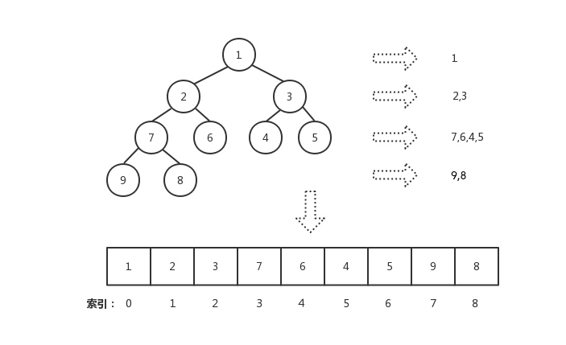

## 1.2 性质

**堆的实现通过构造二叉堆**（binary heap），实为二叉树的一种；由于其应用的普遍性，当不加限定时，均指该数据结构的这种实现。这种数据结构具有以下性质。

- 任意节点小于（或大于）它的所有后裔，最小元（或最大元）在堆的根上（堆序性）。
- **堆总是一棵完全树**。即除了最底层，其他层的节点都被元素填满，且最**底层尽可能地从左到右填入**。

将根节点，**最大的堆叫做最大堆或大根堆，根节点最小的堆叫做最小堆或小根堆。**常见的堆有二叉堆、斐波那契堆等。

- 大顶堆：所有节点大于或等于其子节点

  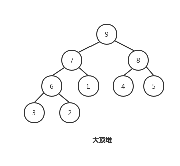

- 小顶堆：所有节点大于或小于其子节点

  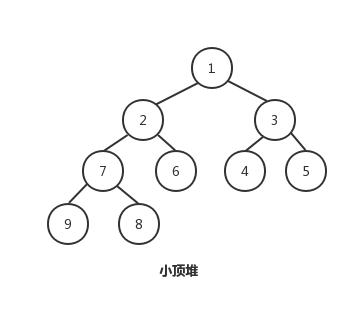

n个结点的堆，高度d=log n。根为第0层，则第i层结点个数为2^i，考虑一个元素在堆中向下移动的距离，这种算法时间代价为Ο（n)

由于堆有层深，插入结点、删除普通元素和删除最小元素的平均**时间代价和时间复杂度都是o(log n)**。

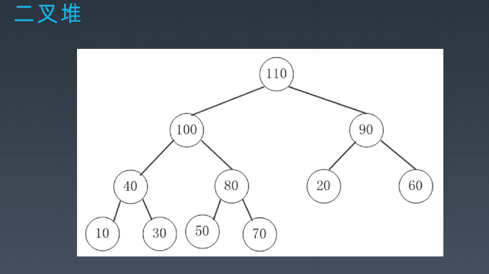

## 1.3 堆的常见操作

堆支持的基本操作：

|  操作   |             描述             | 时间复杂度 |
| :-----: | :--------------------------: | :--------: |
|  build  |         创建一个空堆         |    o(n)    |
| insert  |     向堆中插入一个新元素     |  o(logN)   |
| update  | 将新元素提升使其符合堆的性质 |            |
|   get   |     获取当前堆顶元素的值     |    o(1)    |
| delete  |         删除堆顶元素         |  o(logN)   |
| heapify | 使删除堆顶元素的堆再次成为堆 |            |

某些堆实现还支持其他的一些操作，如**斐波那契堆支持检查一个堆中是否存在某个元素**。

常见操作：

- 基本的

  - **find-max（或find-min）：分别找到max-heap的最大项或min-heap的最小项（又名peek）**
  - insert：向堆中添加新密钥（又名*push*）
  - extract-max*（或*extract-min*）：从堆中移除最大值后返回最大堆的节点（或最小堆中的最小值）（又名*pop）
  - delete-max（或*delete-min*）：分别删除最大堆（或最小堆）的根节点
  - replace：弹出根目录并按下新键。比弹出后弹出更有效，因为只需要平衡一次，而不需要平衡两次，并且适合于固定大小的堆。

- 创建

  - create-heap：创建一个空堆
  - *heapify*：根据给定的元素数组创建堆
  - *merge*（*union*）：*合并*两个堆以形成一个有效的新堆，其中包含两个堆的所有元素，并保留原始堆。
  - 融合：将*两个堆*合并以形成一个有效的新堆，其中包含两个堆的所有元素，从而破坏原始堆。

- 检查

  - *size*：返回堆中的项目数。
  - *is-empty*：如果堆为空，则返回true，否则返回false。

- 内部

  - 增加键 或 减少键：分别在最大或最小堆内更新密钥
  - delete：删除任意节点（随后移动最后一个节点并进行筛选以维护堆）
  - 上移：根据需要*向上*移动树中的节点；用于在插入后恢复堆条件。
  - 下移：将节点在树中下移，类似于上移；用于在删除或替换后恢复堆条件。

## 1.4 二叉堆的实现细节

1. 二叉堆一般都是通过数组实现
2. 假设 第一个元素在数组中的索引为0的话，则父节点和子节点的位置关系如下“
   - 索引为 i 的左孩子的索引是(2 * i + 1)；
   - 索引为 i 的右孩子的索引是(2 * i + 2);
   - 索引为 i 的父节点的索引是floor((i - 1) / 2);

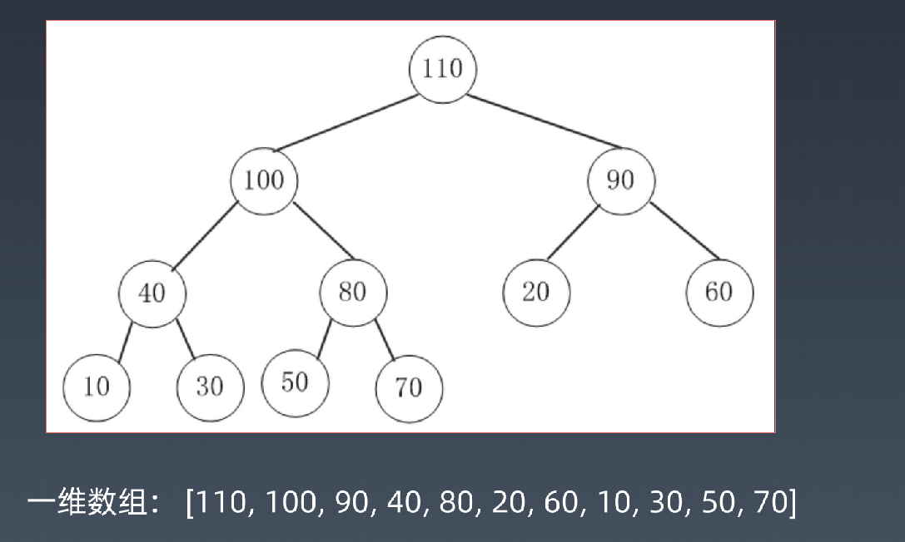

解析：

1. 0 根节点（顶堆元素）是：a[0]
2. 索引为 i 的左孩子的索引是(2 * i + 1)；
3. 索引为 i 的右孩子的索引是(2 * i + 2);
4. 索引为 i 的父节点的索引是floor((i - 1) / 2);

# 2. JAVA实现堆的数据结构

堆就是用数组实现的二叉树，所有它没有使用父指针或者子指针。堆根据“堆属性”来排序，“堆属性”决定了树中节点的位置。

堆的常用方法：

- 构建优先队列
- 支持堆排序
- 快速找出一个集合中的最小值（或者最大值）

**注：这里以小顶堆为例**

## 2.1 定义堆结构

- size : 树节点个数
- nodes : 节点值集合

```java
public class MyArrayHeap<T> {    
    private static final int d = 2; // 定义默认值 2 
    private int[] heap; // 堆数组实现
    private int heapSize; // 堆容量

}
```


## 2.2 插入（insert）

简述插入流程：

1. 将新节点添加到树的末尾，即数组的末尾
2. 再将插入的节点与其父节点做对比，如果父节点大于插入的节点，则交换二者的位置，直到插入的节点比父节点小为止

添加节点流程图：   

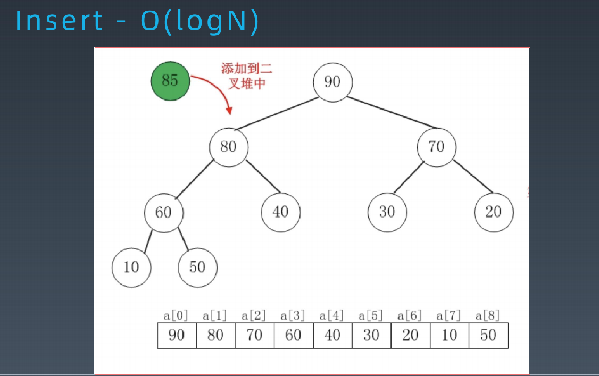

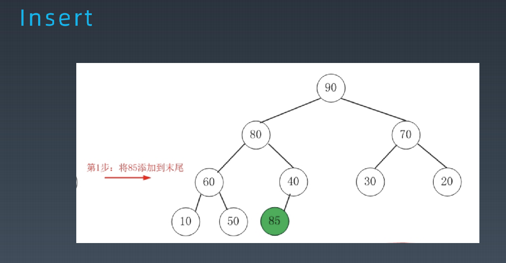

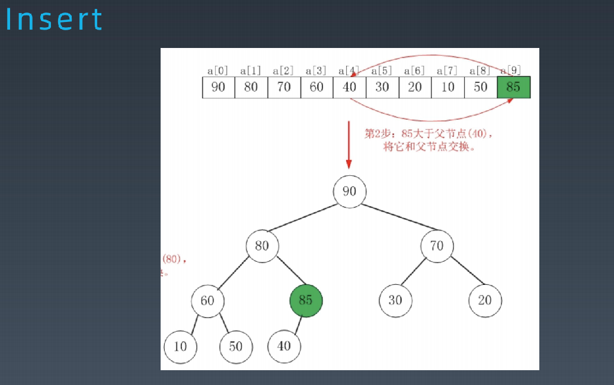

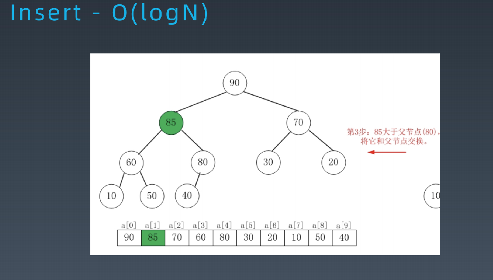


## 2.3 删除（delete）

简述删除流程：

1. 将堆尾元素替换到顶部（即对顶被替代删除掉）
2. 一次从根部向下调整整个堆结构（一直到堆尾即可）

删除节点的流程图

1. 将90删除

   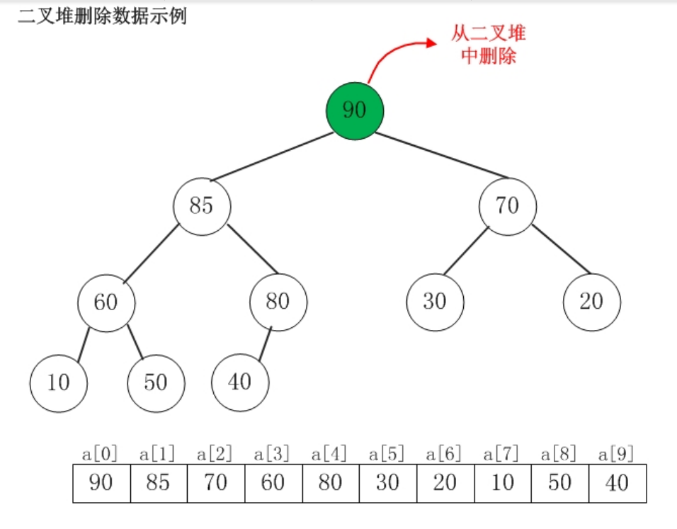

   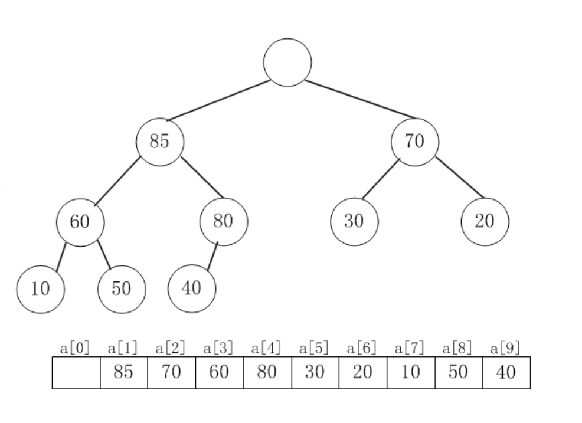

2. 用末尾元素替换被删除的数据

   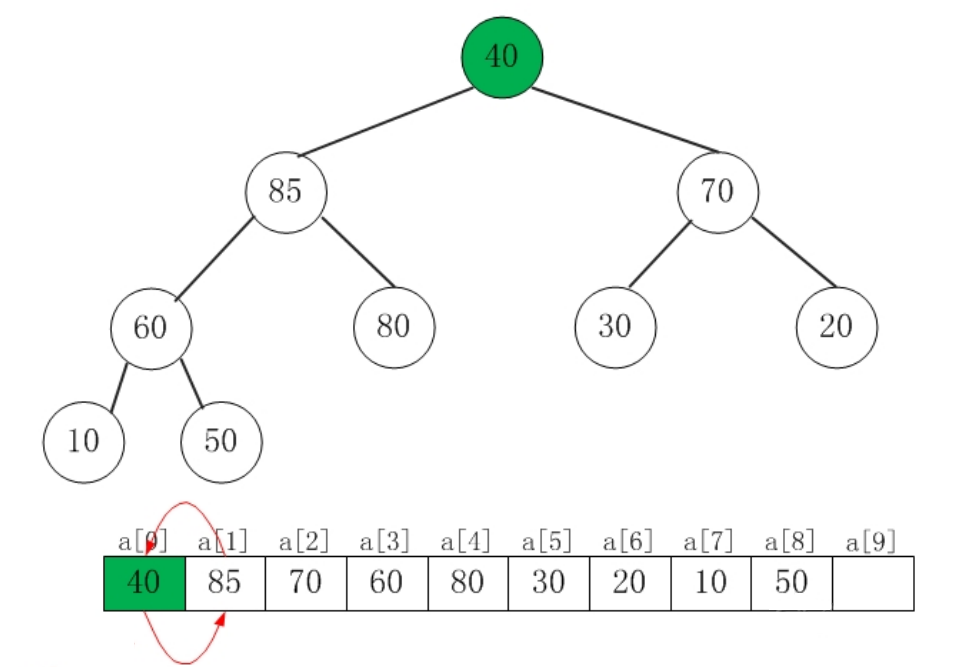

3. 40小于子节点，选取较大的子节点和它交换

   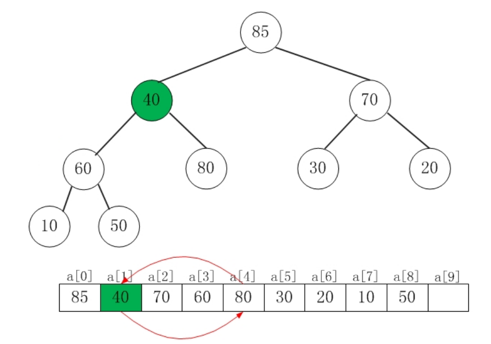

4. 40小于子节点，选取较大的子节点和它交换

   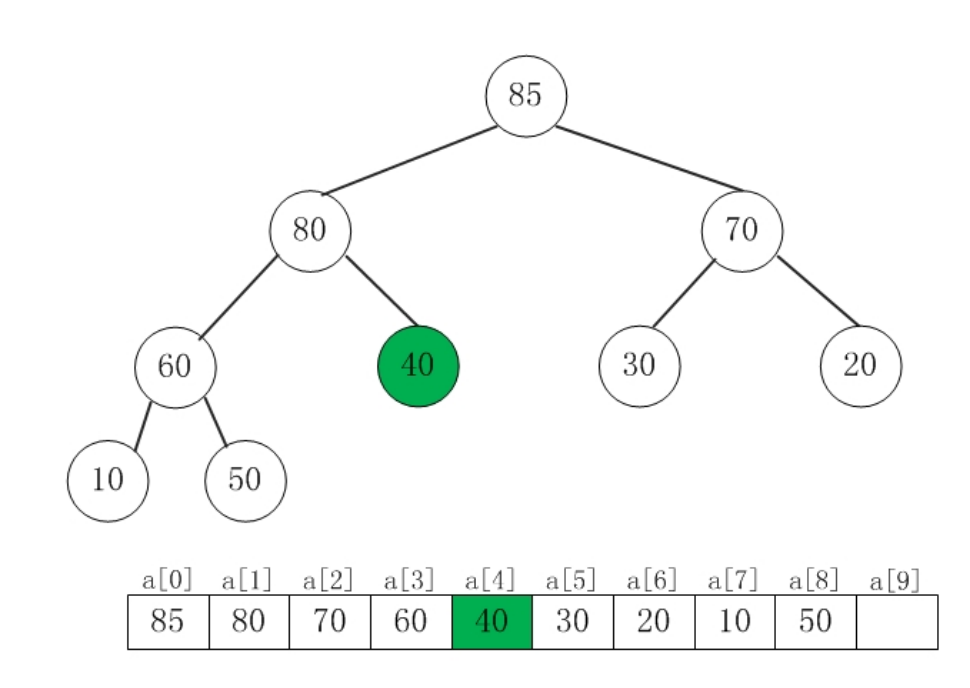


## 2.4 完整代码实现

```java
// Java

import java.util.Arrays;
import java.util.NoSuchElementException;


public class BinaryHeap {


    private static final int d = 2;
    private int[] heap;
    private int heapSize;


    /**
     * This will initialize our heap with default size.
     */
    public BinaryHeap(int capacity) {
        heapSize = 0;
        heap = new int[capacity + 1];
        Arrays.fill(heap, -1);
    }


    public boolean isEmpty() {
        return heapSize == 0;
    }


    public boolean isFull() {
        return heapSize == heap.length;
    }


    private int parent(int i) {
        return (i - 1) / d;
    }


    private int kthChild(int i, int k) {
        return d * i + k;
    }


    /**
     * Inserts new element in to heap
     * Complexity: O(log N)
     * As worst case scenario, we need to traverse till the root
     */
    public void insert(int x) {
        if (isFull()) {
            throw new NoSuchElementException("Heap is full, No space to insert new element");
        }
        heap[heapSize] = x;
        heapSize ++;
        heapifyUp(heapSize - 1);
    }


    /**
     * Deletes element at index x
     * Complexity: O(log N)
     */
    public int delete(int x) {
        if (isEmpty()) {
            throw new NoSuchElementException("Heap is empty, No element to delete");
        }
        int maxElement = heap[x];
        heap[x] = heap[heapSize - 1];
        heapSize--;
        heapifyDown(x);
        return maxElement;
    }


    /**
     * Maintains the heap property while inserting an element.
     */
    private void heapifyUp(int i) {
        int insertValue = heap[i];
        while (i > 0 && insertValue > heap[parent(i)]) {
            heap[i] = heap[parent(i)];
            i = parent(i);
        }
        heap[i] = insertValue;
    }


    /**
     * Maintains the heap property while deleting an element.
     */
    private void heapifyDown(int i) {
        int child;
        int temp = heap[i];
        while (kthChild(i, 1) < heapSize) {
            child = maxChild(i);
            if (temp >= heap[child]) {
                break;
            }
            heap[i] = heap[child];
            i = child;
        }
        heap[i] = temp;
    }


    private int maxChild(int i) {
        int leftChild = kthChild(i, 1);
        int rightChild = kthChild(i, 2);
        return heap[leftChild] > heap[rightChild] ? leftChild : rightChild;
    }


    /**
     * Prints all elements of the heap
     */
    public void printHeap() {
        System.out.print("nHeap = ");
        for (int i = 0; i < heapSize; i++)
            System.out.print(heap[i] + " ");
        System.out.println();
    }


    /**
     * This method returns the max element of the heap.
     * complexity: O(1)
     */
    public int findMax() {
        if (isEmpty())
            throw new NoSuchElementException("Heap is empty.");
        return heap[0];
    }


    public static void main(String[] args) {
        BinaryHeap maxHeap = new BinaryHeap(10);
        maxHeap.insert(10);
        maxHeap.insert(4);
        maxHeap.insert(9);
        maxHeap.insert(1);
        maxHeap.insert(7);
        maxHeap.insert(5);
        maxHeap.insert(3);


        maxHeap.printHeap();
        maxHeap.delete(5);
        maxHeap.printHeap();
        maxHeap.delete(2);
        maxHeap.printHeap();
    }
}
```


# 3. 实战例题

1. https://leetcode-cn.com/problems/zui-xiao-de-kge-shu-lcof/
2. https://leetcode-cn.com/problems/sliding-window-maximum/
3. https://leetcode-cn.com/problems/top-k-frequent-elements/

homework

1. 自学：https://www.geeksforgeeks.org/heap-sort/
2. https://leetcode-cn.com/problems/chou-shu-lcof/
3. https://leetcode-cn.com/problems/top-k-frequent-elements/