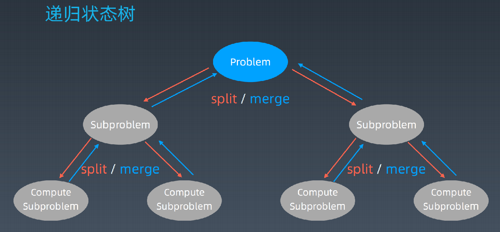
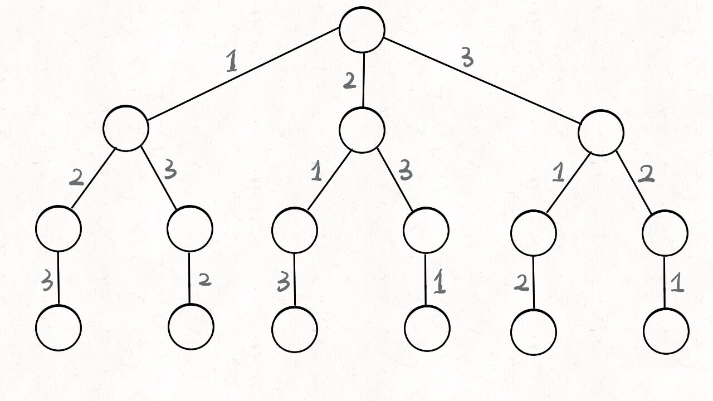

# 1. 分治的概念

在计算机科学中，**分治法**是建基于**多项分支递归**的一种很**重要的算法范式**。字面上的解释是“分而治之”，就是把一个复杂的问题分成两个或更多的相同或相似的子问题，直到最后子问题可以简单的直接求解，原问题的解即子问题的解的合并。

这个技巧是很多高效算法的基础，如[排序算法](https://zh.wikipedia.org/wiki/排序算法)（[归并排序](https://zh.wikipedia.org/wiki/归并排序)、[快速排序](https://zh.wikipedia.org/wiki/快速排序)）、[傅立叶变换](https://zh.wikipedia.org/wiki/傅立叶变换)（[快速傅立叶变换](https://zh.wikipedia.org/wiki/快速傅立叶变换)）。

分治算法通常以数学归纳法来验证。而它的计算成本则多数以解递归关系式来判定。

 任何一个可以用计算机求解的问题所需的计算时间都与其规模有关。问题的规模越小，越容易直接求解，解题所需的计算时间也越少。例如，对于n个元素的排序问题，当n=1时，不需任何计算。n=2时，只要作一次比较即可排好序。n=3时只要作3次比较即可，…。而当n较大时，问题就不那么容易处理了。要想直接解决一个规模较大的问题，有时是相当困难的。

# 2. 分治适用的情况

分治算法是一个**解决复杂问题的好工具**，它可以**把问题分解成若干个子问题**，把子问题**逐个解决**，再**组合到一起形成大问题的答案**。比如，汉诺塔问题如果采用分治算法，可以把高度为n的塔的问题转换成高度为n-1的塔来解决，如此重复，直至问题化简到可以很容易的处理为止。

分治法所能解决的问题一般**具有以下几个特征**：

1. 该问题的规模缩小到一定的程度就可以容易地解决

   > 此特征是绝大多数问题都可以满足的，因为问题的计算复杂性一般是随着问题规模的增加而增加；

2. 该问题可以分解为若干个规模较小的相同问题，即该问题具有最优子结构性质。

   > 此特征是应用分治法的前提它也是大多数问题可以满足的，此特征反映了递归思想的应用；

3. 利用该问题分解出的子问题的解可以合并为该问题的解；

   > 此特征是关键，能否利用分治法完全取决于问题是否具有第三条特征，如果具备了第一条和第二条特征，而不具备第三条特征，则可以考虑用贪心法或动态规划法。

4. 该问题所分解出的各个子问题是相互独立的，即子问题之间不包含公共的子子问题。

   > 此特征涉及到分治法的效率，如果各子问题是不独立的则分治法要做许多不必要的工作，重复地解公共的子问题，此时虽然可用分治法，但一般用动态规划法较好。

# 3. 实现分治

实现分治：在每一层递归上都有三个步骤：

1. 分解：将原问题分解为若干个规模较小，相对独立，与原问题形式相同的子问题。
2. 解决：若子问题规模较小且易于解决时，则直接解。否则，递归地解决各子问题。
3. 合并：将各子问题的解合并为原问题的解。

分治代码模板：

```python
def divide_conquer(problem, param1, param2, ...): 
  # recursion terminator 
  if problem is None: 
	print_result 
	return 

  # prepare data 
  data = prepare_data(problem) 
  subproblems = split_problem(problem, data) 

  # conquer subproblems 
  subresult1 = self.divide_conquer(subproblems[0], p1, ...) 
  subresult2 = self.divide_conquer(subproblems[1], p1, ...) 
  subresult3 = self.divide_conquer(subproblems[2], p1, ...) 
  …

  # process and generate the final result 
  result = process_result(subresult1, subresult2, subresult3, …)
	
  # revert the current level states
```

递归状态树

说明：

- split：切割
- merge：合并



# 4. 分治练习题

# 5.分治法总结

依据分治法设计程序时的思维过程：

实际上就是类似于数学归纳法，找到解决本问题的求解方程公式，然后根据方程公式设计递归程序。

1. 一定是先找到最小问题规模时的求解方法
2. 然后考虑随着问题规模增大时的求解方法
3. 找到求解的递归函数式后（各种规模或因子），设计递归程序即可。

# 6. 回溯的概念

**回溯法**（英语：backtracking）是[暴力搜索法](https://zh.wikipedia.org/wiki/暴力搜尋法)中的一种。

对于某些计算问题而言，回溯法是一种可以找出所有（或一部分）解的一般性算法，尤其适用于[约束补偿问题](https://zh.wikipedia.org/wiki/约束补偿问题)（在解决约束满足问题时，我们逐步构造更多的候选解，并且在确定某一部分候选解不可能补全成正确解之后放弃继续搜索这个部分候选解本身及其可以拓展出的子候选解，转而测试其他的部分候选解）。

在经典的教科书中，**[八皇后问题](https://zh.wikipedia.org/wiki/八皇后问题)**展示了回溯法的用例。（八皇后问题是在标准国际象棋棋盘中寻找八个皇后的所有分布，使得没有一个皇后能攻击到另外一个。）

回溯法**采用试错的思想**，它尝试分步的去解决一个问题。在分步解决问题的过程中，当它通过尝试发现现有的分步答案不能得到有效的正确的解答的时候，它将取消上一步甚至是上几步的计算，再通过其它的可能的分步解答再次尝试寻找问题的答案。**回溯法通常用最简单的递归方法来实现**，在反复重复上述的步骤后**可能出现两种情况**：

- 找到一个可能存在的正确的答案
- 在尝试了所有可能的分步方法后宣告该问题没有答案

在最坏的情况下，回溯法会导致一次[复杂度](https://zh.wikipedia.org/wiki/计算复杂性理论)为[指数时间](https://zh.wikipedia.org/wiki/指數時間)的计算。

# 7. 回溯的实现

**解决一个回溯问题，实际上就是一个决策树的遍历过程**。你只需要思考 3 个问题：

1. 路径：也就是已经做出的选择。
2. 选择列表：也就是你当前可以做的选择。
3. 结束条件：也就是到达决策树底层，无法再做选择的条件。

回溯代码模板：

```python
result = []
def backtrack(路径, 选择列表):
    if 满足结束条件:
        result.add(路径)
        return

    for 选择 in 选择列表:
        做选择
        backtrack(路径, 选择列表)
        撤销选择
```

**其核心就是 for 循环里面的递归，在递归调用之前「做选择」，在递归调用之后「撤销选择」**，特别简单。

什么叫做选择和撤销选择呢，这个框架的底层原理是什么呢？下面我们就通过「全排列」这个问题来解开之前的疑惑，详细探究一下其中的奥妙！

## 7.1 全排列问题

问题：给定一个 **没有重复** 数字的序列，返回其所有可能的全排列。

示例：

```text
输入: [1,2,3]
输出:
[
  [1,2,3],
  [1,3,2],
  [2,1,3],
  [2,3,1],
  [3,1,2],
  [3,2,1]
]
```

来源：https://leetcode-cn.com/problems/permutations/

分析：

1. 我们在高中的时候就做过排列组合的数学题，我们也知道 `n` 个不重复的数，全排列共有 n! 个。

   那么，如何穷举全排列呢？比方说给三个数 `[1,2,3]`

   答案：先固定第一位为 1，然后第二位可以是 2，那么第三位只能是 3；然后可以把第二位变成 3，第三位就只能是 2 了；然后就只能变化第一位，变成 2，然后再穷举后两位……

   **而这就是回溯算法**，可以根据上述分析画出如下**决策树**，如下：

   

   **只要从根遍历这棵树，记录路径上的数字，其实就是所有的全排列**，为啥说这是决策树呢，因为你在每个节点上其实都在做决策。

2. 再进一步，如何遍历一棵树？

   大多数树的遍历都是 `前/中/后` 序遍历，前序遍历的代码在进入某一个节点之前的那个时间点执行，后序遍历代码在离开某个节点之后的那个时间点执行。那么，**我们只要在递归之前做出选择，在递归之后撤销刚才的选择，就能正确得到每个节点的选择列表和路径。**

   代码实现：

   ```java
   class Solution {
       public List<List<Integer>> permute(int[] nums) {
           int len = nums.length;
           List<List<Integer>> res = new ArrayList<>();
           // 如果输入长度为0，则返回空列表
           if (len == 0){
               return res;
           }
           // 从根节点到任意节点的列表
           Deque<Integer> path = new ArrayDeque<>();
           // 实例化boolean数组
           boolean[] used = new boolean[len];
           // 深度优先搜索
           dfs(nums,len,0,path,used,res);
           return res;
       }
   
       /**
        *
        * @param nums 原数组
        * @param len 数组长度
        * @param depth 当前已经选择了几个数，初始化为0
        * @param path 从根节点到任意节点的列表，使用栈来实现
        * @param used boolean数组，保存了当前数是否被选择
        * @param res 存储结果集
        */
       private void dfs(int[] nums, int len, int depth, Deque<Integer> path, boolean[] used, List<List<Integer>> res) {
           // 递归终止条件：当前递归的层数等于数组的长度的时候，此时所有的元素就已经考虑完毕了
           if (depth == len){
               // 注意：path这个变量我们全程只使用一份
               // 在深度优先遍历完成之后path应该回到根节点，path成为一个空列表，此处应该添加数组的拷贝，防止出现很多空列表
               res.add(new ArrayList<>(path));
               return;
           }
           for (int i = 0; i < len; i++) {
               // 判断当前元素是否已被选择过
               if (used[i]){
                   // 如果已经选择过，则跳过
                   continue;
               }
               // 将未被选择过的元素添加到栈尾
               path.addLast(nums[i]);
               // 将此元素标记为已使用
               used[i] = true;
   
               dfs(nums,len,depth+1,path,used,res);
   
               // 回到上一层节点：回溯
               // 之前做了什么，就要做相应的逆操作
               path.removeLast();
               used[i] = false;
           }
       }
   }
   ```

## 7.2 N 皇后问题

题目：N 皇后

来源：https://leetcode-cn.com/problems/n-queens/

题目说明：n 皇后问题研究的是如何将 *n* 个皇后放置在 *n*×*n* 的棋盘上，并且使皇后彼此之间不能相互攻击

**示例：**

给定一个整数 n，返回所有不同的 n 皇后问题的解决方案。

每一种解法包含一个明确的 n 皇后问题的棋子放置方案，该方案中 'Q' 和 '.' 分别代表了皇后和空位。

```text
输入：4
输出：[
 [".Q..",  // 解法 1
  "...Q",
  "Q...",
  "..Q."],

 ["..Q.",  // 解法 2
  "Q...",
  "...Q",
  ".Q.."]
]
解释: 4 皇后问题存在两个不同的解法。
```

提示：皇后彼此不能相互攻击，也就是说：任何两个皇后都不能处于同一条横行、纵行或斜线上。

代码实现

```java
import java.util.ArrayDeque;
import java.util.ArrayList;
import java.util.Deque;
import java.util.List;

public class Solution {

    private int n;
    // 记录某一列是否放置了皇后
    private boolean[] col;
    // 记录主对角线上的单元格是否放置了皇后
    private boolean[] sub;
    // 记录了副对角线上的单元格是否放置了皇后
    private boolean[] main;
    private List<List<String>> res;

    public List<List<String>> solveNQueens(int n) {
        res = new ArrayList<>();
        if (n == 0) {
            return res;
        }

        // 设置成员变量，减少参数传递，具体作为方法参数还是作为成员变量，请参考团队开发规范
        this.n = n;
        this.col = new boolean[n];
        this.sub = new boolean[2 * n - 1];
        this.main = new boolean[2 * n - 1];
        Deque<Integer> path = new ArrayDeque<>();
        dfs(0, path);
        return res;
    }

    private void dfs(int row, Deque<Integer> path) {
        if (row == n) {
            // 深度优先遍历到下标为 n，表示 [0.. n - 1] 已经填完，得到了一个结果
            List<String> board = convert2board(path);
            res.add(board);
            return;
        }

        // 针对下标为 row 的每一列，尝试是否可以放置
        for (int j = 0; j < n; j++) {
            if (!col[j] && !sub[row + j] && !main[row - j + n - 1]) {
                path.addLast(j);
                col[j] = true;
                sub[row + j] = true;
                main[row - j + n - 1] = true;

                dfs(row + 1, path);

                main[row - j + n - 1] = false;
                sub[row + j] = false;
                col[j] = false;
                path.removeLast();
            }
        }
    }

    private List<String> convert2board(Deque<Integer> path) {
        List<String> board = new ArrayList<>();
        for (Integer num : path) {
            StringBuilder row = new StringBuilder();
            row.append(".".repeat(Math.max(0, n)));
            row.replace(num, num + 1, "Q");
            board.add(row.toString());
        }
        return board;
    }
}
```


# 8. 回溯练习题

说明：以下题目来自leetcode

## 8.1 题型一：排列、组合、子集相关问题

提示：这部分练习可以帮助我们熟悉「回溯算法」的一些概念和通用的解题思路。解题的步骤是：先画图，再编码。去思考可以剪枝的条件， 为什么有的时候用 used 数组，有的时候设置搜索起点 begin 变量，理解状态变量设计的想法。

- 46.全排列（中等）
- 47.全排列 II（中等）：思考为什么造成了重复，如何在搜索之前就判断这一支会产生重复；
- 39.组合总和（中等）\
- 40.组合总和 II（中等）
- 77.组合（中等）
- 78.子集（中等）
- 90.子集 II（中等）：剪枝技巧同 47 题、39 题、40 题；
- 60.第 k 个排列（中等）：利用了剪枝的思想，减去了大量枝叶，直接来到需要的叶子结点；
- 93.复原 IP 地址（中等）

## 8.2 题型二：Flood Fill

提示：Flood 是「洪水」的意思，Flood Fill 直译是「泛洪填充」的意思，体现了洪水能够从一点开始，迅速填满当前位置附近的地势低的区域。类似的应用还有：PS 软件中的「点一下把这一片区域的颜色都替换掉」，扫雷游戏「点一下打开一大片没有雷的区域」。

下面这几个问题，思想不难，但是初学的时候代码很不容易写对，并且也很难调试。我们的建议是多写几遍，忘记了就再写一次，参考规范的编写实现（设置 visited 数组，设置方向数组，抽取私有方法），把代码写对。

- 733.图像渲染（Flood Fill，中等）
- 200.岛屿数量（中等）
- 130.被围绕的区域（中等）
- 79.单词搜索（中等）

说明：以上问题都不建议修改输入数据，设置 visited 数组是标准的做法。可能会遇到参数很多，是不是都可以写成成员变量的问题，面试中拿不准的记得问一下面试官

## 8.3 题型三：字符串中的回溯问题

提示：字符串的问题的特殊之处在于，字符串的拼接生成新对象，因此在这一类问题上没有显示「回溯」的过程，但是如果使用 StringBuilder 拼接字符串就另当别论。
在这里把它们单独作为一个题型，是希望朋友们能够注意到这个非常细节的地方。

- 17.电话号码的字母组合（中等），题解；
- 784.字母大小写全排列（中等）；
- 22.括号生成（中等） ：这道题广度优先遍历也很好写，可以通过这个问题理解一下为什么回溯算法都是深度优先遍历，并且都用递归来写。

## 8.4 题型四：游戏问题

回溯算法是早期简单的人工智能，有些教程把回溯叫做暴力搜索，但回溯没有那么暴力，回溯是有方向地搜索。「力扣」上有一些简单的游戏类问题，解决它们有一定的难度，大家可以尝试一下。

- 51.N 皇后（困难）：其实就是全排列问题，注意设计清楚状态变量，在遍历的时候需要记住一些信息，空间换时间；
- 37.解数独（困难）：思路同「N 皇后问题」；
- 488.祖玛游戏（困难）
- 529.扫雷游戏（困难）
