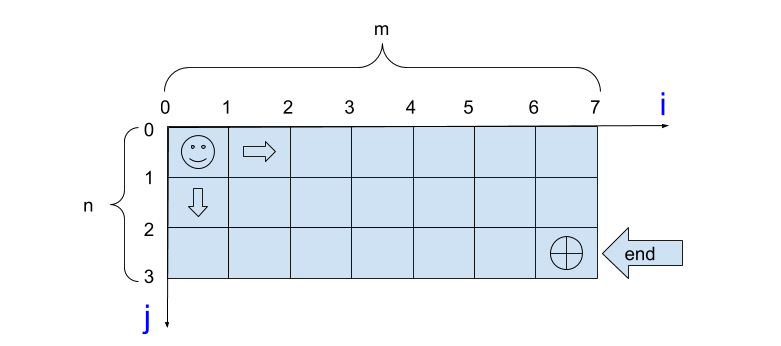
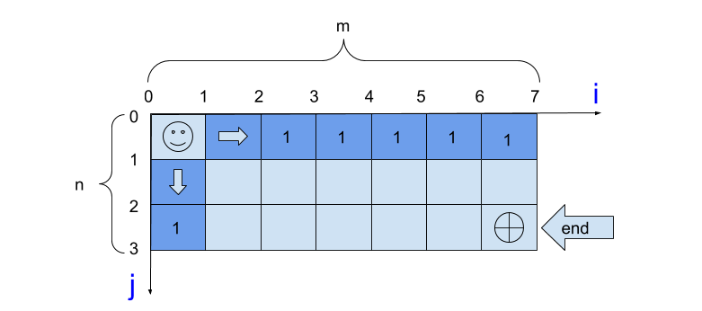
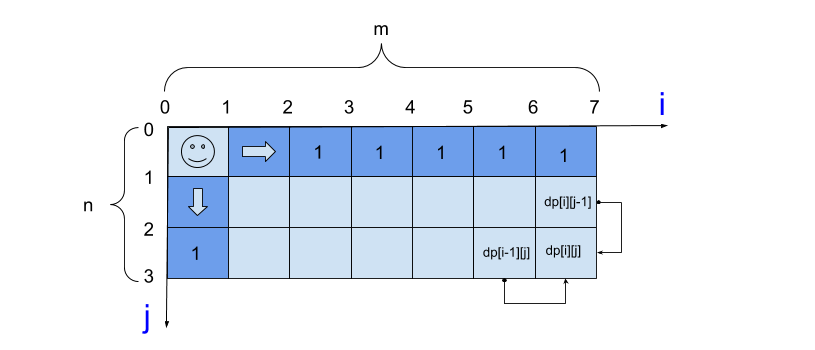
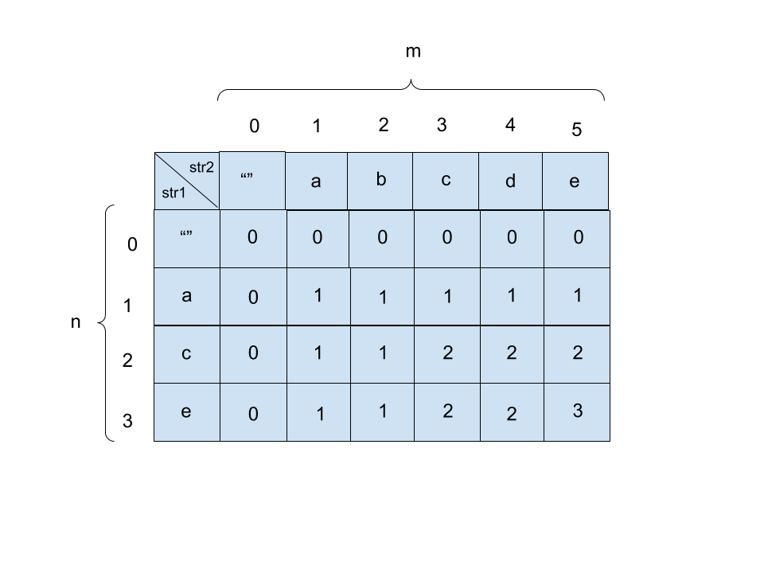
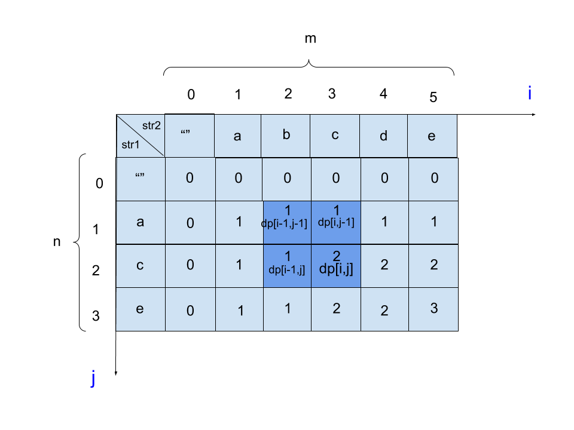

# 1. 动态规划的概念

- 动态规划（英语：Dynamic programming，简称DP）是一种在数学、管理科学、计算机科学、经济学和生物信息学中使用的，通过把原问题分解为相对简单的子问题的方式求解复杂问题的方法。
- 动态规划常常**适用**于 **有重叠子问题** 和最 **优子结构性质** 的问题，动态规划方法所耗时间往往远少于朴素解法。
- 它是指**通过以递归的方式将其分解为更简单的子问题来简化复杂的问题**。虽然无法以这种方式解决某些决策问题，但跨越多个时间点的决策通常会递归拆分。同样，**在计算机科学中，如果可以通过将问题分解为子问题然后递归地找到子问题的最优解来最佳地解决问题，则可以说它具有最优子结构。**
- 动态规划在查找有很多**重叠子问题**的情况的最优解时有效。它将问题重新组合成子问题。为了避免多次解决这些子问题，它们的结果都逐渐被计算并被保存，从简单的问题直到整个问题都被解决。因此，动态规划保存递归时的结果，因而不会在解决同样的问题时花费时间。
- 动态规划只能应用于有**最优子结构**的问题。最优子结构的意思是局部最优解能决定全局最优解（对有些问题这个要求并不能完全满足，故有时需要引入一定的近似）。简单地说，问题能够分解成子问题来解决。

概念关键点：

- 动态规划 和 递归或者分治 没有根本上的区别（关键看有无最优的子结构） 
- 共性：找到重复子问题
- 差异性：最优子结构、中途可以淘汰次优解

动态规划代码关键点：

1. 最优子结构` opt[n] = best_of(opt[n-1], opt[n-2], …)`

2. 储存中间状态：`opt[i]`

3. 递推公式（美其名曰：状态转移方程或者 DP 方程） 

   ```java
   Fib: opt[i] = opt[n-1] + opt[n-2] 
   ```

   二维路径：`opt[i,j] = opt[i+1][j] + opt[i][j+1] `(且判断`a[i,j]`是否空地）

# 2. 适用性

1. 最优子结构性质。如果问题的最优解所包含的子问题的解也是最优的，我们就称该问题具有最优子结构性质（即满足最优化原理）。最优子结构性质为动态规划算法解决问题提供了重要线索。
2. 无后效性。即子问题的解一旦确定，就不再改变，不受在这之后、包含它的更大的问题的求解决策影响。
3. 子问题重叠性质。子问题重叠性质是指在用递归算法自顶向下对问题进行求解时，每次产生的子问题并不总是新问题，有些子问题会被重复计算多次。动态规划算法正是利用了这种子问题的重叠性质，对每一个子问题只计算一次，然后将其计算结果保存在一个表格中，当再次需要计算已经计算过的子问题时，只是在表格中简单地查看一下结果，从而获得较高的效率，降低了时间复杂度。

# 3. 斐波那契数列案例分析

题目：[爬楼梯](https://leetcode-cn.com/problems/climbing-stairs/)

在斐波那契数列的第n个成员的计算中使用动态编程可以大大提高其性能。这是一个简单的实现，直接基于数学定义：

```java
public int climbStairs(int n) {
    // 原始递归，时间复杂度O(2^n)
    return fib(n);
}

public int fib(int n){
    if(n <= 2) return n;
    return fib(n-1) + fib(n-2);
}
```

请注意，如果我们调用，`fib(5)`我们将生成一个调用树，该调用树在相同值上多次调用该函数：

1. `fib(5)`
2. `fib(4) + fib(3)`
3. `(fib(3) + fib(2)) + (fib(2) + fib(1))`
4. `((fib(2) + fib(1)) + (fib(1) + fib(0))) + ((fib(1) + fib(0)) + fib(1))`
5. `(((fib(1) + fib(0)) + fib(1)) + (fib(1) + fib(0))) + ((fib(1) + fib(0)) + fib(1))`

特别`fib(2)`是从头算起了三遍。在较大的示例中，将重新计算`fib`或子问题的更多值，从而得出指数时间算法。

现在，假设我们有一个简单的存储结果的数组memo，该数组对象将`fib`已经计算出的每个值存储，然后我们修改函数以使用它并对其进行更新。

```java
public int climbStairs(int n) {
    // 递归+记忆化搜索，时间复杂度O(n)，空间复杂度O(1)
    int[] memo = new int[n+1];
    return fib(n,memo);
}
public int fib(int n, int[] memo){
    if(n <= 2) return n;
    // 如果memo[n] 等于0，则证明当前数没有被计算过
    if(memo[n] == 0){
        memo[n] = fib(n - 1,memo) + fib(n - 2,memo);
    }
    // 不等于0的情况下，意味着这个数被计算过了，不需要重复计算了直接从数组中那就可以了
    return memo[n];
}
```

**这种保存已经计算出的值的技术称为记忆**。这是自顶向下的方法，因为我们首先将问题分解为子问题，然后计算并存储值。


最终解法：

```java
public int climbStairs(int n) {
    // 最终优化，非递归。时间复杂度O(n)
    int[] res = new int[n+1];
    return fib(n,res);
}
public int fib(int n, int[] res){
    // 传入1时，会报错，使用如下代码纠正
    if(n <= 2) return n;
    
    res[1] = 1;
    res[2] = 2;
    for(int i = 3; i <= n; i++){
        res[i] = res[i - 1] + res[i - 2];
    }
    return res[n];
}
```

# 4. 不同路径案例

题目：[不同路径](https://leetcode-cn.com/problems/unique-paths/)

一个机器人位于一个 m x n 网格的左上角 （起始点在下图中标记为“Start” ）。

机器人每次只能向下或者向右移动一步。机器人试图达到网格的右下角（在下图中标记为“Finish”）。

问总共有多少条不同的路径？


图解：

根据题目可制作如下图：



- 根据题目进行理解，可以把整个网格当作二维数组，那么需要从网格左上角走到右下角，且每次只能**向下**或者**向右**移动一步次

- 由于从`i=0，j=0`的位置出发，每次只能向下或者向右移动一步，因此在所有坐标为`（0，j）`的位置机器人要到达的话只有一条路径**（一直向下）**；在所有`（i，0）`的位置，机器人想要到达也只有一条路径**（一直向右）**。

  - 我们假设 `dp[i][j]` 是到达 `i, j` 最多路径

  - 注意，对于第一行 `dp[0][j]`，或者第一列 `dp[i][0]`，由于都是在边界，所以最多路径为1

  如下图

  

  

- 那么，要到达任一位置`(i,j)`的总路径条数，总是等于「 位置`(i-1,j)`的路径条数」 **加上 **「位置`(i，j-1)`的路径条数」。

  > 没理解`(i-1,j)`与`(i,j-1)`？没关系，这里我们告诉你：
  >
  > 已知机器人只能向右或者向下走一步，那么，对于每一个选项都只有两个选择，要么向右要么向下，假设你要求得机器人到达坐标`(i,j)`位置的路径总数，就等于终点`(i,j)`的上一个坐标`(i,j-1)`路径总数加往左一个格子坐标`(i-1，j)`的路径总数

  如下图：

  

- 所以，可以得出dp方程式为：`dp[i][j] = dp[i-1][j] + dp[i][j-1]`

- 时空复杂度：
  - 时间复杂度：O(m * n)
  - 空间复杂度：O(m * n)

```java
class Solution {
    public int uniquePaths(int m, int n) {
        int[][] dp = new int[m][n];

        // 初始化一行和一列为1
        /**
            如下：
            [1, 1, 1, 1, 1, 1, 1]
            [1, 0, 0, 0, 0, 0, 0]
            [1, 0, 0, 0, 0, 0, 0]

        **/
        for(int i = 0; i < n; ++i) dp[0][i] = 1;
        for(int i = 0; i < m; ++i) dp[i][0] = 1;

        for(int i = 1; i < m; ++i){
            for(int j = 1; j < n; ++j){                
                // 状态转移方程
                dp[i][j] = dp[i-1][j] + dp[i][j-1];
            }
        }

        return dp[m-1][n-1];
    }
}
```

上述代码可以被优化：

- `Arrays.fill(a1,value)`方法说明：
  注：a1是一个数组变量，value是一个a1中元素数据类型的值，作用：填充a1数组中的每个元素都是value
- 此时空间复杂度为：O(2n)

```java
class Solution {
    public int uniquePaths(int m, int n) {
        int[] pre = new int[n];
        int[] cur = new int[n];
        Arrays.fill(pre, 1);
        Arrays.fill(cur,1);
        for (int i = 1; i < m;i++){
            for (int j = 1; j < n; j++){
                cur[j] = cur[j-1] + pre[j];
            }
            pre = cur.clone();
        }
        return pre[n-1]; 
    }
}
```

继续优化：

```java
class Solution {
    public int uniquePaths(int m, int n) {
        int[] cur = new int[n];
        Arrays.fill(cur,1);
        for (int i = 1; i < m;i++){
            for (int j = 1; j < n; j++){
                cur[j] += cur[j-1] ;
            }
        }
        return cur[n-1];
    }
}
```


# 5. 最长公共子序列

题目：[最长公共子序列](https://leetcode-cn.com/problems/longest-common-subsequence/)

 给定两个字符串 `text1` 和 `text2`，返回这两个字符串的最长公共子序列的长度。

示例：

> ```
> 输入：text1 = "abcde", text2 = "ace" 
> 输出：3  
> 解释：最长公共子序列是 "ace"，它的长度为 3。
> ```

最长公共子序列（Longest Common Subsequence，简称 LCS）是一道**非常经典的面试题目**，因为它的解法是**典型的二维动态规划**，大部分比较困难的字符串问题都和这个问题一个套路，比如说编辑距离。而且，这个算法稍加改造就可以用于解决其他问题，所以说 LCS 算法是值得掌握的。

动态规划三部曲：

- 明确dp数组的含义

  - 对于两个字符串的动态规划问题，套路是通用的。
  - 比如说对于字符串 `str1` 和 `str2`，一般来说都要构造一个这样的 DP table：

  比如说对于字符串 str1 和 str2，它们的长度分别是 m、n，一般来说都要构造一个这样的 DP table：`int[][] dp = new int[m+1][n+1]`。

  > 这里为什么要加1，原因是你可以不加1，但是不加1你就会用其它限制条件来确保这个index是有效的，而当你加1之后你就不需要去判断，只是**让索引为0的行和列表示空串**即可。
  >

  

- 定义base case

  我们专门让索引为0的行和列表示空串，`dp[0][...]` 和 `dp[...][0]` 都应该初始化为0，这就是base case

  比如说，按照刚才 dp 数组的定义，`dp[0][3]=0 `的含义是：对于字符串 `" "` 和 `"ace"`，其 LCS 的长度为 0。因为有一个字符串是空串，它们的最长公共子序列的长度显然应该是 0。

- 找状态转移方程

  这是动态规划最难的一步，不过好在这种字符串问题的套路都差不多，权且借这道题来聊聊处理这类问题的思路。

  

  - 子问题划分：

    1. 如果m的最后一位**等于**n的最后一位即，则最大子序列就是`dp[i-1][j-1] + 1`

    2. 如果m的最后一位**不等于**n的最后一位即，最大子序列就是：

       `dp[i-1][j]` 或 `dp[i][j-1]`的最大值
  
    


```java
class Solution {
    public int longestCommonSubsequence(String text1, String text2) {
        char[] s1 = text1.toCharArray();
        char[] s2 = text2.toCharArray();
        int m = s1.length;
        int n = s2.length;
        int dp[][] = new int[m+1][n+1];

        for(int i = 1; i < m+1; i ++){
            for(int j = 1; j < n+1; j ++){
                if(s1[i - 1] == s2[j - 1]){
                    // 相同时
                    dp[i][j] = dp[i-1][j-1] + 1;
                }else{
                    // 不同时
                    dp[i][j] = Math.max(dp[i-1][j],dp[i][j-1]);
                }
            }
        }
        return dp[m][n];
    }
}
```

# 6. 回文子串

题目：给定一个字符串，你的任务是计算这个字符串中有多少个回文子串。

具有不同开始位置或结束位置的子串，即使是由相同的字符组成，也会被视作不同的子串。

动态规划法：

1. 状态：`dp[i][j]`表示字符串s在`[i,j]`区间的字串是不是一个回文串

2. 方程：当` s[i] == s[j] && (j - i < 2 || dp[i + 1][j - 1])` 时，`dp[i][j]=true`，否则为`false`

   解释：

   - 假设只有一个字符，例如a，那么就只有一个回文串
   - 假设有两个字符，且字符是相等的，例如aa，也是一个回文串
   - 当有三个及以上字符时，比如 ababa 这个字符记作串 1，把两边的 a 去掉，也就是 bab 记作串 2，可以看出只要串2是一个回文串，那么左右各多了一个 a 的串 1 必定也是回文串。所以当 `s[i]==s[j] `时，自然要看 `dp[i+1][j-1] `是不是一个回文串。


```java
class Solution {
    public int countSubstrings(String s) {
        // 动态规划法
        boolean[][] dp = new boolean[s.length()][s.length()];
        int ans = 0;

        for (int j = 0; j < s.length(); j++) {
            for (int i = 0; i <= j; i++) {
                if (s.charAt(i) == s.charAt(j) && (j - i < 2 || dp[i + 1][j - 1])) {
                    dp[i][j] = true;
                    ans++;
                }
            }
        }

        return ans;
    }
}
```


# 7. 总结

对于两个字符串的动态规划问题，一般来说都是像本文一样定义 DP table，因为这样定义有一个好处，就是容易写出状态转移方程，`dp[i][j] `的状态可以通过之前的状态推导出来：


找状态转移方程的方法是，思考每个状态有哪些「选择」，只要我们能用正确的逻辑做出正确的选择，算法就能够正确运行。