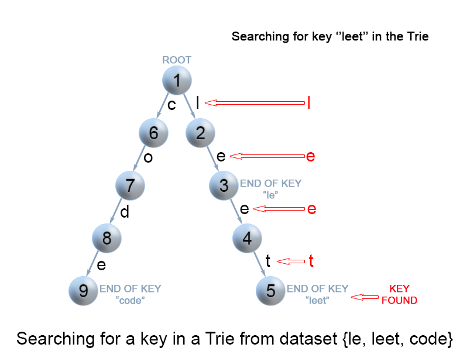
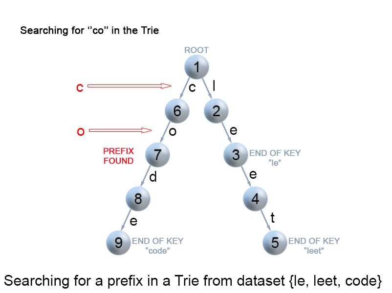

# 1. 字典树的基本概念

在计算机科学中，trie，又**称前缀树或字典树**，是**一种有序树**，用于保存关联数组，其中的键通常是字符串。与二叉查找树不同，键不是直接保存在节点中，而是由节点在树中的位置决定。**一个节点的所有子孙都有相同的前缀**，也就是这个节点对应的字符串，而**根节点对应空字符串**。一般情况下，不是所有的节点都有对应的值，只有叶子节点和部分内部节点所对应的键才有相关的值。


在图示中，键标注在节点中，值标注在节点之下。每一个完整的英文单词对应一个特定的整数。Trie可以看作是一个确定有限状态自动机，尽管边上的符号一般是隐含在分支的顺序中的。

**键不需要被显式地保存在节点中。图示中标注出完整的单词，只是为了演示trie的原理。**

trie中的键通常是字符串，但也可以是其它的结构。trie的算法可以很容易地修改为处理其它结构的有序序列，比如一串数字或者形状的排列。比如，**bitwise trie**中的键是一串比特，可以用于表示整数或者内存地址。

**字典树的应用：**

- trie树常用于搜索提示。如当输入一个网址，可以自动搜索出可能的选择。当没有完全匹配的搜索结果，可以返回前缀最相似的可能。
- 典型应用是用于统计和排序大量的字符串（但不仅限于字符串），所以经常被搜索引擎系统用于文本词频统计。

举例：自动补全，拼写检查，IP路由（最长前缀匹配），T9 (九宫格) 打字预测，单词游戏，等等

其**优点**是：最大限度地减少无谓的字符串比较，查询效率要比哈希表要高

**基本性质：**

1. 节点本身不存完整的单词
2. 从根节点到某一节点，路径上经过的字符连接起来，为该结点对应的字符串；
3. 每个节点的所有子节点路径代表的字符都不相同

**核心思想：**

- Trie树的核心思想时空间换时间。
- 利用字符串的公共前缀来降低查询时间的开销以达到提高效率的目的


**问题：**还有其他的数据结构，如平衡树和哈希表，使我们能够在字符串数据集中搜索单词。为什么我们还需要 Trie 树呢？尽管哈希表可以在 O(1)时间内寻找键值，却无法高效的完成以下操作：

- 找到具有同一前缀的全部键值。
- 按词典序枚举字符串的数据集。

**Trie 树优于哈希表的另一个理由是**，随着哈希表大小增加，会出现大量的冲突，时间复杂度可能增加到 `O(n)`，其中 n是插入的键的数量。与哈希表相比，**Trie 树在存储多个具有相同前缀的键时可以使用较少的空间**。此时 Trie 树只需要 `O(m) `的时间复杂度，其中 m为键长。而在平衡树中查找键值需要` O(m log n)`时间复杂度。


# 2. Trie树的结点结构

Trie 树是一个有根的树，其结点具有以下字段：。

- 最多 R 个指向子结点的链接，其中每个链接对应字母表数据集中的一个字母。本文中假定 R 为 26，小写拉丁字母的数量。
- 布尔字段，以指定节点是对应键的结尾还是只是键前缀。

如下图为单词 leet 在Trie中的表示：


java代码实现一个Trie结点：

```java
class TrieNode {

    // R 链接到节点子节点
    private TrieNode[] links;
	// 26个拉丁字母数量的表示
    private final int R = 26;
	// 该结点是否是一个串的结束
    private boolean isEnd;
	// 初始化数据结构
    public TrieNode() {
        // 里面保存了对当前结点而言下一个可能出现的所有字符的链接，因此我们可以通过一个父结点来预知它所有子结点的值：
        links = new TrieNode[R]; // 字母映射表
    }
    
	// 判断链接是否存在
    public boolean containsKey(char ch) {
        /**
        	注意：char值是和unicode编码表一一对应的关系。
        	
        	当char型字符参与计算时，均会将char型数据准换成int型。转换的方向是：char->short->int->long->float->double。
        	比如：char ch = 'b'; 其unicode值的表示是98，同时，在进行运算的时候，如(ch - 'a') 得出的结果为1，因为b的unicode值为98，a的unicode值为97
        **/
        return links[ch -'a'] != null;
    }
	
    // 获取
    public TrieNode get(char ch) {
        return links[ch -'a'];
    }
    // 根据字符的unicode值，放入对应位置
    public void put(char ch, TrieNode node) {
        links[ch -'a'] = node;
    }
    // 设置结点状态
    public void setEnd() {
        isEnd = true;
    }
    // 返回结点状态
    public boolean isEnd() {
        return isEnd;
    }
}
```

Trie 树中最常见的两个操作是键的插入和查找。

# 3. 向Trie中插入单词

**描述**：向 Trie 中插入一个单词 word

**说明**：我们通过搜索 Trie 树来插入一个键。我们从根开始搜索它对应于第一个键字符的链接。有两种情况：

- 链接存在。沿着链接移动到树的下一个子层。算法继续搜索下一个键字符。
- 链接不存在。创建一个新的节点，并将它与父节点的链接相连，该链接与当前的键字符相匹配。
  重复以上步骤，直到到达键的最后一个字符，然后将当前节点标记为结束节点，算法完成。

**实现**：这个操作和构建链表很像。首先从根结点的子结点开始与 word 第一个字符进行匹配，一直匹配到前缀链上没有对应的字符，这时开始不断开辟新的结点，直到插入完 word 的最后一个字符，同时还要将最后一个结点` isEnd = true;`，表示它是一个单词的末尾。


代码实现：

```java
class Trie {
    private TrieNode root;

    public Trie() {
        root = new TrieNode();
    }

    // Inserts a word into the trie.
    public void insert(String word) {
        TrieNode node = root;
        // 从根开始搜索它对应于第一个键字符的链接
        for (int i = 0; i < word.length(); i++) {
            char currentChar = word.charAt(i);
            // 判断链接是否存在
            if (!node.containsKey(currentChar)) {
                // 创建一个新的节点，并将它与父节点的链接相连，该链接与当前的键字符相匹配。
                node.put(currentChar, new TrieNode());
            }
            // 存在时：沿着链接移动到树的下一个子层。算法继续搜索下一个键字符。
            node = node.get(currentChar);
        }
        // 设置结点状态
        node.setEnd();
    }
}
```

时空复杂度：

- 时间复杂度：O(m)，其中 m 为键长。在算法的每次迭代中，我们要么检查要么创建一个节点，直到到达键尾。只需要 m 次操作。
- 空间复杂度：O(m)。最坏的情况下，新插入的键和 Trie 树中已有的键没有公共前缀。此时需要添加 m 个结点，使用 O(m)空间。

# 4. 查找Trie中的键

**说明**：每个键在 trie 中表示为从根到内部节点或叶的路径。我们用第一个键字符从根开始，检查当前节点中与键字符对应的链接。有两种情况：

- 存在链接。我们移动到该链接后面路径中的下一个节点，并继续搜索下一个键字符。
- 不存在链接。若已无键字符，且当前结点标记为 isEnd，则返回 true。否则有两种可能，均返回 false :
  - 还有键字符剩余，但无法跟随 Trie 树的键路径，找不到键。
  - 没有键字符剩余，但当前结点没有标记为 isEnd。也就是说，待查找键只是Trie树中另一个键的前缀。



```java
class Trie {
    ...

    // 在trie中搜索前缀或完整关键字，然后返回搜索结束的节点
    private TrieNode searchPrefix(String word) {
        TrieNode node = root;
        for (int i = 0; i < word.length(); i++) {
           char curLetter = word.charAt(i);
           if (node.containsKey(curLetter)) {
               node = node.get(curLetter);
           } else {
               return null;
           }
        }
        return node;
    }

    // Returns if the word is in the trie.
    public boolean search(String word) {
       TrieNode node = searchPrefix(word);
       return node != null && node.isEnd();
    }
}
```

时空复杂度：

- 时间复杂度 : O(m)。算法的每一步均搜索下一个键字符。最坏的情况下需要 m 次操作。
- 空间复杂度 : O(1)。

# 5. 查找 Trie 树中的键前缀

**说明**：该方法与在 Trie 树中搜索键时使用的方法非常相似。我们**从根遍历 Trie 树，直到键前缀中没有字符，或者无法用当前的键字符继续 Trie 中的路径**。与上面提到的“搜索键”算法唯一的区别是，到达键前缀的末尾时，总是返回 true。我们不需要考虑当前 Trie 节点是否用 “isend” 标记，因为我们搜索的是键的前缀，而不是整个键。



```java
class Trie {
    ...

    // 返回trie中是否有单词以给定前缀开头。
    public boolean startsWith(String prefix) {
        TrieNode node = searchPrefix(prefix);
        return node != null;
    }
}

```

# 6. 字典树总结

- **Trie 的形状和单词的插入或删除顺序无关**，也就是说对于任意给定的一组单词，Trie 的形状都是唯一的。
- 查找或插入一个长度为 L 的单词，访问 next 数组的次数最多为 L+1，和 Trie 中包含多少个单词无关。

- Trie 的每个结点中都保留着一个字母表，这是很耗费空间的。如果 Trie 的高度为 n，字母表的大小为 m，最坏的情况是 Trie 中还不存在前缀相同的单词，那空间复杂度就为 O(m^n)


最后，关于 Trie 的应用场景，希望你能记住 8 个字：一次建树，多次查询。 

实战题目：

1. https://leetcode-cn.com/problems/implement-trie-prefix-tree/#/description
2. https://leetcode-cn.com/problems/word-search-ii/
3. Search suggestion - system design

**字典树常用操作简洁版：**

```java
public class Trie {
    private boolean is_string=false;
    private Trie next[]=new Trie[26];

    public Trie(){}

    public void insert(String word){//插入单词
        Trie root=this;
        char w[]=word.toCharArray();
        for(int i=0;i<w.length;++i){
            if(root.next[w[i]-'a']==null)root.next[w[i]-'a']=new Trie();
            root=root.next[w[i]-'a'];
        }
        root.is_string=true;
    }

    public boolean search(String word){//查找单词
        Trie root=this;
        char w[]=word.toCharArray();
        for(int i=0;i<w.length;++i){
            if(root.next[w[i]-'a']==null)return false;
            root=root.next[w[i]-'a'];
        }
        return root.is_string;
    }
    
    public boolean startsWith(String prefix){//查找前缀
        Trie root=this;
        char p[]=prefix.toCharArray();
        for(int i=0;i<p.length;++i){
            if(root.next[p[i]-'a']==null)return false;
            root=root.next[p[i]-'a'];
        }
        return true;
    }
}
```

Trie代码模板

```java
class Trie {
    private boolean isEnd;
    private Trie[] next;
    /** Initialize your data structure here. */
    public Trie() {
        isEnd = false;
        next = new Trie[26];
    }
    
    /** Inserts a word into the trie. */
    public void insert(String word) {
        if (word == null || word.length() == 0) return;
        Trie curr = this;
        char[] words = word.toCharArray();
        for (int i = 0;i < words.length;i++) {
            int n = words[i] - 'a';
            if (curr.next[n] == null) curr.next[n] = new Trie();
            curr = curr.next[n];
        }
        curr.isEnd = true;
    }
    
    /** Returns if the word is in the trie. */
    public boolean search(String word) {
        Trie node = searchPrefix(word);
        return node != null && node.isEnd;
    }
    
    /** Returns if there is any word in the trie that starts with the given prefix. */
    public boolean startsWith(String prefix) {
        Trie node = searchPrefix(prefix);
        return node != null;
    }

    private Trie searchPrefix(String word) {
        Trie node = this;
        char[] words = word.toCharArray();
        for (int i = 0;i < words.length;i++) {
            node = node.next[words[i] - 'a'];
            if (node == null) return null;
        }
        return node;
    }
}

```

# 7. 并查集的概念

在计算机科学中，并查集是一种树型的数据结构，用于处理一些不交集（Disjoint Sets）的合并及查询问题。有一个联合-查找算法（union-find algorithm）定义了两个用于此数据结构的操作：

- Find：确定元素属于哪一个子集。它可以被用来确定两个元素是否属于同一子集。
- Union：将两个子集合并成同一个集合。

由于支持这两种操作，一个不相交集也常被称为联合-查找数据结构（union-find data structure）或合并-查找集合（merge-find set）。其他的重要方法，`MakeSet`，用于创建单元素集合。有了这些方法，许多经典的划分问题可以被解决。

为了更加精确的定义这些方法，需要定义如何表示集合。一种常用的策略是为每个集合选定一个固定的元素，称为代表，以表示整个集合。接着，`Find(x)` 返回`x`所属集合的代表，而`Union`使用两个集合的代表作为参数。

**适用场景**：

- 组团，配对问题
- Group or not？

**基本操作：**

- `makeSet(s)`：建立一个新的并查集，其中包含 s 个单元素集合。
- `unionSet(x, y)`：把元素 x 和元素 y 所在的集合合并，要求 x 和 y 所在
  的集合不相交，如果相交则不合并。
- `find(x)`：找到元素 x 所在的集合的代表，该操作也可以用于判断两个元
  素是否位于同一个集合，只要将它们各自的代表比较一下就可以了。

并查集代码模板：

```java
class UnionFind { 
	private int count = 0; 
	private int[] parent; 
	public UnionFind(int n) { 
		count = n; 
		parent = new int[n]; 
		for (int i = 0; i < n; i++) { 
			parent[i] = i;
		}
	} 
	public int find(int p) { 
		while (p != parent[p]) { 
			parent[p] = parent[parent[p]]; 
			p = parent[p]; 
		}
		return p; 
	}
	public void union(int p, int q) { 
		int rootP = find(p); 
		int rootQ = find(q); 
		if (rootP == rootQ) return; 
		parent[rootP] = rootQ; 
		count--;
	}
}
```

# 8. 并查集练习题

实战练习题：

- [朋友圈](https://leetcode-cn.com/problems/friend-circles)（亚马逊、Facebook、字节跳动在半年内面试中考过）
- [岛屿数量](https://leetcode-cn.com/problems/number-of-islands/)（近半年内，亚马逊在面试中考查此题达到 361 次）
- [被围绕的区域](https://leetcode-cn.com/problems/surrounded-regions/)（亚马逊、eBay、谷歌在半年内面试中考过）