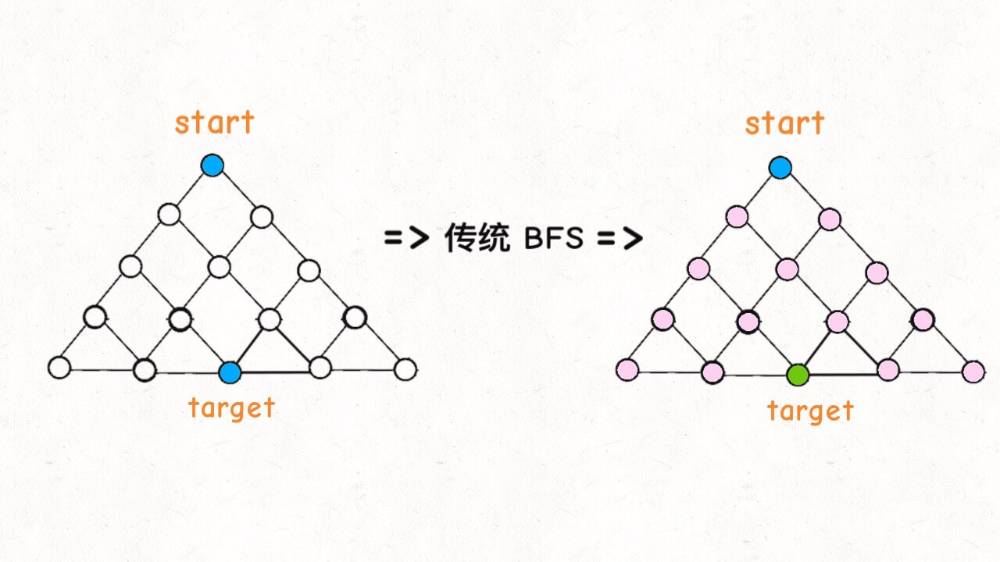
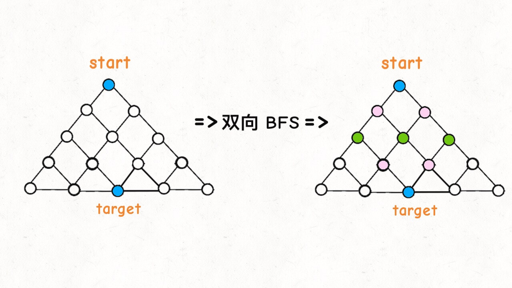

# 1. 剪枝

**修剪是指通过删除树中不重要且多余的部分来对实例进行分类，从而简化/压缩和优化决策树。**

> 修剪的想法最初源自试图防止所谓的过拟合在通过机器学习创建的树中的尝试。过度拟合描述了树木中不希望有的噪声感应。噪声表示错误的属性值或类成员身份，这会篡改数据集，从而不必要地扩大决策树。通过修剪树，不必要的子树再次被缩短。
>
> 此外，修剪对于在资源有限的移动设备上实施机器学习模型这一巨大问题也是一个很好的解决方案-模型中的大量权重通常使模型无法部署在低存储量和低存储量的设备上。
>
> 决策树算法中出现的问题之一是最终树的最佳大小。一棵太大的树可能会过度拟合训练数据，而无法推广到新样本。一棵小树可能无法捕获有关样本空间的重要结构信息。但是，很难确定何时停止树算法，因为无法确定添加单个额外节点是否会显着减少错误。这个问题被称为地平线效应。一种常见的策略是增长树，直到每个节点包含少量实例，然后使用修剪删除不提供其他信息的节点。
>
> 修剪应减少学习树的大小，而不会降低通过交叉验证集衡量的预测准确性。有许多用于树修剪的技术，它们在用于优化性能的度量上有所不同。

剪枝应当在减小决策树大小的同时，保证交叉验证下的精度不降低。

剪枝**算法主要分为两类**：**从上往下剪枝和从下往上剪枝**。从上往下剪枝遍历所有节点从根开始剪枝，也称为**：**预剪枝。然而从下往上剪枝是从叶节点开始从下往上剪枝，也称为**：**后剪枝。

- 预剪枝是在**决策树生成过程中**，对树进行剪枝，提前结束树的分支生长。
- 后剪枝是在**决策树生长完成之后**，对树进行剪枝，得到简化版的决策树。

经典的剪枝算法：

- **Reduced error pruning误差降低剪枝（REP）；**
- **Pesimistic-Error Pruning悲观错误剪枝(PEP）；**
- **Cost-Complexity Pruning代价复杂剪枝（CCP)；**
- **Minimum Error Pruning最小误差剪枝（MEP）;** 

| **剪枝名称** | **剪枝方式** | **计算复杂度** | **误差估计**     |
| ------------ | ------------ | -------------- | ---------------- |
| REP          | 自底向上     | 0(n)           | 剪枝集上误差估计 |
| PEP          | 自顶向下     | o(n)           | 使用连续纠正     |
| CCP          | 自底向上     | o(n2)          | 标准误差         |
| MEP          | 自底向上     | o(n)           | 使用连续纠正     |

# 2. 搜索算法中的减枝

Search algorithm 便是专门解决搜索问题的。就是在特定的数据结构中（如：链表，树，数组等）搜索出需要检索的信息。深度优先算法，广度优先算法，A*算法，贪婪算法都是经典的搜索算法。然而当搜索的范围太大时，复杂度是必须考虑的问题。因此，剪枝算法在搜索问题中也得到了广泛的运用。例如，基于MINMAX衍生出的Alpha–beta（α-β）剪枝是典型的剪枝算法。α-β剪枝是在应用于双人博弈（如tic-tac-toe。 象棋， 围棋等， etc.）的对抗搜索算法。

**剪枝策略的寻找的方法**

1. 微观方法：从问题本身出发，发现剪枝条件
2. 宏观方法：从整体出发，发现剪枝条件。
3. 注意提高效率，这是关键，最重要的。

总之，剪枝策略，属于算法优化范畴；**通常应用在DFS 和 BFS 搜索算法中**；剪枝策略就是寻找过滤条件，提前减少不必要的搜索路径。

**剪枝优化三原则：正确、准确、高效。**

搜索算法，绝大部分需要用到剪枝。然而，不是所有的枝条都可以剪掉，这就需要通过设计出合理的判断方法，以决定某一分支的取舍。在设计判断方法的时候，需要遵循一定的原则。

**剪枝的原则**

1. 正确性

   正如上文所述，枝条不是爱剪就能剪的。如果随便剪枝，把带有最优解的那一分支也剪掉了的话，剪枝也就失去了意义。所以，剪枝的前提是一定要保证不丢失正确的结果。

2. 准确性

   在保证了正确性的基础上，我们应该根据具体问题具体分析，采用合适的判断手段，使不包含最优解的枝条尽可能多的被剪去，以达到程序“最优化”的目的。可以说，**剪枝的准确性，是衡量一个优化算法好坏的标准**。

3. 高效性

   **设计优化程序的根本目的，是要减少搜索的次数，使程序运行的时间减少。但为了使搜索次数尽可能的减少，我们又必须花工夫设计出一个准确性较高的优化算法，而当算法的准确性升高，其判断的次数必定增多，从而又导致耗时的增多，这便引出了矛盾**。因此，如何在优化与效率之间寻找一个平衡点，使得程序的时间复杂度尽可能降低，同样是非常重要的。倘若一个剪枝的判断效果非常好，但是它却需要耗费大量的时间来判断、比较，结果整个程序运行起来也跟没有优化过的没什么区别，这样就太得不偿失了。

# 3. 双向BFS

BFS 广度优先搜索，BFS 算法还有一种稍微高级一点的优化思路：**双向 BFS**，可以进一步提高算法的效率。

**双向BFS：**传统的 BFS 框架就是从起点开始向四周扩散，遇到终点时停止；而双向 BFS 则是从起点和终点同时开始扩散，当两边有交集的时候停止

为什么这样能够能够提升效率呢？其实从 Big O 表示法分析算法复杂度的话，它俩的最坏复杂度都是 `O(N)`，但是实际上双向 BFS 确实会快一些，如下图：

图示中的树形结构，如果终点在最底部，按照传统 BFS 算法的策略，会把整棵树的节点都搜索一遍，最后找到 `target`；而双向 BFS 其实只遍历了半棵树就出现了交集，也就是找到了最短距离。从这个例子可以直观地感受到，双向 BFS 是要比传统 BFS 高效的。

**不过，双向 BFS 也有局限，因为你必须知道终点在哪里**。比如我们刚才讨论的二叉树最小高度的问题，你一开始根本就不知道终点在哪里，也就无法使用双向 BFS；

# 4. 减枝例题

1. https://leetcode-cn.com/problems/word-ladder/
2. https://leetcode-cn.com/problems/minimum-genetic-mutation/

# 5. 启发式搜索

基本概念：启发式搜索(Heuristically Search)又称为**有信息搜索**(Informed Search)，它是**利用问题拥有的启发信息来引导搜索，达到减少搜索范围、降低问题复杂度的目的**，这种利用启发信息的搜索过程称为启发式搜索。

启发式策略可以通过指导搜索向最有希望的方向前进，降低了复杂性。通过删除某些状态及其延伸，启发式算法可以消除组合爆炸，并得到令人能接受的解(通常并不一定是最佳解)。

然而，**启发式策略是极易出错的**。在解决问题的过程中启发仅仅是下一步将要采取措施的一个猜想，常常根据经验和直觉来判断。由于启发式搜索只有有限的信息(比如当前状态的描述)，要想预测进一步搜索过程中状态空间的具体行为则很难。**一个启发式搜索可能得到一个次最佳解，也可能一无所获。这是启发式搜索固有的局限性。**这种局限性不可能由所谓更好的启发式策略或更有效的搜索算法来消除。一般说来，启发信息越强，扩展的无用节点就越少。引入强的启发信息，有可能大大降低搜索工作量，但不能保证找到最小耗散值的解路径(最佳路径)。因此，**在实际应用中，最好能引入降低搜索工作量的启发信息而不牺牲找到最佳路径的保证。** 

# 6. 估价函数：

用于评价节点重要性的函数称为估价函数，其一般形式为：`f(x)=g(x)+h(x)`

式中：`g(x)`为从初始节点到节点x付出的实际代价；`h(x)`为从节点x到目标节点的最优路径的估计代价。启发性信息主要体现在`h(x)`中，其形式要根据问题的特性来确定。

**虽然启发式搜索有望能够很快到达目标节点，但需要花费一些时间来对新生节点进行评价。**因此，在启发式搜索中，**估计函数的定义是十分重要的**。如定义不当，则上述搜索算法不一定能找到问题的解，即使找到解，也不一定是最优的。

启发式函数是一种告知搜索方向的方法。它提供了一种明智的方法来猜测哪个邻居结点会导向一个目标。

# 7. 有序搜索算法

在启发式搜索算法中，根据估价函数值，按由小到大的次序对Open表中的节点进行重新排序，这就是有序搜索法。因此，此时的Open表是一个按节点的启发估价函数值的大小为序排列的一个优先队。

有序搜索算法如下：

1. 将初始节点S0放入Open表中；
2. 如Open表为空，则搜索失败，退出；
3. 把Open表的第一个节点取出，放入到Closed表中，并把该节点记为节点n；
4. 如果节点n是目标节点，则搜索成功，求得一个解，退出；
5. 扩展节点n，生成一组子节点，对既不在Open表中也不在Closed表中的子节点，计算出相应的估价
6. 函数值；把节点n的子节点放到Open表中；
7. 对Open表中的各节点按估价函数值从小到大排列；
8. 转到2。

对上述算法分析可以发现，**如果取估价函数等于节点深度，则它将退化为广度优先搜索。**

# 8. A*算法

在A算法中，启发性信息用一个特别的估价函数f来表示：`f(x)=g(x)+h(x)`

式中：g(x)为从初始节点到节点x的最佳路径所付出的代价；h(x)是从x到目标节点的最佳路径所付出的代价；f(x)是从初始节点出发通过节点x到达目标节点的最佳路径的总代价。

基于上述g(x)和h(x)的定义，对启发式搜索算法中的g(x)和h(x)做如下限制：

1. g(x)是对g(x)的估计，且`g(x)>0`；
2. h(x)是h(x)的下界，即对任意节点x均有`h(x)≤h(x)`。

在满足上述条件情况下的有序搜索算法称为A算法。

对于某一搜索算法，当最佳路径存在时，就一定能找到它，则称此算法是可纳的。可以证明，A*算法是可纳算法。也就是说，对于有序搜索算法，当满足`h(x)≤h(x)`条件时，只要最佳路径存在，就一定能找出这条路径。

实战题目：

1. https://leetcode-cn.com/problems/shortest-path-in-binarymatrix/ 
2. https://leetcode-cn.com/problems/sliding-puzzle/
3. https://leetcode-cn.com/problems/sudoku-solver/