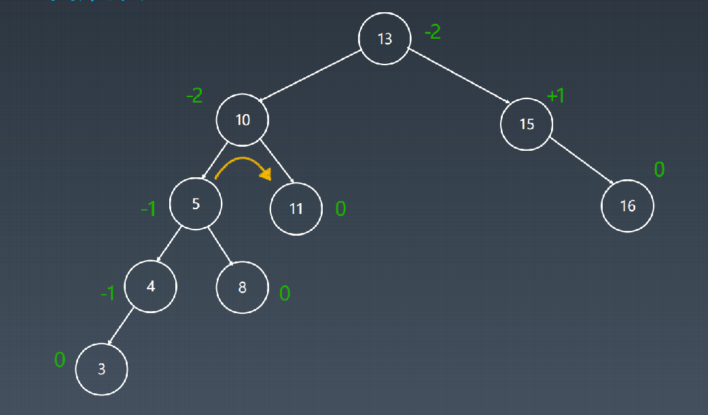

# 1. AVL树的基本概念

- 在计算机科学中，AVL树是最早被发明的**自平衡**二叉查找树。
- 在AVL树中，任一节点对应的两棵子树的最大高度差为1，因此它也被称为**高度平衡树**。
- 查找、插入和删除在平均和**最坏情况**下的时间复杂度都是 O(log n)。
- 增加和删除元素的操作则**可能需要借由一次或多次树旋转（四种），以实现树的重新平衡**。

节点的**平衡因子**是它的**左子树的高度减去它的右子树的高度**（有时相反）

> 带有平衡因子1、0或 -1的节点被认为是平衡的。带有平衡因子 -2或2的节点被认为是不平衡的，并需要重新平衡这个树。平衡因子可以直接存储在每个节点中，或从可能存储在节点中的子树高度计算出来。

举例：

1. 记录左右子树的高度，如图：

   > 说明：二叉树高度（深度）指的是二叉树中的最大叶子结点所在的层。

   

   举例：J 的高度等于它右子树的高度减去左子树的高度等于4-3 = 1

2. 顺利情况下，增加一个结点14，此时不会破坏平衡二叉树结构

   

   

3. 不顺利的情况下，增加3示例

   

   

   此时可以发现，有部分节点的平衡因子变为了-2

   那么，应该如何调整呢？可以继续看下面的旋转操作

# 2. 旋转操作

1. 左旋

   情况：当子树形态为：**右右子树时---->左旋**；如下图

   

   > 左旋操作和右旋操作十分类似，唯一不同的就是需要将左右呼唤下。我们可以认为这两种操作是对称的。

2. 右旋

   情况：当子树形态为：**左左子树时----->右旋**；如下图

   

   > 所谓右旋操作，就是把上图中的 B 节点和 C 节点进行所谓“父子交换”。在仅有这三个节点时候，是十分简单的。但是当 B 节点处存在右孩子时，事情就变得有点复杂了。我们通常的操作是：**抛弃右孩子，将之和旋转后的节点 C 相连，成为节点 C 的左孩子**。

3. 左右旋

   情况：当子树形态为：**左右子树时----->左右旋**；如下图

   

   

4. 右左旋

   情况：当子树形态为：**右左子树时----->右左旋**；如下图

   

   

# 3. 带子树的旋转

1. 左旋带子树

   

2. 右旋带子树

   

   

   

# 4. 旋转概览

AVL树的基本操作一般涉及运作同在不平衡的二叉查找树所运作的同样的算法。但是要进行预先或随后做一次或多次所谓的"AVL旋转"。

以下图表以四列表示四种情况，每行表示在该种情况下要进行的操作。在左左和右右的情况下，只需要进行一次旋转操作；在左右和右左的情况下，需要进行两次旋转操作。

# 5. AVL总结

删除

> 从AVL树中删除，可以通过把要删除的节点向下旋转成一个叶子节点，接着直接移除这个叶子节点来完成。因为在旋转成叶子节点期间最多有log n个节点被旋转，而每次AVL旋转耗费固定的时间，所以删除处理在整体上耗费O(log n) 时间。

搜索

> 可以像普通二叉查找树一样的进行，所以耗费O(log n)时间，因为AVL树总是保持平衡的。不需要特殊的准备，树的结构不会由于查找而改变。（这是与伸展树搜索相对立的，它会因为搜索而变更树结构。）

特点：

1. 平衡二叉搜索树
2. 每个结点存 balance factor = {-1, 0, 1}
3. 四种旋转操作

不足：结点需要存储额外信息、且调整次数频繁

# 6. 红黑树

红黑树（英语：Red–black tree）是一种自平衡二叉查找树，是在计算机科学中用到的一种数据结构，典型用途是实现关联数组。红黑树的结构复杂，但它的操作有着良好的最坏情况运行时间，并且在实践中高效：它可以在`O(log n) `时间内完成查找、插入和删除，这里的n是树中元素的数目。

**红黑树相对于AVL树来说，牺牲了部分平衡性以换取插入/删除操作时少量的旋转操作，整体来说性能要优于AVL树。**

简单说明：红黑树是一种近似平衡的二叉搜索树（Binary Search Tree），它能够确保任何一个结点的左右子树的高度差小于两倍。

# 7. 红黑树性质

红黑树是**每个节点都带有颜色属性的二叉查找树**，颜色为红色或黑色。在二叉查找树强制一般要求以外，对于任何有效的红黑树我们增加了额外要求，具体来说，红黑树是满足如下条件的二叉搜索树：

1. 节点是红色或黑色。
2. 根是黑色。
3. 所有叶子都是黑色（叶子是NIL节点）。
4. 每个红色节点必须有两个黑色的子节点。（从每个叶子到根的所有路径上不能有两个连续的红色节点。）
5. 从任一节点到其每个叶子的所有简单路径都包含相同数目的黑色节点。

这些约束确保了红黑树的关键特性：**从根到叶子的最长的可能路径不多于最短的可能路径的两倍长。**

> 结果是这个树大致上是平衡的。因为操作比如插入、删除和查找某个值的最坏情况时间都要求与树的高度成比例，这个在高度上的理论上限允许红黑树在最坏情况下都是高效的，而不同于普通的二叉查找树。

> 要知道为什么这些性质确保了这个结果，注意到性质4导致了路径不能有两个毗连的红色节点就足够了。最短的可能路径都是黑色节点，最长的可能路径有交替的红色和黑色节点。因为根据性质5所有最长的路径都有相同数目的黑色节点，这就表明了没有路径能多于任何其他路径的两倍长。

> 在很多树数据结构的表示中，一个节点有可能只有一个子节点，而叶子节点包含数据。用这种范例表示红黑树是可能的，但是这会改变一些性质并使算法复杂。为此，本文中我们**使用"nil叶子"或"空（null）叶子"**，如上图所示，**它不包含数据而只充当树在此结束的指示**。这些节点在绘图中经常被省略，导致了这些树好像同上述原则相矛盾，而实际上不是这样。与此有关的结论是所有节点都有两个子节点，尽管其中的一个或两个可能是空叶子。