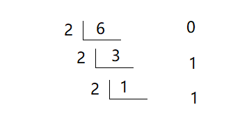
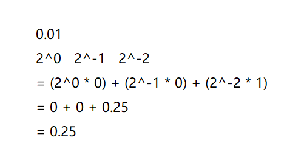
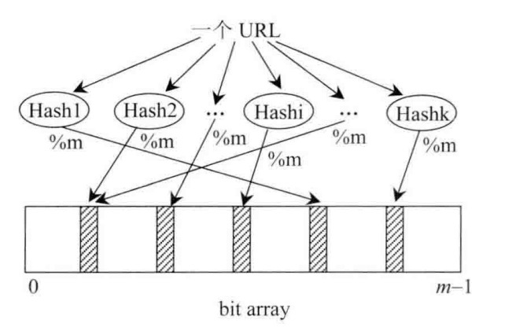

# 1. 位运算基本概念

位运算就是基于整数的二进制表示进行的运算。由于计算机内部就是以二进制来存储数据，位运算是相当快的。

常用的运算符共 6 种，分别为与（ `&` ）、或（ `|` ）、异或（ `^` ）、取反（ `~` ）、左移（ `<<` ）和右移（ `>>` ）。

## 1.1 与、或、异或

与（ `&` ）或（ `|` ）和异或（ `^` ）这三者都是**两数间的运算**，它们都是将两个整数作为二进制数，对二进制表示中的每一位逐一运算。

| 运算符 | 解释                                               | 例子                              |
| ------ | -------------------------------------------------- | --------------------------------- |
| &      | 只有两个对应位都为 1 时才为 1                      | 0011<br/>------- => 0011<br/>1011 |
| \|     | 只要两个对应位中有一个 1 时就为 1                  | 0011<br/>------- => 1011<br/>1011 |
| ^      | 只有两个对应位不同时才为 1，**(相同为零不同为一)** | 0011<br/>------- => 1000<br/>1011 |

说明：异或运算的逆运算是它本身，也就是说两次异或同一个数最后结果不变，即 `a^b^b = a`

## 1.2 取反

取反是对一个数num进行的计算，即单目运算。

`~` 把的补码中的 0 和 1 全部取反（0 变为 1，1 变为 0）。有符号整数的符号位在 `~` 运算中同样会取反。

> 补码：计算机中的有符号数有三种表示方法，即原码、反码和补码。三种表示方法均有符号位和数值位两部分，符号位都是用0表示“正”，用1表示“负”，而数值位，三种表示方法各不相同 。在计算机系统中，数值一律用补码来表示和存储。原因在于，使用补码，可以将符号位和数值域统一处理；同时，加法和减法也可以统一处理
>
> 在二进制表示下，正数和 0 的补码为其本身，负数的补码是将其对应正数按位取反后加一。

| 运算符 | 解释               | 例子         |
| ------ | ------------------ | ------------ |
| ~      | 0 变为 1，1 变为 0 | 0011 => 1100 |

示例：

`~5` —>结果为 `-6`

> 取反就是1为0，0为1，5的二进制位是0000 0101，取反后为1111 1010，值为-6

## 1.3 左移和右移

`num << i` 表示将`num`的二进制表示向左移动`i`位所得的值。

`num >> i` 表示将`num`的二进制表示向右移动`i`位所得的值。

| 运算符 | 解释 | 例子         |
| ------ | ---- | ------------ |
| `<<`   | 左移 | 0011 => 1100 |
| `>>`   | 右移 |              |

示例1：

`5<<2` —->结果为 20

> 5<<2的意思为5的二进制位往左挪两位，右边补0。
>
> 5的二进制位是0000 0101 ， 就是把有效值101往左挪两位就是0001 0100 ，正数左边第一位补0，负数补1，等于乘于2的n次方，十进制位是20

示例2：

`5>>2` —->结果为 1

> 凡位运算符都是把值先转换成二进制再进行后续的处理。
>
> 5的二进制位是0000 0101，右移两位就是把101左移后为0000 0001，正数左边第一位补0，负数补1，等于除于2的n次方，结果为1

**注意：**

移位运算中如果出现如下情况，则其行为未定义：

1. 右操作数（即移位数）为负值；
2. 右操作数大于等于左操作数的位数；

> 例如，对于 `int` 类型的变量 `a` ， `a<<-1` 和 `a<<32` 都是未定义的。

> 对于左移操作，需要确保移位后的结果能被原数的类型容纳，否则行为也是未定义的。对一个负数执行左移操作也未定义。
>
> 对于右移操作，右侧多余的位将会被舍弃，而左侧较为复杂：对于无符号数，会在左侧补 0；而对于有符号数，则会用最高位的数（其实就是符号位，非负数为 0，负数为 1）补齐。

## 1.4 复合赋值位运算符

和 `+=` , `-=` 等运算符类似，位运算也有复合赋值运算符： `&=` , `|=` , `^=` , `<<=` , `>>=` 。（取反是单目运算，所以没有。）

## 1.5 优先级问题

位运算的优先级低于算术运算符（除了取反），而按位与、按位或及异或低于比较运算符，所以使用时需多加注意，在必要时添加括号。

## 1.6 无符号右移

示例1：

`15>>>2` —-> 结果为：3

> 无符号右移运算符和右移运算符的主要区别在于负数的计算，因为无符号右移是高位补0，移多少位补多少个0。
>
> 15的二进制位是0000 1111 ， 右移2位0000 0011，结果为3

示例2：

`-6>>>3` —-> 结果为：536870911

> -6的二进制是6的二进制取反再加1
>
> 6的二进制也就是0000 0000 0000 0000 0000 0000 0000 0110，取反后加1为1111 1111 1111 1111 1111 1111 1111 1010，右移三位0001 1111 1111 1111 1111 1111 1111 1111

# 2. 二进制的运算

转成二进制主要有以下几种：正整数转二进制，负整数转二进制，小数转二进制

一些用到的基本概念：

1. 次方：

   `2^2 = 2 * 2 = 4`

2. 负次方

   `2^-2 = 1 / 2^2 = 1 / 4 = 0.25`

## 2.1 值转化为二进制

1. 正整数转二进制

   

   > 在计算机中存储字节是定长的，即我们8、16、32位等等，6的二进制位为110，但如果在8位计算机中是00000110，高位补零

2. 负整数转二进制

   ```
   6的二进制为110，字节为8位
   0000 0110	<----- 取反
   1111 1001	<----- +1
   1111 1010	<-----  
   ```

   取反就是把1变0，加1就是把最右边的1挪到后面一位去

3. 小数转二进制

   ```
   6.25
   6 = 110
   0.25 * 2 = 0.5  ----> 0
   0.5 * 2 = 1.0	----> 1
   ```

   小数转二进制，先把整数为转换成二进制，然后把小数位转换(小数为换算每次乘2，不足1为0)，最后相加，6.25的二进制为110.01

## 2.2 二进制转换负整数以及小数

1. 二进制转正整数

   > 二进制位左边首位为0为正数（6 --->0000 0110），1为负数(-6---->1111 1010)

   ```
   6
   二进制表示为：0000 0110
   
   
   2^0 * 0 = 0
   2^1 * 1 = 2
   2^2 * 1 = 4
   
   0 + 2 + 4 = 6
   ```

2. 二进制转负整数

   -6的二进制位为1111 1010，取反为0000 0101，然后加1为0000 0110，110为6，故值为-6

3. 二进制转小数

   和小数转二进制一致，先算整数位，再算小数位，最后相加

   

   

# 3. 位运算的应用

位运算一般有三种作用：

1. 高效地进行某些运算，代替其它低效的方式。
2. 表示集合。（常用于 状压 DP（状态压缩）。）
3. 题目本来就要求进行位运算。

> 需要注意的是，用位运算代替其它运算方式（即第一种应用）在很多时候并不能带来太大的优化，反而会使代码变得复杂，使用时需要斟酌。（但像“乘 2 的非负整数次幂”和“除以 2 的非负整数次幂”就最好使用位运算，因为此时使用位运算可以优化复杂度。）

引入案例

1. 乘 2 的非负整数次幂

   ```java
   int mulPowerOfTwo(int n, int m) {  // 计算 n*(2^m)
     return n << m;
   }
   ```

2. 除以 2 的非负整数次幂

   ```java
   int divPowerOfTwo(int n, int m) {  // 计算 n/(2^m)
     return n >> m;
   }
   ```

   > 注意：我们平常写的除法是向 0 取整，而这里的右移是向下取整（注意这里的区别），即当数大于等于 0 时两种方法等价，当数小于 0 时会有区别，如： `-1 / 2` 的值为 ，而 `-1 >> 1` 的值为 。

3. 判断一个数是不是 2 的非负整数次幂

   ```java
   boolean isPowerOfTwo(int n) { 
       return n > 0 && (n & (n - 1)) == 0;
   }
   ```

4. 对 2 的非负整数次幂取模

   ```java
   int modPowerOfTwo(int x, int mod) { 
       return x & (mod - 1); 
   }
   ```

5. 取绝对值

   在某些机器上，效率比 `n > 0 ? n : -n` 高。

   ```java
   int Abs(int n) {
     return (n ^ (n >> 31)) - (n >> 31);
     /* n>>31 取得 n 的符号，若 n 为正数，n>>31 等于 0，若 n 为负数，n>>31 等于 -1
        若 n 为正数 n^0=n, 数不变，若 n 为负数有 n^(-1)
        需要计算 n 和 -1 的补码，然后进行异或运算，
        结果 n 变号并且为 n 的绝对值减 1，再减去 -1 就是绝对值 */
   }
   ```

6. 取两个数的最大/最小值

   在某些机器上，效率比 `a > b ? a : b` 高。

   ```java
   // 如果 a>=b,(a-b)>>31 为 0，否则为 -1
   int max(int a, int b) { return b & ((a - b) >> 31) | a & (~(a - b) >> 31); }
   int min(int a, int b) { return a & ((a - b) >> 31) | b & (~(a - b) >> 31); }
   ```

7. 获取一个数二进制的某一位

   ```java
   // 获取 a 的第 b 位，最低位编号为 0
   int getBit(int a, int b) { 
       return (a >> b) & 1;
   }
   ```

8. 将一个数二进制的某一位设置为 0

   ```java
   // 将 a 的第 b 位设置为 0 ，最低位编号为 0
   int unsetBit(int a, int b) { return a & ~(1 << b); }
   ```

9. 将一个数二进制的某一位设置为 

   ```java
   // 将 a 的第 b 位设置为 1 ，最低位编号为 0
   int setBit(int a, int b) { return a | (1 << b); }
   ```

10. 将一个数二进制的某一位取反

    ```java
    // 将 a 的第 b 位取反 ，最低位编号为 0
    int flapBit(int a, int b) { return a ^ (1 << b); }
    ```

# 4.指定位置的位运算

1. 将 x 最右边的 n 位清零：`x & (~0 << n)`
2. 获取 x 的第 n 位值（0 或者 1）： `(x >> n) & 1`
3. 获取 x 的第 n 位的幂值：`x & (1 << n)`
4. 仅将第 n 位置为 1：`x | (1 << n)`
5. 仅将第 n 位置为 0：`x & (~ (1 << n))`
6. 将 x 最高位至第 n 位（含）清零：`x & ((1 << n) - 1)`

实战位运算要点：

1. 判断奇偶

   ```
   x % 2 == 1 —> (x & 1) == 1
   x % 2 == 0 —> (x & 1) == 0
   ```

2. x >> 1 —> x / 2. 

   ```
   即： x = x / 2; —> x = x >> 1;
   mid = (left + right) / 2; —> mid = (left + right) >> 1;
   ```

3. `X = X & (X-1) `清零最低位的 1

4.  `X & -X => 得到最低位的 1`

5.  `X & ~X => 0`

# 5. 位运算的练习题

1. https://leetcode-cn.com/problems/number-of-1-bits/
2. https://leetcode-cn.com/problems/power-of-two/
3. https://leetcode-cn.com/problems/reverse-bits/
4. https://leetcode-cn.com/problems/n-queens/description/
5. https://leetcode-cn.com/problems/n-queens-ii/description/

N皇后的位运算解

```java
class Solution {
    private int size;
    private int count;
    private void solve(int row, int ld, int rd) {
        if (row == size) {
            count++;
            return;
        }
        int pos = size & (~(row | ld | rd));
        while (pos != 0) {
            int p = pos & (-pos);
            pos -= p; // pos &= pos - 1; 
            solve(row | p, (ld | p) << 1, (rd | p) >> 1);
        }
    }
    public int totalNQueens(int n) {
        count = 0;
        size = (1 << n) - 1;
        solve(0, 0, 0);
        return count;
    }
}
```

DP + 位运算

https://leetcode-cn.com/problems/counting-bits/description/

# 6. 布隆过滤器基本概念

题目导入：

> 如果一个黑名单网站包含100亿个黑名单网页，每个网页最多占64B，设计一个系统，判断当前的URL是否在这个黑名单当中，要求额外空间不超过30GB，允许误差率为万分之一。

解题思路：布隆过滤器

> 布隆过滤器（Bloom Filter）是1970年由布隆提出的。它实际上是一个很长的二进制向量和一系列随机映射函数。布隆过滤器可以用于检索一个元素是否在一个集合中。它的**优点是空间效率和查询时间都比一般的算法要好的多，缺点是有一定的误识别率和删除困难。**

实际应用：

> 实际上，布隆过滤器广泛应用于网页黑名单系统、垃圾邮件过滤系统、爬虫网址判重系统等，有人会想，我直接将网页URL存入数据库进行查找不就好了，或者建立一个哈希表进行查找不就OK了。
>
> 当数据量小的时候，这么思考是对的，但如果整个网页黑名单系统包含100亿个网页URL，在数据库查找是很费时的，并且如果每个URL空间为64B，那么需要内存为640GB，一般的服务器很难达到这个需求。
>
> 那么，在这种内存不够且检索速度慢的情况下，不妨考虑下布隆过滤器，但业务上要可以忍受判断失误率。



## 6.1什么情况下需要布隆过滤器 

几个比较常见的例子：

- 字处理软件中，需要检查一个英语单词是否拼写正确
- 在 FBI，一个嫌疑人的名字是否已经在嫌疑名单上
- 在网络爬虫里，一个网址是否被访问过
- yahoo, gmail等邮箱垃圾邮件过滤功能

这几个例子有一个共同的特点： **如何判断一个元素是否存在一个集合中？**

## 6.2 布隆过滤器原理

布隆过滤器（Bloom Filter）的核心实现是一个超大的位数组和几个哈希函数。假设位数组的长度为m，哈希函数的个数为k


以上图为例，具体的操作流程：

1. 假设集合里面有3个元素{x, y, z}，哈希函数的个数为3。

2. 首先将位数组进行初始化，将里面每个位都设置位0。

   > 对于集合里面的每一个元素，将元素依次通过3个哈希函数进行映射，每次映射都会产生一个哈希值，这个值对应位数组上面的一个点，然后将位数组对应的位置标记为1。

3. 查询W元素是否存在集合中的时候，同样的方法将W通过哈希映射到位数组上的3个点。

   > 如果3个点的其中有一个点不为1，则可以判断该元素一定不存在集合中。反之，如果3个点都为1，则该元素可能存在集合中。

   **注意**：此处不能判断该元素是否一定存在集合中，可能存在一定的误判率。

   > 可以从图中可以看到：假设某个元素通过映射对应下标为4，5，6这3个点。虽然这3个点都为1，但是很明显这3个点是不同元素经过哈希得到的位置，因此这种情况说明元素虽然不在集合中，也可能对应的都是1，这是误判率存在的原因。

## 6.3 java实现布隆过滤器

```java
package com.github.lovasoa.bloomfilter;

import java.util.BitSet;
import java.util.Random;
import java.util.Iterator;

public class BloomFilter implements Cloneable {
    private BitSet hashes;
    private RandomInRange prng;
    private int k; // Number of hash functions
    private static final double LN2 = 0.6931471805599453; // ln(2)

    /**
   * Create a new bloom filter.
   * @param n Expected number of elements
   * @param m Desired size of the container in bits
   **/
    public BloomFilter(int n, int m) {
        k = (int) Math.round(LN2 * m / n);
        if (k <= 0) k = 1;
        this.hashes = new BitSet(m);
        this.prng = new RandomInRange(m, k);
    }

    /**
   * Create a bloom filter of 1Mib.
   * @param n Expected number of elements
   **/
    public BloomFilter(int n) {
        this(n, 1024*1024*8);
    }

    /**
  * Add an element to the container
  **/
    public void add(Object o) {
        prng.init(o);
        for (RandomInRange r : prng) hashes.set(r.value);
    }
    /** 
  * If the element is in the container, returns true.
  * If the element is not in the container, returns true with a probability ≈ e^(-ln(2)² * m/n), otherwise false.
  * So, when m is large enough, the return value can be interpreted as:
  *    - true  : the element is probably in the container
  *    - false : the element is definitely not in the container
  **/
    public boolean contains(Object o) {
        prng.init(o);
        for (RandomInRange r : prng)
            if (!hashes.get(r.value))
                return false;
        return true;
    }

    /**
   * Removes all of the elements from this filter.
   **/
    public void clear() {
        hashes.clear();
    }

    /**
   * Create a copy of the current filter
   **/
    public BloomFilter clone() throws CloneNotSupportedException {
        return (BloomFilter) super.clone();
    }

    /**
   * Generate a unique hash representing the filter
   **/
    public int hashCode() {
        return hashes.hashCode() ^ k;
    }

    /**
   * Test if the filters have equal bitsets.
   * WARNING: two filters may contain the same elements, but not be equal
   * (if the filters have different size for example).
   */
    public boolean equals(BloomFilter other) {
        return this.hashes.equals(other.hashes) && this.k == other.k;
    }

    /**
   * Merge another bloom filter into the current one.
   * After this operation, the current bloom filter contains all elements in
   * other.
   **/
    public void merge(BloomFilter other) {
        if (other.k != this.k || other.hashes.size() != this.hashes.size()) {
            throw new IllegalArgumentException("Incompatible bloom filters");
        }
        this.hashes.or(other.hashes);
    }

    private class RandomInRange
        implements Iterable<RandomInRange>, Iterator<RandomInRange> {

        private Random prng;
        private int max; // Maximum value returned + 1
        private int count; // Number of random elements to generate
        private int i = 0; // Number of elements generated
        public int value; // The current value

        RandomInRange(int maximum, int k) {
            max = maximum;
            count = k;
            prng = new Random();
        }
        public void init(Object o) {
            prng.setSeed(o.hashCode());
        }
        public Iterator<RandomInRange> iterator() {
            i = 0;
            return this;
        }
        public RandomInRange next() {
            i++;
            value = prng.nextInt() % max;
            if (value<0) value = -value;
            return this;
        }
        public boolean hasNext() {
            return i < count;
        }
        public void remove() {
            throw new UnsupportedOperationException();
        }
    }
}

```

