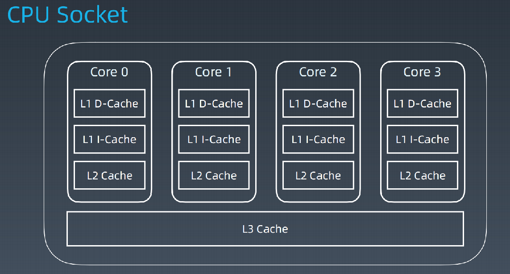
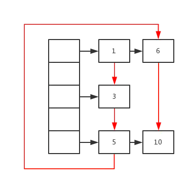
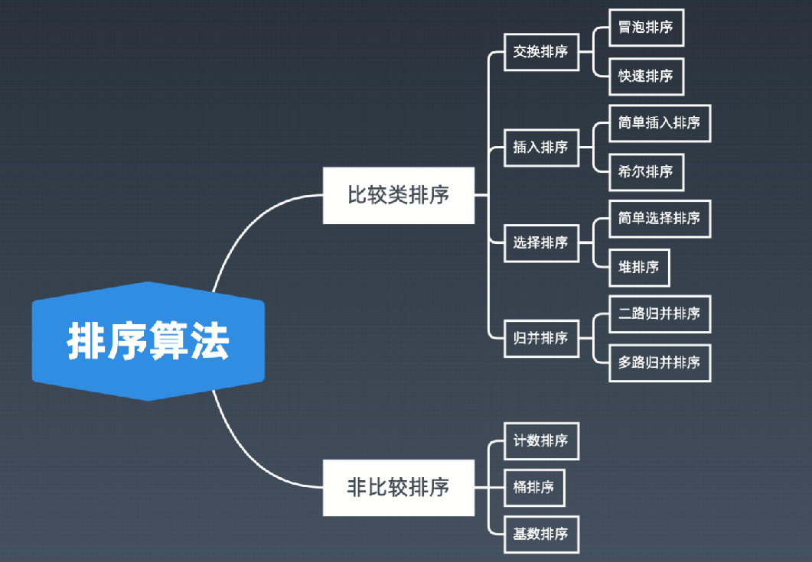
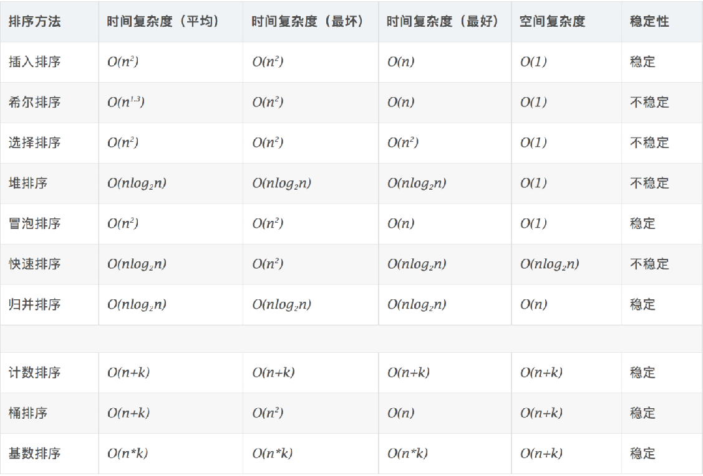

# 1.LRU缓存

什么是缓存？

> 这里说的缓存是一种广义的概念，在计算机存储层次结构中，低一层的存储器都可以看做是高一层的缓存。比如Cache是内存的缓存，内存是硬盘的缓存，硬盘是网络的缓存等等。
>
> 缓存可以有效地解决存储器性能与容量的这对矛盾，但绝非看上去那么简单。如果缓存算法设计不当，非但不能提高访问速度，反而会使系统变得更慢。



LRU概念：

> LRU是Least Recently Used的缩写，即最近最少使用，是一种常用的页面置换算法，选择最近最久未使用的页面予以淘汰。该算法赋予每个页面一个访问字段，用来记录一个页面自上次被访问以来所经历的时间 t，当须淘汰一个页面时，选择现有页面中其 t 值最大的，即最近最少使用的页面予以淘汰。

该算法的思路是，发生缺页中断时，选择未使用时间最长的页面置换出去。

注意：必须有两类硬件之一的支持：寄存器或栈。

重点：

- 两个要素： 大小 、替换策略

- Hash Table + Double LinkedList

- O(1) 查询 
- O(1) 修改、更新

# 2. LRU缓存实现

我们以内存访问为例解释缓存的工作原理。假设缓存的大小固定，初始状态为空。每发生一次读内存操作，首先查找待读取的数据是否存在于缓存中，若是，则缓存命中，返回数据；若否，则缓存未命中，从内存中读取数据，并把该数据添加到缓存中。向缓存添加数据时，如果缓存已满，则需要删除访问时间最早的那条数据，这种更新缓存的方法就叫做LRU。

实现LRU时，我们需要关注它的读性能和写性能，理想的LRU应该可以在O(1)的时间内读取一条数据或更新一条数据，也就是说读写的时间复杂度都是O(1)。

此时很容易想到使用HashMap，根据数据的键访问数据可以达到O(1)的速度。但是更新缓存的速度却无法达到O(1)，因为需要确定哪一条数据的访问时间最早，这需要遍历所有缓存才能找到。

因此，我们需要一种既按访问时间排序，又能在常数时间内随机访问的数据结构。

这可以通过HashMap+双向链表实现。HashMap保证通过key访问数据的时间为O(1)，双向链表则按照访问时间的顺序依次穿过每个数据。之所以选择双向链表而不是单链表，是为了可以从中间任意结点修改链表结构，而不必从头结点开始遍历。

如下图所示，黑色部分为HashMap的结构，红色箭头则是双向链表的正向连接（逆向连接未画出）。可以清晰地看到，数据的访问顺序是1->3->5->6->10。我们只需要在每次访问过后改变链表的连接顺序即可。



```java
public class LRUCache {

    private Map<Integer, Integer> map;

    public LRUCache(int capacity) {
        map = new LinkedCappedHashMap<>(capacity);
    }

    public int get(int key) {
        if(!map.containsKey(key)) { return -1; }
        return map.get(key);
    }

    public void put(int key, int value) {
        map.put(key,value);
    }
    private static class LinkedCappedHashMap<K,V> extends LinkedHashMap<K,V> {
        int maximumCapacity;

        LinkedCappedHashMap(int maximumCapacity) {
            super(16, 0.75f, true);
            this.maximumCapacity = maximumCapacity;
        }

        protected boolean removeEldestEntry(Map.Entry eldest) {
            return size() > maximumCapacity;
        }
    }
}
```

# 3. LRU练习题

https://leetcode-cn.com/problems/lru-cache/#/

# 4. 排序算法

所谓排序，就是使一串记录，按照其中的某个或某些关键字的大小，递增或递减的排列起来的操作。排序算法，就是如何使得记录按照要求排列的方法。排序算法在很多领域得到相当地重视，尤其是在大量数据的处理方面。一个优秀的算法可以节省大量的资源。在各个领域中考虑到数据的各种限制和规范，要得到一个符合实际的优秀算法，得经过大量的推理和分析。

十种常见排序算法可以分为两大类：

1. 比较类排序：

   > 通过比较来决定元素间的相对次序，由于其时间复杂度不能突破
   > O(nlogn)，因此也称为非线性时间比较类排序。

2. 非比较类排序：

   > 不通过比较来决定元素间的相对次序，它可以突破基于比较排序的时
   > 间下界，以线性时间运行，因此也称为线性时间非比较类排序。



排序算法复杂度一览：



相关概念：

- **稳定**：如果a原本在b前面，而a=b，排序之后a仍然在b的前面。
- **不稳定**：如果a原本在b的前面，而a=b，排序之后 a 可能会出现在 b 的后面。
- **时间复杂度**：对排序数据的总的操作次数。反映当n变化时，操作次数呈现什么规律。
- **空间复杂度：**是指算法在计算机内执行时所需存储空间的度量，它也是数据规模n的函数。 

## 4.1 冒泡排序

冒泡排序是一种简单的排序算法。它重复地走访过要排序的数列，一次比较两个元素，如果它们的顺序错误就把它们交换过来。走访数列的工作是重复地进行直到没有再需要交换，也就是说该数列已经排序完成。这个算法的名字由来是因为越小的元素会经由交换慢慢“浮”到数列的顶端。 

描述：

- 比较相邻的元素。如果第一个比第二个大，就交换它们两个；
- 对每一对相邻元素作同样的工作，从开始第一对到结尾的最后一对，这样在最后的元素应该会是最大的数；
- 针对所有的元素重复以上的步骤，除了最后一个；
- 重复步骤1~3，直到排序完成。


代码实现：

```java
int[] bubbleSort(int[] arr) {
    int len = arr.length;
    for(int i = 0; i < len - 1; i++) {
        for(int j = 0; j < len - 1 - i; j++) {
            if(arr[j] > arr[j+1]) {        // 相邻元素两两对比
                int temp = arr[j+1];        // 元素交换
                arr[j+1] = arr[j];
                arr[j] = temp;
            }
        }
    }
    return arr;
}
```

## 4.2 选择排序

选择排序(Selection-sort)是一种简单直观的排序算法。它的工作原理：首先在未排序序列中找到最小（大）元素，存放到排序序列的起始位置，然后，再从剩余未排序元素中继续寻找最小（大）元素，然后放到已排序序列的末尾。以此类推，直到所有元素均排序完毕。 

描述：

n个记录的直接选择排序可经过n-1趟直接选择排序得到有序结果。具体算法描述如下：

- 初始状态：无序区为`R[1..n]`，有序区为空；
- 第`i`趟排序`(i=1,2,3…n-1)`开始时，当前有序区和无序区分别为`R[1..i-1]`和`R(i..n`）。该趟排序从当前无序区中-选出关键字最小的记录 `R[k]`，将它与无序区的第1个记录R交换，使`R[1..i]`和`R[i+1..n)`分别变为记录个数增加1个的新有序区和记录个数减少1个的新无序区；
- `n-1`趟结束，数组有序化了。

演示：


实现：

```java
int[] selectionSort(int[]arr) {
    int len = arr.length;
    int minIndex, temp = 0;
    for(int i = 0; i < len - 1; i++) {
        minIndex = i;
        for(int j = i + 1; j < len; j++) {
            if(arr[j] < arr[minIndex]) {     // 寻找最小的数
                minIndex = j;                 // 将最小数的索引保存
            }
        }
        temp = arr[i];
        arr[i] = arr[minIndex];
        arr[minIndex] = temp;
    }
    return arr;
} 
```

说明：

> 表现最稳定的排序算法之一，因为无论什么数据进去都是O(n2)的时间复杂度，所以用到它的时候，数据规模越小越好。唯一的好处可能就是不占用额外的内存空间了吧。理论上讲，选择排序可能也是平时排序一般人想到的最多的排序方法了吧。

## 4.3 插入排序

插入排序（Insertion-Sort）的算法描述是一种简单直观的排序算法。它的工作原理是通过构建有序序列，对于未排序数据，在已排序序列中从后向前扫描，找到相应位置并插入。

描述：

一般来说，插入排序都采用in-place在数组上实现。具体算法描述如下：

- 从第一个元素开始，该元素可以认为已经被排序；
- 取出下一个元素，在已经排序的元素序列中从后向前扫描；
- 如果该元素（已排序）大于新元素，将该元素移到下一位置；
- 重复步骤3，直到找到已排序的元素小于或者等于新元素的位置；
- 将新元素插入到该位置后；
- 重复步骤2~5。

演示：


实现：

```java
int[] insertionSort(int[] arr) {
    int len = arr.length;
    int preIndex, current;
    for(int i = 1; i < len; i++) {
        preIndex = i - 1;
        current = arr[i];
        while(preIndex >= 0 && arr[preIndex] > current) {
            arr[preIndex + 1] = arr[preIndex];
            preIndex--;
        }
        arr[preIndex + 1] = current;
    }
    return arr;
}
```

分析：

插入排序在实现上，通常采用in-place排序（即只需用到O(1)的额外空间的排序），因而在从后向前扫描过程中，需要反复把已排序元素逐步向后挪位，为最新元素提供插入空间。

## 4.4 希尔排序

1959年Shell发明，第一个突破O(n2)的排序算法，是简单插入排序的改进版。它与插入排序的不同之处在于，它会优先比较距离较远的元素。希尔排序又叫**缩小增量排序**。

描述：

先将整个待排序的记录序列分割成为若干子序列分别进行直接插入排序，具体算法描述：

- 选择一个增量序列t1，t2，…，tk，其中ti>tj，tk=1；
- 按增量序列个数k，对序列进行k 趟排序；
- 每趟排序，根据对应的增量ti，将待排序列分割成若干长度为m 的子序列，分别对各子表进行直接插入排序。仅增量因子为1 时，整个序列作为一个表来处理，表长度即为整个序列的长度。

演示：


实现：

```java
int[] shellSort(int[] arr) {
    int len = arr.length;
    for(int gap = Math.floor(len / 2); gap > 0; gap = Math.floor(gap / 2)) {
        // 注意：这里和动图演示的不一样，动图是分组执行，实际操作是多个分组交替执行
        for(int i = gap; i < len; i++) {
            int j = i;
            int current = arr[i];
            while(j - gap >= 0 && current < arr[j - gap]) {
                 arr[j] = arr[j - gap];
                 j = j - gap;
            }
            arr[j] = current;
        }
    }
    return arr;
}
```

希尔排序的核心在于间隔序列的设定。既可以提前设定好间隔序列，也可以动态的定义间隔序列。

## 4.5 归并排序

归并排序是建立在归并操作上的一种有效的排序算法。该算法是采用分治法（Divide and Conquer）的一个非常典型的应用。将已有序的子序列合并，得到完全有序的序列；即先使每个子序列有序，再使子序列段间有序。若将两个有序表合并成一个有序表，称为2-路归并。 

描述：

- 把长度为n的输入序列分成两个长度为n/2的子序列；
- 对这两个子序列分别采用归并排序；
- 将两个排序好的子序列合并成一个最终的排序序列。

演示：


```java
public static void mergeSort(int[] array, int left, int right) {
    if (right <= left) return;
    int mid = (left + right) >> 1; // (left + right) / 2
    mergeSort(array, left, mid);
    mergeSort(array, mid + 1, right);
    merge(array, left, mid, right);
}
public static void merge(int[] arr, int left, int mid, int right) {
    int[] temp = new int[right - left + 1]; // 中间数组
    int i = left, j = mid + 1, k = 0;
    while (i <= mid && j <= right) {
        temp[k++] = arr[i] <= arr[j] ? arr[i++] : arr[j++];
    }
    while (i <= mid) temp[k++] = arr[i++];
    while (j <= right) temp[k++] = arr[j++];
    for (int p = 0; p < temp.length; p++) {
        arr[left + p] = temp[p];
    }
    // 也可以用 System.arraycopy(a, start1, b, start2, length)
}
```

归并排序是一种稳定的排序方法。和选择排序一样，归并排序的性能不受输入数据的影响，但表现比选择排序好的多，因为始终都是O(nlogn）的时间复杂度。代价是需要额外的内存空间。

## 4.6 快速排序

快速排序的基本思想：通过一趟排序将待排记录分隔成独立的两部分，其中一部分记录的关键字均比另一部分的关键字小，则可分别对这两部分记录继续进行排序，以达到整个序列有序。

描述：

快速排序使用分治法来把一个串（list）分为两个子串（sub-lists）。具体算法描述如下：

- 从数列中挑出一个元素，称为 “基准”（pivot）；
- 重新排序数列，所有元素比基准值小的摆放在基准前面，所有元素比基准值大的摆在基准的后面（相同的数可以到任一边）。在这个分区退出之后，该基准就处于数列的中间位置。这个称为分区（partition）操作；
- 递归地（recursive）把小于基准值元素的子数列和大于基准值元素的子数列排序。

演示：


实现：

```java
public static void quickSort(int[] array, int begin, int end) {
    if (end <= begin) return;
    int pivot = partition(array, begin, end);
    quickSort(array, begin, pivot - 1);
    quickSort(array, pivot + 1, end);
}
static int partition(int[] a, int begin, int end) {
    // pivot: 标杆位置，counter: 小于pivot的元素的个数
    int pivot = end, counter = begin;
    for (int i = begin; i < end; i++) {
        if (a[i] < a[pivot]) {
            int temp = a[counter]; a[counter] = a[i]; a[i] = temp;
            counter++;
        }
    }
    int temp = a[pivot]; a[pivot] = a[counter]; a[counter] = temp;
    return counter;
}

调用方式： quickSort(a, 0, a.length - 1)
```

## 4.7 堆排序

堆排序（Heapsort）是指利用堆这种数据结构所设计的一种排序算法。堆积是一个近似完全二叉树的结构，并同时满足堆积的性质：即子结点的键值或索引总是小于（或者大于）它的父节点。

描述：

- 将初始待排序关键字序列(R1,R2….Rn)构建成大顶堆，此堆为初始的无序区；
- 将堆顶元素R[1]与最后一个元素R[n]交换，此时得到新的无序区(R1,R2,……Rn-1)和新的有序区(Rn),且满足R[1,2…n-1]<=R[n]；
- 由于交换后新的堆顶R[1]可能违反堆的性质，因此需要对当前无序区(R1,R2,……Rn-1)调整为新堆，然后再次将R[1]与无序区最后一个元素交换，得到新的无序区(R1,R2….Rn-2)和新的有序区(Rn-1,Rn)。不断重复此过程直到有序区的元素个数为n-1，则整个排序过程完成。

演示：


实现：

```java
/**
 * 堆排序演示
 *
 * @author Lvan
 */
public class HeapSort {
    public static void main(String[] args) {
        //        int[] arr = {5, 1, 7, 3, 1, 6, 9, 4};
        int[] arr = {16, 7, 3, 20, 17, 8};

        heapSort(arr);

        for (int i : arr) {
            System.out.print(i + " ");
        }
    }


    /**
     * 创建堆，
     * @param arr 待排序列
     */
    private static void heapSort(int[] arr) {
        //创建堆
        for (int i = (arr.length - 1) / 2; i >= 0; i--) {
            //从第一个非叶子结点从下至上，从右至左调整结构
            adjustHeap(arr, i, arr.length);
        }

        //调整堆结构+交换堆顶元素与末尾元素
        for (int i = arr.length - 1; i > 0; i--) {
            //将堆顶元素与末尾元素进行交换
            int temp = arr[i];
            arr[i] = arr[0];
            arr[0] = temp;

            //重新对堆进行调整
            adjustHeap(arr, 0, i);
        }
    }

    /**
     * 调整堆
     * @param arr 待排序列
     * @param parent 父节点
     * @param length 待排序列尾元素索引
     */
    private static void adjustHeap(int[] arr, int parent, int length) {
        //将temp作为父节点
        int temp = arr[parent];
        //左孩子
        int lChild = 2 * parent + 1;

        while (lChild < length) {
            //右孩子
            int rChild = lChild + 1;
            // 如果有右孩子结点，并且右孩子结点的值大于左孩子结点，则选取右孩子结点
            if (rChild < length && arr[lChild] < arr[rChild]) {
                lChild++;
            }

            // 如果父结点的值已经大于孩子结点的值，则直接结束
            if (temp >= arr[lChild]) {
                break;
            }

            // 把孩子结点的值赋给父结点
            arr[parent] = arr[lChild];

            //选取孩子结点的左孩子结点,继续向下筛选
            parent = lChild;
            lChild = 2 * lChild + 1;
        }
        arr[parent] = temp;
    }
}
```

## 4.8 计时排序

计数排序不是基于比较的排序算法，其核心在于将输入的数据值转化为键存储在额外开辟的数组空间中。 作为一种线性时间复杂度的排序，计数排序要求输入的数据必须是有确定范围的整数。

描述

- 找出待排序的数组中最大和最小的元素；
- 统计数组中每个值为i的元素出现的次数，存入数组C的第i项；
- 对所有的计数累加（从C中的第一个元素开始，每一项和前一项相加）；
- 反向填充目标数组：将每个元素i放在新数组的第C(i)项，每放一个元素就将C(i)减去1。

演示：


实现：

```java
int[] countingSort(int[] arr,int maxValue) {
    int[] bucket = new Array[maxValue + 1],
        sortedIndex = 0,
        arrLen = arr.length,
        bucketLen = maxValue + 1;
    for(int i = 0; i < arrLen; i++) {
        if(!bucket[arr[i]]) {
            bucket[arr[i]] = 0;
        }
        bucket[arr[i]]++;
    }
    for(int j = 0; j < bucketLen; j++) {
        while(bucket[j] > 0) {
            arr[sortedIndex++] = j;
            bucket[j]--;
        }
    }
 
    return arr;
}
```

计数排序是一个稳定的排序算法。当输入的元素是 n 个 0到 k 之间的整数时，时间复杂度是O(n+k)，空间复杂度也是O(n+k)，其排序速度快于任何比较排序算法。当k不是很大并且序列比较集中时，计数排序是一个很有效的排序算法。

## 4.9 桶排序

桶排序是计数排序的升级版。它利用了函数的映射关系，高效与否的关键就在于这个映射函数的确定。桶排序 (Bucket sort)的工作的原理：假设输入数据服从均匀分布，将数据分到有限数量的桶里，每个桶再分别排序（有可能再使用别的排序算法或是以递归方式继续使用桶排序进行排）。

描述

- 设置一个定量的数组当作空桶；
- 遍历输入数据，并且把数据一个一个放到对应的桶里去；
- 对每个不是空的桶进行排序；
- 从不是空的桶里把排好序的数据拼接起来。 

演示：


实现：

```javascript
function bucketSort(arr, bucketSize) {
    if(arr.length === 0) {
      returnarr;
    }
 
    var i;
    var minValue = arr[0];
    var maxValue = arr[0];
    for(i = 1; i < arr.length; i++) {
      if(arr[i] < minValue) {
          minValue = arr[i];                // 输入数据的最小值
      } elseif(arr[i] > maxValue) {
          maxValue = arr[i];                // 输入数据的最大值
      }
    }
 
    // 桶的初始化
    var DEFAULT_BUCKET_SIZE = 5;            // 设置桶的默认数量为5
    bucketSize = bucketSize || DEFAULT_BUCKET_SIZE;
    var bucketCount = Math.floor((maxValue - minValue) / bucketSize) + 1;  
    var buckets = newArray(bucketCount);
    for(i = 0; i < buckets.length; i++) {
        buckets[i] = [];
    }
 
    // 利用映射函数将数据分配到各个桶中
    for(i = 0; i < arr.length; i++) {
        buckets[Math.floor((arr[i] - minValue) / bucketSize)].push(arr[i]);
    }
 
    arr.length = 0;
    for(i = 0; i < buckets.length; i++) {
        insertionSort(buckets[i]);                      // 对每个桶进行排序，这里使用了插入排序
        for(varj = 0; j < buckets[i].length; j++) {
            arr.push(buckets[i][j]);                     
        }
    }
 
    return arr;
}
```

分析：

桶排序最好情况下使用线性时间O(n)，桶排序的时间复杂度，取决与对各个桶之间数据进行排序的时间复杂度，因为其它部分的时间复杂度都为O(n)。很显然，桶划分的越小，各个桶之间的数据越少，排序所用的时间也会越少。但相应的空间消耗就会增大。 

## 4.10 基数排序

基数排序是按照低位先排序，然后收集；再按照高位排序，然后再收集；依次类推，直到最高位。有时候有些属性是有优先级顺序的，先按低优先级排序，再按高优先级排序。最后的次序就是高优先级高的在前，高优先级相同的低优先级高的在前。

描述

- 取得数组中的最大数，并取得位数；
- arr为原始数组，从最低位开始取每个位组成radix数组；
- 对radix进行计数排序（利用计数排序适用于小范围数的特点）；

演示


分析：

```javascript
varcounter = [];
function radixSort(arr, maxDigit) {
    var mod = 10;
    var dev = 1;
    for(var i = 0; i < maxDigit; i++, dev *= 10, mod *= 10) {
        for(varj = 0; j < arr.length; j++) {
            var bucket = parseInt((arr[j] % mod) / dev);
            if(counter[bucket]==null) {
                counter[bucket] = [];
            }
            counter[bucket].push(arr[j]);
        }
        var pos = 0;
        for(var j = 0; j < counter.length; j++) {
            var value = null;
            if(counter[j]!=null) {
                while((value = counter[j].shift()) != null) {
                      arr[pos++] = value;
                }
          }
        }
    }
    return arr;
}
```

分析：

基数排序基于分别排序，分别收集，所以是稳定的。但基数排序的性能比桶排序要略差，每一次关键字的桶分配都需要O(n)的时间复杂度，而且分配之后得到新的关键字序列又需要O(n)的时间复杂度。假如待排数据可以分为d个关键字，则基数排序的时间复杂度将是O(d*2n) ，当然d要远远小于n，因此基本上还是线性级别的。

基数排序的空间复杂度为O(n+k)，其中k为桶的数量。一般来说n>>k，因此额外空间需要大概n个左右。

# 5. 排序练习

1. https://leetcode-cn.com/problems/relative-sort-array/
2. https://leetcode-cn.com/problems/valid-anagram/
3. https://leetcode-cn.com/problems/design-a-leaderboard/
4. https://leetcode-cn.com/problems/merge-intervals/
5. https://leetcode-cn.com/problems/reverse-pairs/