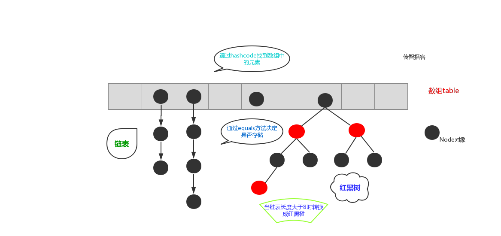

# 1.  java集合简介

什么是集合（Collection）？集合就是“由若干个确定的元素所构成的整体”。

在Java中，如果一个Java对象可以在内部持有若干其他Java对象，并对外提供访问接口，我们把这种Java对象称为集合。

既然Java提供了数组这种数据类型，可以充当集合，那么，我们为什么还需要其他集合类？这是因为**数组有如下限制：**

- 数组初始化后长度不可变；
- 数组只能按索引顺序存取。
- 数组中存储的是同一类型的元素

因此，我们需要各种不同类型的集合类来处理不同的数据，例如：

- 可变大小的顺序链表；
- 保证无重复元素的集合；
- ...

Java中的集合框架大类可分为Collection和Map；两者的区别：

- **Collection是单列集合；Map是双列集合**
- Collection中**只有**Set系列要求元素唯一；Map中键需要唯一，值可以重复，List集合则无此要求
- Collection的数据结构是针对元素的；Map的数据结构是针对键的。

# 2. Collection


Java标准库自带的`java.util`包提供了集合类：`Collection`，**它是除`Map`外所有其他集合类的根接口**。Java的`java.util`包主要提供了以下三种类型的集合：

- `List`：一种**存取顺序一致，允许重复，有索引的列表的集合**
- `Set`：一种**不允许存储重复元素，且没有索引的列表集合**


Java集合的设计有几个特点：

- 一是**实现了接口和实现类相分离**，例如，有序表的接口是`List`，具体的实现类有`ArrayList`，`LinkedList`等

- 二是**支持泛型**，我们可以限制在一个集合中只能放入同一种数据类型的元素，例如：

  ```java
  List<String> list = new ArrayList<>(); // 只能放入String类型
  ```

## 2.1 Collection常用功能

Collection是所有单列集合的父接口，因此在Collection中定义了单列集合(List和Set)通用的一些方法，这些方法可用于操作所有的单列集合。方法如下：

* `public boolean add(E e)`：  把给定的对象添加到当前集合中 。
* `public void clear()` :清空集合中所有的元素。
* `public boolean remove(E e)`: 把给定的对象在当前集合中删除。
* `public boolean contains(E e)`: 判断当前集合中是否包含给定的对象。
* `public boolean isEmpty()`: 判断当前集合是否为空。
* `public int size()`: 返回集合中元素的个数。
* `public Object[] toArray()`: 把集合中的元素，存储到数组中。

```java
import java.util.ArrayList;
import java.util.Collection;

public class Demo1Collection {
    public static void main(String[] args) {
        // 创建集合对象 
        // 使用多态形式
        Collection<String> coll = new ArrayList<String>();
        // 使用方法
        // 添加功能  boolean  add(String s)
        coll.add("小李广");
        coll.add("扫地僧");
        coll.add("石破天");
        System.out.println(coll);

        // boolean contains(E e) 判断o是否在集合中存在
        System.out.println("判断  扫地僧 是否在集合中"+coll.contains("扫地僧"));

        //boolean remove(E e) 删除在集合中的o元素
        System.out.println("删除石破天："+coll.remove("石破天"));
        System.out.println("操作之后集合中元素:"+coll);

        // size() 集合中有几个元素
        System.out.println("集合中有"+coll.size()+"个元素");

        // Object[] toArray()转换成一个Object数组
        Object[] objects = coll.toArray();
        // 遍历数组
        for (int i = 0; i < objects.length; i++) {
            System.out.println(objects[i]);
        }

        // void  clear() 清空集合
        coll.clear();
        System.out.println("集合中内容为："+coll);
        // boolean  isEmpty()  判断是否为空
        System.out.println(coll.isEmpty());  	
    }
}
```


## 2.2 Iterator迭代器

Java访问集合总是通过统一的方式——**迭代器（Iterator）来实现**，它最明显的好处在于无需知道集合内部元素是按什么方式存储的。

在程序开发中，经常需要遍历集合中的所有元素。针对这种需求，JDK专门提供了一个接口`java.util.Iterator`。`Iterator`接口也是Java集合中的一员，但它与`Collection`、`Map`接口有所不同，`Collection`接口与`Map`接口主要用于存储元素，而**`Iterator`主要用于迭代访问（即遍历）**`Collection`中的元素，因此`Iterator`对象也被称为迭代器。

**想要遍历Collection集合，那么就要获取该集合迭代器完成迭代操作**，下面介绍一下获取迭代器的方法：

- `public Iterator iterator()`: 获取集合对应的迭代器，用来遍历集合中的元素的。

下面介绍一下**迭代的概念：**

* **迭代**：即**Collection集合元素的通用获取方式**。在取元素之前先要判断集合中有没有元素，如果有，就把这个元素取出来，继续在判断，如果还有就再取出出来。一直把集合中的所有元素全部取出。这种取出方式专业术语称为迭代。

**Iterator接口的常用方法如下：**

* `public E next()`:返回迭代的下一个元素。
* `public boolean hasNext()`:如果仍有元素可以迭代，则返回 true。

注意：

> 在进行集合元素取出时，如果集合中已经没有元素了，还继续使用迭代器的next方法，将会发生java.util.NoSuchElementException没有集合元素的错误。

示例：

```java
public class IteratorDemo {
    public static void main(String[] args) {
        // 使用多态方式 创建对象
        Collection<String> coll = new ArrayList<String>();

        // 添加元素到集合
        coll.add("串串星人");
        coll.add("吐槽星人");
        coll.add("汪星人");
        //遍历
        //使用迭代器 遍历   每个集合对象都有自己的迭代器
        Iterator<String> it = coll.iterator();
        //  泛型指的是 迭代出 元素的数据类型
        while(it.hasNext()){ //判断是否有迭代元素
            String s = it.next();//获取迭代出的元素
            System.out.println(s);
        }
    }
}
```

## 2.3 迭代器的实现原理

分析：当遍历集合时，首先通过调用t集合的iterator()方法获得迭代器对象，然后使用`hashNext()`方法判断集合中是否存在下一个元素，如果存在，则调用next()方法将元素取出，否则说明已到达了集合末尾，停止遍历元素。

Iterator迭代器对象**在遍历集合时，内部采用指针的方式来跟踪集合中的元素**

图解示例：


**文字说明：**

在调用Iterator的next方法之前，迭代器的索引位于第一个元素之前，不指向任何元素，当第一次调用迭代器的next方法后，迭代器的索引会向后移动一位，指向第一个元素并将该元素返回，当再次调用next方法时，迭代器的索引会指向第二个元素并将该元素返回，依此类推，直到hasNext方法返回false，表示到达了集合的末尾，终止对元素的遍历。

# 3. 数据结构基本了解

当你用着java里面的容器类很爽的时候，你有没有想过，怎么ArrayList就像一个无限扩充的数组，也好像链表之类的。好用吗？好用，这就是数据结构的用处，只不过你在不知不觉中使用了。

现实世界的存储，我们使用的工具和建模。每种数据结构有自己的优点和缺点，想想如果Google的数据用的是数组的存储，我们还能方便地查询到所需要的数据吗？而算法，在这么多的数据中如何做到最快的插入，查找，删除，也是在追求更快。

**常见的数据结构：堆栈、队列、数组、链表和红黑树**

**这里仅进行基本了解，后续有基于源码的详解和相关LeetCode题目练习**

## 3.1 栈

概念：**stack**,又称堆栈，它是运算受限的线性表，其限制是**仅允许在栈的一端进行插入和删除操作**，不允许在其他任何位置进行添加、查找、删除等操作。

简单的说：采用该结构的集合，对元素的存取有如下的特点：

* **先进后出**（即，存进去的元素，要在后它后面的元素依次取出后，才能取出该元素）。
* 栈的**入口、出口的都是栈的顶端位置**。


这里两个名词需要注意：

* **压栈**：就是存元素。即，把元素存储到栈的顶端位置，栈中已有元素依次向栈底方向移动一个位置。
* **弹栈**：就是取元素。即，把栈的顶端位置元素取出，栈中已有元素依次向栈顶方向移动一个位置。

## 3.2 队列

队列（`Queue`）是一种经常使用的集合，仅允许在表的一端进行插入，而在表的另一端进行删除。`Queue`实际上是实现了一个**先进先出**（FIFO：First In First Out）的有序表。它和`List`的区别在于，`List`可以在任意位置添加和删除元素，而`Queue`只有两个操作：

- 把元素添加到队列末尾；
- 从队列头部取出元素。


## 3.3 数组

数组（Array），**是有序的元素序列**，数组是在内存中开辟一段连续的空间，并在此空间存放元素。就像是一排出租屋，有100个房间，从001到100每个房间都有固定编号，通过编号就可以快速找到租房子的人。


简单的说，采用该结构的集合，对元素的存取有如下的特点：

- 查找元素快：通过索引，可以快速访问指定位置的元素

  

- 增删元素慢

  - **指定索引位置增加元素**：需要创建一个新数组，将指定新元素存储在指定索引位置，再把原数组元素根据索引，复制到新数组对应索引的位置。如下图

    

  - **指定索引位置删除元素：**需要创建一个新数组，把原数组元素根据索引，复制到新数组对应索引的位置，原数组中指定索引位置元素不复制到新数组中。如下图

    

## 3.4 链表

链表Linked list，由一系列结点node（链表中每一个元素称为结点）组成，**结点可以在运行时动态生成**。每个结点包括两个部分：**一个是存储数据元素的数据域，另一个是存储下一个结点地址的指针域。**我们常说的链表结构有单向链表与双向链表，那么这里介绍的是**单向链表**。

单向链表图解：


简单的说，采用该结构的集合，对元素的存取有如下的特点：

- **多个结点之间，通过地址进行连接。**例如，多个人手拉手，每个人使用自己的右手拉住下个人的左手，依次类推，这样多个人就连在一起了。

  

- **查找元素慢：**想查找某个元素，需要通过连接的节点，依次向后查找指定元素

- **增删元素快：**

  * 增加元素：只需要修改连接下个元素的地址即可。

    

  *  删除元素：只需要修改连接下个元素的地址即可。

     

## 3.5 红黑树

**二叉树：binary tree，是每个结点不超过2的有序树（tree） 。**

简单的理解，就是一种类似于我们生活中树的结构，只不过每个结点上都最多只能有两个子结点。

二叉树是每个节点最多有两个子树的树结构。顶上的叫根结点，两边被称作“左子树”和“右子树”。

如图：


我们要说的是二叉树的一种比较有意思的叫做**红黑树**，红黑树本身就是一颗二叉查找树，将节点插入后，该树仍然是一颗二叉查找树。也就意味着，树的键值仍然是有序的。

**红黑树的约束:**

1. 节点可以是红色的或者黑色的


2. 根节点是黑色的


3. 叶子节点(特指空节点)是黑色的
4. 每个红色节点的子节点都是黑色的
5. 任何一个节点到其每一个叶子节点的所有路径上黑色节点数相同

**红黑树的特点:**

​	速度特别快，趋近平衡树，查找叶子元素最少和最多次数不多于二倍

# 4. List集合

`java.util.List`接口继承自`Collection`接口，是单列集合的一个重要分支，习惯性地会将实现了`List`接口的对象称为List集合。在List集合中**允许出现重复的元素**，所有的元素**是以一种线性方式进行存储的**，在程序中**可以通过索引来访问集合中的指定元素**。另外，List集合还有一个特点就是**元素有序，即元素的存入顺序和取出顺序一致。**

小结：List接口特点：

1. 它是一个**元素存取有序**的集合。
2. 它是一个**带有索引**的集合，通过索引就可以精确的操作集合中的元素（与数组的索引是一个道理）。
3. 集合中**可以有重复的元素**，通过元素的equals方法，来比较是否为重复的元素。

## 4.1 List接口常用方法

List作为Collection集合的子接口，不但继承了Collection接口中的全部方法，而且还增加了一些根据元素索引来操作集合的特有方法，如下：

- `public void add(int index, E element)`: 将指定的元素，添加到该集合中的指定位置上。
- `public E get(int index)`:返回集合中指定位置的元素。
- `public E remove(int index)`: 移除列表中指定位置的元素, 返回的是被移除的元素。
- `public E set(int index, E element)`:用指定元素替换集合中指定位置的元素,返回值的更新前的元素。

**List集合特有的方法都是跟索引相关**

```java
public class ListDemo {
    public static void main(String[] args) {
        // 创建List集合对象
        List<String> list = new ArrayList<String>();

        // 往 尾部添加 指定元素
        list.add("图图");
        list.add("小美");
        list.add("不高兴");

        System.out.println(list);
        // add(int index,String s) 往指定位置添加
        list.add(1,"没头脑");

        System.out.println(list);
        // String remove(int index) 删除指定位置元素  返回被删除元素
        // 删除索引位置为2的元素 
        System.out.println("删除索引位置为2的元素");
        System.out.println(list.remove(2));

        System.out.println(list);

        // String set(int index,String s)
        // 在指定位置 进行 元素替代（改） 
        // 修改指定位置元素
        list.set(0, "三毛");
        System.out.println(list);

        // String get(int index)  获取指定位置元素

        // 跟size() 方法一起用  来 遍历的 
        for(int i = 0;i<list.size();i++){
            System.out.println(list.get(i));
        }
        //还可以使用增强for
        for (String string : list) {
            System.out.println(string);
        }  	
    }
}
```

## 4.2 ArrayList集合

`java.util.ArrayList`集合数据存储的结构是数组结构。**元素增删慢，查找快**，由于日常开发中使用最多的功能为查询数据、遍历数据，所以`ArrayList`是最常用的集合。

官网地址，可自行查询：https://docs.oracle.com/javase/10/docs/api/java/util/ArrayList.html

构造方法：

| **Constructor**                  | 描述                                                         |
| :------------------------------- | :----------------------------------------------------------- |
| `ArrayList()`                    | 构造一个初始容量为10的空列表。                               |
| `ArrayList(int initialCapacity)` | 构造一个具有指定初始容量的空列表。                           |
| `ArrayList(Collection c)`        | 构造一个列表，该列表包含指定集合的元素，其顺序由集合的迭代器返回。 |

常用方法：

| 参数       | 方法                        | 描述                                                         |
| ---------- | --------------------------- | ------------------------------------------------------------ |
| `void`     | `add(int index, E element)` | Inserts the specified element at the specified position in this list. |
| `boolean`  | `contains(Object o)`        | 返回`true`此列表是否包含指定的元素。                         |
| `E`        | `get(int index)`            | 返回此列表中指定位置的元素。                                 |
| `boolean`  | `isEmpty()`                 | `true`如果此列表不包含任何元素，则返回。                     |
| `E`        | `remove(int index)`         | 删除此列表中指定位置的元素。                                 |
| `E`        | `set(int index, E element)` | 用指定的元素替换此列表中指定位置的元素。                     |
| `int`      | `size()`                    | 返回此列表中的元素数。                                       |
| `Object[]` | `toArray()`                 | 以正确的顺序（从第一个元素到最后一个元素）返回一个包含此列表中所有元素的数组。 |

## 4.3 LinkedList 集合

`java.util.LinkedList`集合数据存储的结构是链表结构。**方便元素添加、删除的集合。**

**LinkedList是一个双向链表**，那么双向链表是什么样子的呢，我们用个图了解下


实际开发中对一个集合元素的添加与删除经常涉及到首尾操作，而LinkedList提供了大量首尾操作的方法。这些方法我们作为了解即可：

* `public void addFirst(E e)`:将指定元素插入此列表的开头。
* `public void addLast(E e)`:将指定元素添加到此列表的结尾。
* `public E getFirst()`:返回此列表的第一个元素。
* `public E getLast()`:返回此列表的最后一个元素。
* `public E removeFirst()`:移除并返回此列表的第一个元素。
* `public E removeLast()`:移除并返回此列表的最后一个元素。
* `public E pop()`:从此列表所表示的堆栈处弹出一个元素。
* `public void push(E e)`:将元素推入此列表所表示的堆栈。
* `public boolean isEmpty()`：如果列表不包含元素，则返回true。

LinkedList是List的子类，List中的方法LinkedList都是可以使用，这里就不做详细介绍，我们只需要了解LinkedList的特有方法即可。在开发时**，LinkedList集合也可以作为堆栈，队列的结构使用。**

````java
public class LinkedListDemo {
    public static void main(String[] args) {
        LinkedList<String> link = new LinkedList<String>();
        //添加元素
        link.addFirst("abc1");
        link.addFirst("abc2");
        link.addFirst("abc3");
        System.out.println(link);
        // 获取元素
        System.out.println(link.getFirst());
        System.out.println(link.getLast());
        // 删除元素
        System.out.println(link.removeFirst());
        System.out.println(link.removeLast());

        while (!link.isEmpty()) { //判断集合是否为空
            System.out.println(link.pop()); //弹出集合中的栈顶元素
        }

        System.out.println(link);
    }
}
````

# 5. Set集合

`java.util.Set`接口和`java.util.List`接口一样，同样继承自`Collection`接口，它与`Collection`接口中的方法基本一致，并没有对`Collection`接口进行功能上的扩充，只是比`Collection`接口更加严格了。与`List`接口不同的是，**`Set`接口中元素无序**，并且都会以某种规则保证存入的元素不出现重复。

`Set`集合有多个子类，这里我们介绍其中的`java.util.HashSet`、`java.util.LinkedHashSet`这两个集合。

**Set集合取出元素的方式可以采用：迭代器、增强for。**

## 5.1 HashSet集合

`java.util.HashSet`是`Set`接口的一个实现类，它所**存储的元素是不可重复的**，并且**元素都是无序的(即存取顺序不一致)**。`java.util.HashSet`底层的实现其实是一个`java.util.HashMap`支持。

源码：

```java
public HashSet() {
    map = new HashMap<>();
}
```

**`HashSet`是根据对象的哈希值来确定元素在集合中的存储位置**，因此具有良好的存取和查找性能。保证元素唯一性的方式依赖于：`hashCode`与`equals`方法。

基本使用：

```java
public class HashSetDemo {
    public static void main(String[] args) {
        //创建 Set集合
        HashSet<String>  set = new HashSet<String>();

        //添加元素
        set.add(new String("cba"));
        set.add("abc");
        set.add("bac"); 
        set.add("cba");  
        //遍历
        for (String name : set) {
            System.out.println(name);
        }
    }
}
```

输出：

```
cba
abc
bac
```

### 5.1.1 HashSet集合存储数据的结构（哈希表）

什么是哈希表呢？

**在JDK1.8之前，哈希表底层采用数组+链表实现**，即使用链表处理冲突，同一hash值的链表都存储在一个链表里。但是当位于一个桶中的元素较多，即hash值相等的元素较多时，通过key值依次查找的效率较低。而**JDK1.8中，哈希表存储采用数组+链表+红黑树实现**，当链表长度超过阈值（8）时，将链表转换为红黑树，这样大大减少了查找时间。

简单的来说，**哈希表是由数组+链表+红黑树（JDK1.8增加了红黑树部分）实现的**，如下图所示。



看到这张图就有人要问了，这个是怎么存储的呢？

为了方便大家的理解我们结合一个存储流程图来说明一下：


总而言之，**JDK1.8**引入红黑树大程度优化了HashMap的性能，那么对于我们来讲保证HashSet集合元素的唯一，其实就是**根据对象的hashCode和equals方法来决定的**。如果我们往集合中存放自定义的对象，那么保证其唯一，就**必须复写hashCode和equals方法建立属于当前对象的比较方式。**

### 5.1.2 HashSet存储自定义类型元素

给HashSet中存放自定义类型元素时，需要重写对象中的hashCode和equals方法，建立自己的比较方式，才能保证HashSet集合中的对象唯一

- 创建自定义Student类

  ```java
  public class Student {
      private String name;
      private int age;
  
   	// 省略get set及构造方法
  
      @Override
      public boolean equals(Object o) {
          if (this == o)
              return true;
          if (o == null || getClass() != o.getClass())
              return false;
          Student student = (Student) o;
          return age == student.age &&
                 Objects.equals(name, student.name);
      }
  
      @Override
      public int hashCode() {
          return Objects.hash(name, age);
      }
  }
  ```

- 测试

  ```java
  public class HashSetDemo2 {
      public static void main(String[] args) {
          //创建集合对象   该集合中存储 Student类型对象
          HashSet<Student> stuSet = new HashSet<Student>();
          //存储 
          Student stu = new Student("于谦", 43);
          stuSet.add(stu);
          stuSet.add(new Student("郭德纲", 44));
          stuSet.add(new Student("于谦", 43));
          stuSet.add(new Student("郭麒麟", 23));
          stuSet.add(stu);
  
          for (Student stu2 : stuSet) {
              System.out.println(stu2);
          }
      }
  }
  执行结果：
  Student [name=郭德纲, age=44]
  Student [name=于谦, age=43]
  Student [name=郭麒麟, age=23]
  ```

## 5.2 LinkedHashSet集合

我们知道HashSet保证元素唯一，可是元素存放进去是没有顺序的，那么我们要保证有序，怎么办呢？

在HashSet下面有一个子类`java.util.LinkedHashSet`，它是链表和哈希表组合的一个数据存储结构。

演示代码如下:

```java
public class LinkedHashSetDemo {
	public static void main(String[] args) {
		Set<String> set = new LinkedHashSet<String>();
		set.add("bbb");
		set.add("aaa");
		set.add("abc");
		set.add("bbc");
        Iterator<String> it = set.iterator();
		while (it.hasNext()) {
			System.out.println(it.next());
		}
	}
}
结果：
  bbb
  aaa
  abc
  bbc
```

# 6. Collections

```java
public class Collections extends Object
```

## 6.1 常用功能

`java.utils.Collections`是集合工具类，用来对集合进行操作。部分方法如下：

- `public static <T> boolean addAll(Collection<T> c, T... elements)  `:往集合中添加一些元素。
- `public static void shuffle(List<?> list) `打乱顺序:打乱集合顺序。
- `public static <T> void sort(List<T> list)`:将集合中元素按照默认规则排序。
- `public static <T> void sort(List<T> list，Comparator<? super T> )`:将集合中元素按照指定规则排序。

```java
public class CollectionsDemo {
    public static void main(String[] args) {
        ArrayList<Integer> list = new ArrayList<Integer>();
        //原来写法
        //list.add(12);
        //list.add(14);
        //list.add(15);
        //list.add(1000);
        //采用工具类 完成 往集合中添加元素  
        Collections.addAll(list, 5, 222, 1，2);
        System.out.println(list);
        //排序方法 
        Collections.sort(list);
        System.out.println(list);
    }
}
结果：
[5, 222, 1, 2]
[1, 2, 5, 222]
```

代码演示之后 ，发现我们的集合按照顺序进行了排列，可是这样的顺序是采用默认的顺序，如果想要指定顺序那该怎么办呢？

我们发现还有个方法没有讲，`public static <T> void sort(List<T> list，Comparator<? super T> )`:将集合中元素按照指定规则排序。接下来讲解一下指定规则的排列。

## 6.2 Comparator比较器

两个对象之间比较大小，在JAVA中提供了两种比较实现的方式，一种是比较死板的采用`java.lang.Comparable`接口去实现，一种是灵活的当我需要做排序的时候在去选择的`java.util.Comparator`接口完成。

那么我们采用的`public static <T> void sort(List<T> list)`这个方法完成的排序，实际上**要求了被排序的类型需要实现Comparable接口完成比较的功能**，在String类型上如下：

```java
public final class String implements java.io.Serializable, Comparable<String>, CharSequence {
```

String类实现了这个接口，并完成了比较规则的定义，但是这样就把这种规则写死了，那比如我想要字符串按照第一个字符降序排列，那么这样就要修改String的源代码，这是不可能的了，那么这个时候我们可以使用

`public static <T> void sort(List<T> list，Comparator<? super T> )`方法灵活的完成，这个里面就涉及到了Comparator这个接口，位于位于`java.util`包下，排序是comparator能实现的功能之一,该接口代表一个比较器，比较器具有可比性！顾名思义就是做排序的，通俗地讲需要比较两个对象谁排在前谁排在后，那么比较的方法就是：

` public int compare(String o1, String o2)`：比较其两个参数的顺序。

> 两个对象比较的结果有三种：大于，等于，小于。
>
> 如果要按照升序排序，
> 则o1 小于o2，返回（负数），相等返回0，01大于02返回（正数）
> 如果要按照降序排序
> 则o1 小于o2，返回（正数），相等返回0，01大于02返回（负数）

```java
public class CollectionsDemo3 {
    public static void main(String[] args) {
        ArrayList<String> list = new ArrayList<String>();
        list.add("cba");
        list.add("aba");
        list.add("sba");
        list.add("nba");
        //排序方法  按照第一个单词的降序
        Collections.sort(list, new Comparator<String>() {
            @Override
            public int compare(String o1, String o2) {
                return o2.charAt(0) - o1.charAt(0);
            }
        });
        System.out.println(list);
    }
}
```

结果如下：

```
[sba, nba, cba, aba]
```

## 6.3 Comparable和Comparator两个接口的区别

**Comparable**：**强行对实现它的每个类的对象进行整体排序**。这种排序被称为类的自然排序，类的compareTo方法被称为它的自然比较方法。只能在类中实现compareTo()一次，不能经常修改类的代码实现自己想要的排序。实现此接口的对象列表（和数组）可以通过Collections.sort（和Arrays.sort）进行自动排序，对象可以用作有序映射中的键或有序集合中的元素，无需指定比较器。

**Comparator：** **强行对某个对象进行整体排序。**可以将Comparator 传递给sort方法（如Collections.sort或 Arrays.sort），从而允许在排序顺序上实现精确控制。还可以使用Comparator来控制某些数据结构（如有序set或有序映射）的顺序，或者为那些没有自然顺序的对象collection提供排序。

练习：

- student类

  ```java
  public class Student{
      private String name;
      private int age;
  
    	// 省略 get set 构造方法
  
      @Override
      public String toString() {
          return "Student{" +
                 "name='" + name + '\'' +
                 ", age=" + age +
                 '}';
      }
  }
  ```

- 测试

  ```java
  public class Demo {
  
      public static void main(String[] args) {
          // 创建四个学生对象 存储到集合中
          ArrayList<Student> list = new ArrayList<Student>();
  
          list.add(new Student("rose",18));
          list.add(new Student("jack",16));
          list.add(new Student("abc",16));
          list.add(new Student("ace",17));
          list.add(new Student("mark",16));
  
  
          /*
            让学生 按照年龄排序 升序
           */
  //        Collections.sort(list);//要求 该list中元素类型  必须实现比较器Comparable接口
  
  
          for (Student student : list) {
              System.out.println(student);
          }
  
  
      }
  }
  ```

- 发现，当我们调用`Collections.sort()`方法的时候 程序报错了。

  **原因：如果想要集合中的元素完成排序，那么必须要实现比较器Comparable接口。**

- 修改student类

  ```java
  public class Student implements Comparable<Student>{
      ....
      @Override
      public int compareTo(Student o) {
          return this.age-o.age;//升序
      }
  }
  ```

  此时测试OK


